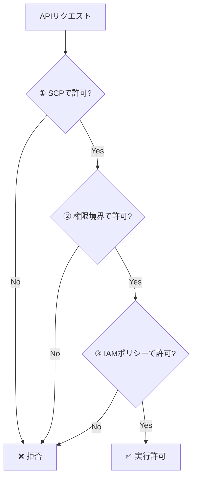
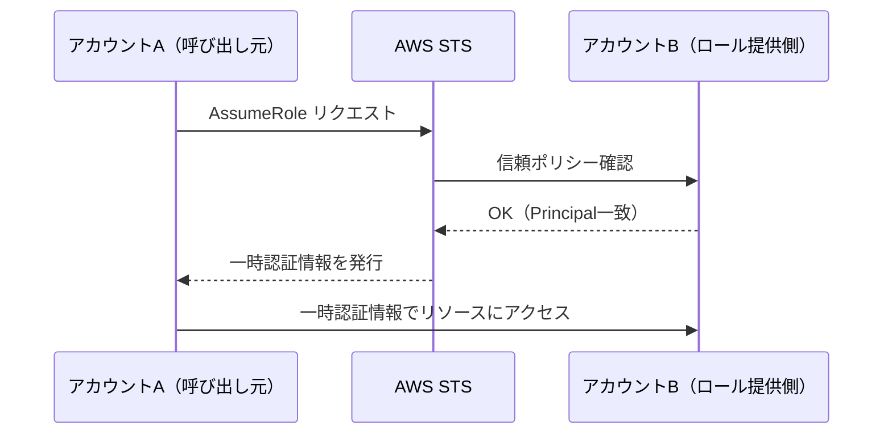

# テーマ2: IAM高度設計

> 🟡 所要日数: 2日 | 座学 → 問題演習

---

## 座学

## Part 1: 権限の「委任」が生む危険と権限境界

大規模な組織でAWSを運用すると、必ずこういう問題が出てきます。中央のクラウドチームがすべてのIAMロールを管理するのは非現実的で、各開発チームに「自分たちのロールは自分たちで作ってほしい」と委任したくなる。しかし、何の制約もなく委任してしまうと、開発チームが `AdministratorAccess` を持つロールを勝手に作り、実質的に無制限の権限を手に入れてしまうリスクがあります。



この問題を解決するのが**権限境界（Permissions Boundary）**です。権限境界はIAMロールやユーザーに設定する「持てる権限の上限」であり、境界の外にある操作はたとえIAMポリシーで許可されていても実行できません。実効権限は「IAMポリシーで許可されている範囲」と「権限境界で許可されている範囲」の**積（AND）**になります。

委任の実装では `iam:PermissionsBoundary` という条件キーが鍵になります。開発チームに `iam:CreateRole` を許可しつつ、その条件として「必ず `DeveloperBoundary` ポリシーを権限境界として設定すること」を要求します。これにより、「ロールは作れるが、自分より強い権限のロールは作れない」という安全な委任が実現します。なお権限の評価順序はSCP → 権限境界 → IAMポリシーであり、いずれかで拒否されると実行不可になります。

---

## Part 2: AssumeRoleとクロスアカウントアクセスの設計

複数のAWSアカウントをまたいで作業するとき、最もよく使われるメカニズムがAssumeRoleです。「アカウントAのユーザーが、アカウントBのロールを引き受けて操作する」という構造で、引き受けた瞬間にSTSが一時的な認証情報を発行し、呼び出し元はアカウントBのリソースにアクセスできるようになります。



ここで重要なのが**信頼ポリシー（Trust Policy）**です。信頼ポリシーは「誰がこのロールをAssumeRoleできるか」をロール側（受け入れ側）に設定するもので、`Principal` フィールドで特定のアカウント・ロール・サービスを指定します。クロスアカウントでは双方の許可が必要で、ロール側の信頼ポリシーだけでなく、呼び出し元にも `sts:AssumeRole` の許可ポリシーが必要です。

AssumeRoleとリソースベースポリシーの使い分けも設計上の重要な判断です。S3バケットポリシーで直接許可する場合、呼び出し元は「自分のアイデンティティのまま」アクセスします。一方AssumeRoleでは「ロールのアイデンティティに切り替わる」ため、監査ログでの識別方法や権限の粒度が変わります。複雑な権限管理が必要な場合はAssumeRoleが適しています。

---

## Part 3: STSセッションタグとABACによるスケーラブルな制御

社員数が増え、プロジェクトが増えるほど、「プロジェクトAのメンバーはプロジェクトAのリソースだけ触れる」という制御が難しくなります。プロジェクトごとにIAMロールを作ると、ロールが爆発的に増えてしまいます。

この課題を解決するのが**STSセッションタグ**と**ABAC（属性ベースアクセス制御）**です。AssumeRole呼び出し時に `Project=Phoenix` や `Department=Engineering` といったキーバリューペアをタグとして渡すと、そのセッション中で `aws:PrincipalTag/Project` という条件キーとして参照できるようになります。IAMポリシー側では `s3:ExistingObjectTag/Project` がセッションタグと一致する場合だけ許可するように書くと、同一のロールを使いながらアクセスできるリソースをユーザーの属性で動的に変えられます。

さらに、ロールを連鎖してAssumeRoleする場合（ロール→ロール→ロール）でも `sts:TransitiveTagKeys` でタグを「推移的」に指定すると、チェーン全体にタグが引き継がれます。ポリシーの数を増やさずにアクセス制御をスケールできるのがABACの最大の利点であり、SAPの試験でも「多数のプロジェクト・チームを管理したい」シナリオでセッションタグが正解になります。

---

## Part 4: aws:PrincipalOrgIDで組織全体へのアクセスを一元管理

Organizationsで数十〜数百のアカウントを管理しているとき、「組織内の全アカウントにS3バケットを共有したい」という要件が出てきます。従来のやり方では各アカウントIDをリソースポリシーに列挙しなければならず、新しいアカウントが追加されるたびにポリシーの更新が必要でした。

`aws:PrincipalOrgID` という条件キーを使うと、この問題が消えます。リソースポリシーの `Principal` を `"*"` にしつつ、条件に `"aws:PrincipalOrgID": "o-abc123def4"` を付けることで「この組織に属する任意のアカウントからのアクセスを許可する」という設定が可能になります。新しいアカウントが組織に追加されても、ポリシーを一切変更せずに自動的にアクセスが許可されます。

関連する条件キーとして `aws:PrincipalOrgPaths` があります。これはOUのパス（例: `o-xxx/r-xxx/ou-xxx-yyy/`）で絞り込むものであり、「Production OUに属するアカウントだけ許可」という細かい制御ができます。Organizationsの構造を活かしたアクセス制御の設計はSAPで頻出の設計パターンです。

---

## Part 5: 外部IDで「混乱した代理」攻撃を防ぐ

サードパーティのSaaSサービスにAWSアカウントへのアクセスを許可するシナリオを考えます。顧客（アカウントA）がSaaSプロバイダ（アカウントB）を信頼ポリシーに追加してロールを作ります。これ自体は正しい設計ですが、「混乱した代理問題（Confused Deputy Problem）」と呼ばれる脆弱性があります。アカウントBのサービスを使う別の悪意ある顧客（攻撃者）が、アカウントBを踏み台にしてアカウントAのロールを引き受けようとする可能性があるのです。

**外部ID（External ID）**はこのリスクを防ぐ仕組みです。SaaSプロバイダが各顧客にユニークな外部IDを発行し、顧客はそれを信頼ポリシーの `sts:ExternalId` 条件として設定します。AssumeRole時に正しい外部IDが渡されない限りアクセスを拒否するため、攻撃者は他の顧客のロールを引き受けられなくなります。

外部IDは秘密情報ではなく、パスワードとは異なります。目的は「正規の顧客からのリクエストであることを証明する」ことであり、SaaSプロバイダが自社の顧客管理システムと連動させて一意性を担保します。SAPでは「サードパーティへのクロスアカウントアクセス許可の安全な方法」として必ず外部IDを選ぶことを覚えておいてください。

---

## 練習問題

### 問題1

ある物流企業は、国内外に15拠点の物流センターを持ち、AWS上でリアルタイムの荷物追跡システムや在庫管理プラットフォームを運用しています。各拠点には独立した開発チームがあり、これまでは中央のクラウド基盤チームがすべてのIAMロール作成を一括管理していました。しかしリリースサイクルを短縮するため、各拠点の開発チームリーダーにIAMロールの作成・管理を委任する方針を決定しました。

組織では、各アカウントのSCPですでに「東京リージョン以外のリソース作成禁止」「特定の高コストインスタンスタイプ禁止」といったガードレールが設定されています。今回の要件は「リーダーがIAMロールを作成できる権限は与えるが、自身が保有する権限の範囲を超えたロールを作れないようにしたい」というものです。セキュリティチームは `DeveloperBoundary` という名前のポリシーを用意し、これをすべてのリーダー作成ロールに必ず付与させることを義務付けたいと考えています。

セキュリティチームの検討の中で、SCPに `iam:CreateRole` の Deny を追加する案は「リーダーへの委任そのものができなくなる」として却下されました。また、AWS ConfigのカスタムルールでPermissions Boundaryのないロールを検出してEventBridgeで通知するアーキテクチャも提案されましたが、検出から対処までの間に作成されたロールが利用される恐れがあるとして見送られました。

この要件を実現する最適な方法はどれですか？

<details>
<summary>選択肢を見る</summary>

A. SCPで `iam:CreateRole` を全面禁止し、セキュリティチームだけが作成する運用にする

B. リーダーのIAMポリシーに `iam:CreateRole` の条件として `iam:PermissionsBoundary` が指定されたPermissions Boundary ARNと一致することを要求する

C. AWS Configルールで権限境界のないロールを検出し、自動修復でPermissions Boundaryを追加する

D. Lambda関数をCloudTrailイベントでトリガーし、Permissions Boundaryがないロールが作成されたら削除する
</details>

<details>
<summary>正解と解説を見る</summary>

**正解: B**

`iam:CreateRole` アクションに対して `iam:PermissionsBoundary` 条件キーを使うことで、Permissions Boundaryを指定しないロール作成を技術的にブロックできます。リーダーのIAMポリシーで以下のように設定します：

```json
"Condition": {
  "StringEquals": {
    "iam:PermissionsBoundary": "arn:aws:iam::123456789012:policy/DeveloperBoundary"
  }
}
```

- A: リーダーへの委任という要件を満たせない
- C: 事後対応であり、一時的にPermissions Boundaryなしのロールが存在する
- D: 同じく事後対応。ロール作成とLambda実行の間にタイムラグが生じる
</details>

---

### 問題2

あるフィンテック企業は、証券取引業の免許を保有しており、年間を通じて金融庁による定期審査と外部監査を受ける義務があります。今回、外部の大手監査法人との契約に基づき、AWS環境の読み取り専用アクセスを監査法人に提供することになりました。セキュリティチームはIAMロールを作成し、監査法人が運用するAWSアカウント（ID: 987654321098）をPrincipalとする信頼ポリシーを設定しました。現在、監査法人は同じアカウントから、業界の異なる50社以上の顧客企業に対してクラウドコンプライアンス監査サービスを提供しています。

設定から2ヶ月後、フィンテック企業のCloudTrailログに不審なアクセスが記録されているとセキュリティアラートが届きました。調査の結果、監査法人のアカウント（987654321098）からのAssumeRoleリクエストが複数回成功しており、アクセスされたリソースの中にはフィンテック企業と監査法人の契約範囲外のリソースも含まれていることが判明しました。監査法人に問い合わせたところ、「その時間帯に御社の環境へのアクセスは実施していない」との回答を得ました。

その後の詳細調査で、監査法人の別の顧客がフィンテック企業のロールをターゲットとしたAssumeRoleを実行できる状態にあったことが浮上しました。監査法人のAWSアカウント内には監査法人のサービスを利用する複数の顧客のワークロードが共存しており、それらから `sts:AssumeRole` が実行可能な構成になっていたことが確認されました。IPアドレス制限の追加も検討されましたが、監査法人は複数のオフィスとクラウドベースの作業環境を使用しており、固定IPの特定が困難なため採用できません。

この問題を再発防止するために、信頼ポリシーに追加すべき条件はどれですか？

<details>
<summary>選択肢を見る</summary>

A. `aws:PrincipalOrgID` を条件に追加し、監査法人の組織IDを指定する

B. `sts:ExternalId` を条件に追加し、監査法人から提供されたユニークな識別子を設定する

C. `aws:SourceIp` を条件に追加し、監査法人の固定IPアドレスを指定する

D. `aws:MultiFactorAuthPresent` を条件に追加し、MFA認証を要求する
</details>

<details>
<summary>正解と解説を見る</summary>

**正解: B**

これは「混乱した代理問題（Confused Deputy Problem）」の典型例です。マルチテナントSaaSプロバイダが複数の顧客のAWSアカウントにアクセスする場合、External IDを使うことで「そのAssumeRoleリクエストが正規の顧客向けのものか」を検証できます。

- A: PrincipalOrgIDは自社の組織内のアクセス制御に使うもの。外部監査法人は自社の組織に属さない
- C: IPアドレス制限はネットワーク境界の制御であり、混乱した代理問題は防げない
- D: MFAはユーザー認証の強化であり、マルチテナント環境での顧客間分離とは無関係
</details>

---

### 問題3

ある国立大学の情報基盤センターでは、理工学部・医学部・人文社会学部にまたがる100以上の研究プロジェクトがAWS上で進行しています。研究者たちはS3バケットにデータセットや解析結果を保存しており、現在は共通のIAMロール `ResearcherRole` を使用してアクセスしています。情報基盤センターは当初、プロジェクトごとに個別のIAMポリシーを作成して管理していましたが、プロジェクト数の急増によりポリシー数が100を超え、新プロジェクトの開始のたびにポリシー作成・アタッチ作業が発生する状況になっています。

情報基盤センターが設けた要件は「各研究者は自分のプロジェクトに属するS3オブジェクトにのみアクセスできること」です。S3オブジェクトにはすでに `Project=PhoenixGenomics` や `Project=ClimateModel2025` のようなタグが付与されており、プロジェクトメンバーの識別情報も各種ディレクトリサービスで管理されています。今後さらにプロジェクトが増加することが見込まれており、スケーラビリティが重要な選択基準となります。

現行の「プロジェクトごとにIAMポリシーを作成する」アプローチは、IAMポリシーのサイズ上限（1ポリシーあたり6KB、アタッチ上限10件）にも近づきつつあります。また、プロジェクト数が今後300を超えると予想されており、個別ポリシー管理・個別ロール管理・個別バケット管理のいずれも運用上の限界が来ることが明白です。ポリシーの数を増やさずにアクセス制御をスケールさせる仕組みが必要です。

ポリシーの数を増やさずに、各メンバーが自分のプロジェクトのS3オブジェクトにのみアクセスできるようにする方法はどれですか？

<details>
<summary>選択肢を見る</summary>

A. プロジェクトごとに別々のIAMロールを作成し、メンバーに適切なロールをAssumeRoleさせる

B. S3バケットポリシーでプロジェクトごとにアクセス許可を個別に記述する

C. STSセッションタグでプロジェクト名を渡し、IAMポリシーの条件で `aws:PrincipalTag` とS3オブジェクトタグを照合する

D. S3バケットをプロジェクトごとに分割し、バケット単位でアクセス制御する
</details>

<details>
<summary>正解と解説を見る</summary>

**正解: C**

STSセッションタグとABAC（属性ベースアクセス制御）を使えば、1つのIAMポリシーで動的にアクセス対象を切り替えられます。メンバーがAssumeRoleする際にセッションタグ `Project=Phoenix` を渡し、ポリシー側で `${aws:PrincipalTag/Project}` を使ってS3オブジェクトのタグと照合します。

- A: 100以上のロールが必要になり、管理の問題は解決しない
- B: バケットポリシーのサイズ上限（20KB）に達する可能性があり、スケールしない
- D: バケット数の上限やバケット管理の複雑化が発生する
</details>

---

### 問題4

ある全国展開の小売企業は、EC事業・店舗事業・物流事業・マーケティング事業を各々独立したAWSアカウントで運用しており、AWS Organizationsで30のアカウントを一元管理しています。共有サービスアカウントには、全事業で参照する共通データ（商品マスタ、価格テーブル、キャンペーン情報など）を格納したS3バケットがあり、全アカウントからこのバケットへの読み取りアクセスが必要です。

現在の設計では、バケットポリシーのPrincipalフィールドに各アカウントのIAMロールARNを30件列挙しています。この方式はすでに管理負担が大きく、先日の新規事業アカウント追加の際にバケットポリシーの更新漏れが発生し、新事業チームが共通データにアクセスできない事態が数時間続きました。今後も新しいサービスラインの追加や、海外展開に向けたアカウント増加が計画されており、将来的にアカウント数は60〜70に拡大する見込みです。

クラウド基盤チームは、アカウントが追加されるたびにバケットポリシーを変更しなくて済む設計への移行を求められています。AWS RAMを検討したものの、S3バケットの直接共有はサポート外と判明しました。また、各アカウントにクロスアカウントロールを作成してAssumeRoleでアクセスさせる案も出ましたが、ロールの数が膨大になる上に、ロール側・バケット側の双方のメンテナンスが必要なため不採用となりました。

最小限の管理負担でこの要件を満たす方法はどれですか？

<details>
<summary>選択肢を見る</summary>

A. 各アカウントのIAMロールARNをバケットポリシーのPrincipalに列挙する

B. バケットポリシーで `Principal: "*"` を指定し、`aws:PrincipalOrgID` 条件キーで自組織のOrganization IDを条件にする

C. AWS RAM（Resource Access Manager）を使ってS3バケットを組織全体に共有する

D. 各アカウントにクロスアカウントロールを作成し、AssumeRoleでアクセスさせる
</details>

<details>
<summary>正解と解説を見る</summary>

**正解: B**

`aws:PrincipalOrgID` を使えば、S3バケットポリシーで「自組織に属する全アカウントからのアクセスを許可」を1つの条件で実現できます。新規アカウントがOrganizationsに追加された場合でもポリシー変更は不要です。

- A: 30アカウント分のARNを列挙する必要があり、追加時に毎回更新が必要
- C: RAMはS3バケットの共有をサポートしていない（VPCサブネット、Transit Gateway等が対象）
- D: 各アカウントにロール作成が必要で管理負担が大きい
</details>

---

### 問題5

ある大手通信企業は、全国の通信インフラをAWS上のEC2インスタンスクラスターで制御しており、サービス停止は直接的な顧客影響と違約金リスクを伴います。セキュリティポリシーとして「本番環境への変更操作は原則禁止・承認制」を採用しており、通常業務では開発者・運用担当者ともにEC2の停止・起動権限を持っていません。しかし深夜や休日に重大障害が発生した場合、即座にインスタンスの再起動や切り替えが必要になるケースが存在します。

障害対応チームから「緊急時に速やかにEC2を操作できるよう、緊急アクセス手段を整備してほしい」という要求が上がってきました。一方でセキュリティ・コンプライアンスチームの要件は「通常時はその権限を保有しないこと」「緊急アクセスを行った際は誰がいつどの障害に対応したかを事後に証明できること」の2点です。ルートアカウントの認証情報を金庫に保管して緊急時に取り出す方式も一案として出ましたが、操作者の特定が困難なこと・ベストプラクティス違反であることから却下されました。

現在の本番アカウントのSCPには `sts:GetSessionToken` をIAMユーザーに対してDenyするポリシーが適用されており、長期認証情報の直接利用は禁止されています。またIAM Identity Centerによる通常のアクセスは本番アカウントでは閲覧権限のみが付与されており、EC2の操作権限は一切含まれていません。コンプライアンス部門からは「過去6ヶ月分の緊急アクセスのログを証拠として提出できること」「各アクセスが誰の判断で実施されたかを個人レベルで特定できること」という2点が追加で要求されています。

この要件を最も適切に実現する方法はどれですか？

<details>
<summary>選択肢を見る</summary>

A. EC2の停止・起動権限を持つIAMポリシーを常時付与し、CloudTrailで操作ログを記録する

B. 緊急対応用のIAMロールを作成し、信頼ポリシーで障害対応チームのAssumeRoleを許可する。ロールにはセッション期間の制限を設け、AssumeRole時にセッションタグで障害チケット番号を付与させる

C. ルートユーザーの認証情報を金庫に保管し、緊急時のみ取り出して使用する

D. AWS Systems Manager Automationランブックを作成し、承認ワークフロー付きでEC2操作を実行する
</details>

<details>
<summary>正解と解説を見る</summary>

**正解: B**

緊急対応用のIAMロールをAssumeRoleで利用する構成が最適です。セッション期間を制限（例：1時間）すれば、緊急時のみの一時的なアクセスが実現できます。さらにSTSセッションタグで障害チケット番号を付与させることで、CloudTrailログにタグ情報が記録され、監査追跡が可能です。

- A: 常時権限を付与するのは最小権限の原則に反する
- C: ルートユーザーの使用はベストプラクティスに反する。また操作者の識別が困難
- D: Systems Manager Automationも有効だが、設問の要件（一時的なアクセス許可と追跡）にはAssumeRole+セッションタグの方が直接的に適合
</details>

---

### 問題6

あるモバイルゲーム会社では、複数のタイトルを同時並行で開発しており、現在3つのゲームタイトルに対応した開発チーム（TeamA：RPGタイトル、TeamB：パズルゲーム、TeamC：スポーツゲーム）がそれぞれ独立してDynamoDBテーブルを運用しています。各DynamoDBテーブルにはプレイヤーデータ・ゲーム進行データ・ランキングデータなどが格納されており、`Team` タグキーでチーム名が設定されています。リリース予定のタイトルが今後6ヶ月で3つ追加されることが確定しており、チーム数は倍増する見通しです。

現行の設計では「TeamA専用ポリシー」「TeamB専用ポリシー」のように各チームに個別のIAMポリシーを作成してロールにアタッチしています。しかし新チームが追加されるたびに、クラウド基盤チームはポリシーの新規作成・ロールへのアタッチ・テスト確認という一連の作業を繰り返す必要があります。最近、新チームの環境セットアップ時に誤って別チームのDynamoDBテーブルへのアクセス権が付与されたミスが発生し、データ分離の信頼性に疑問が生じています。

クラウド基盤チームはIAMポリシーの数を最小限に抑え、かつ新チーム追加時にポリシー変更なしでアクセス制御が機能する設計を検討しています。DynamoDBにはリソースベースポリシーが存在しないため、バケットポリシーのような「テーブル側での直接制御」は使えません。また、SCPはアカウントレベルの上限設定であり、同一アカウント内のテーブル単位の分離には適していません。KMSキーをチームごとに分ける案も出ましたが、API操作の制御には対応できません。

チームの増減に関わらずポリシー変更を不要にするアクセス制御方式として最適なものはどれですか？

<details>
<summary>選択肢を見る</summary>

A. 各チームのIAMロールにタグ `Team=TeamA` を付与し、IAMポリシーで `aws:PrincipalTag/Team` と `dynamodb:ResourceTag/Team` が一致する場合のみアクセスを許可する

B. DynamoDBテーブルにリソースベースポリシーを設定し、チームごとにアクセスを制限する

C. AWS Organizations SCPでチームごとのDynamoDBアクセスを制御する

D. 各テーブルの暗号化キーをチームごとに分け、KMSキーポリシーでアクセスを制限する
</details>

<details>
<summary>正解と解説を見る</summary>

**正解: A**

ABAC（属性ベースアクセス制御）を使い、IAMロールのタグとDynamoDBテーブルのリソースタグを照合する方法が最適です。ポリシーは以下のように1つで済みます：

```json
"Condition": {
  "StringEquals": {
    "dynamodb:ResourceTag/Team": "${aws:PrincipalTag/Team}"
  }
}
```

新チーム追加時は、ロールに適切なタグを付け、テーブルにも同じタグを付けるだけでポリシー変更は不要です。

- B: DynamoDBはリソースベースポリシーをサポートしていない
- C: SCPはアカウント全体の上限であり、テーブル単位の制御には不適切
- D: KMSキー分離は暗号化データの保護には有効だが、DynamoDB API操作の制御には不十分
</details>
