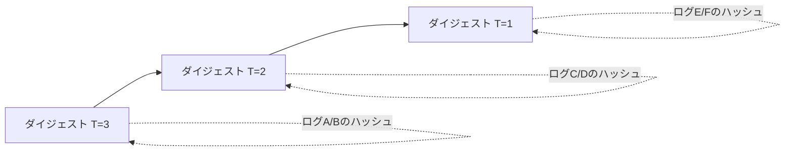
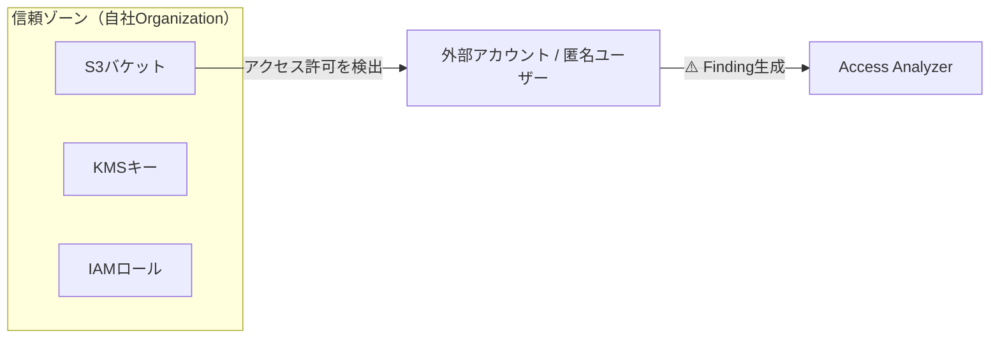
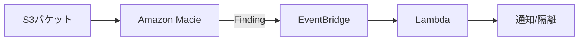
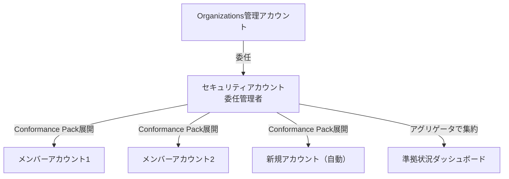
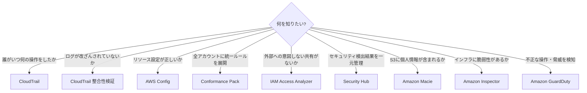

# テーマ3: セキュリティ監査

> 🟡 所要日数: 2日 | 座学 → 問題演習

---

## 座学

## Part 1: CloudTrailログはなぜ「信頼できない」のか

SAAでCloudTrailを学んだとき、「誰がいつ何のAPIを呼んだかを記録するサービス」として理解したはずです。しかし、SAPで問われるのはその先です。「そのログ自体が改ざんされていたら？」という問いです。

セキュリティインシデントが起きたとき、攻撃者はCloudTrailのログを書き換えて証拠を隠滅しようとするかもしれません。あるいは内部の管理者が不正を隠すためにS3のログファイルを削除・改変するかもしれない。ログを記録しているだけでは、そのログが「本物である」ことを証明できません。

**CloudTrail整合性検証（Log File Integrity Validation）**はこの問題を解決します。CloudTrailは1時間ごとに**ダイジェストファイル**を生成し、その時間帯の各ログファイルのSHA-256ハッシュ値を記録します。ダイジェストファイル自体もハッシュで署名され、さらに前のダイジェストファイルへの参照を持つ**チェーン構造**になっています。



ここで重要な区別があります。整合性検証は「**改ざんを検出する**」機能であり「**改ざんを防止する**」機能ではありません。改ざん防止にはS3のオブジェクトロック（WORM: Write Once Read Many）が必要です。「改ざんされたことを証明したい」なら整合性検証、「そもそも改ざんできなくしたい」ならオブジェクトロックという使い分けを覚えておいてください。

---

## Part 2: データイベント記録のコストを制御する詳細イベントセレクタ

SAAでCloudTrailのイベントタイプを学びました。管理イベント（CreateBucket、RunInstancesなどのコントロールプレーン操作）はデフォルトで記録されます。しかしS3のGetObject/PutObjectやLambdaのInvokeといった**データイベント**は、デフォルトでは記録されません。なぜかというと、大規模なシステムでは1日数百万回のS3アクセスが発生し、全て記録するとコストが爆発するからです。

基本イベントセレクタでデータイベントを有効化すると「S3の全バケット全オブジェクト」という粗い単位でしか制御できません。そこでSAPで問われるのが**詳細イベントセレクタ（Advanced Event Selectors）**です。フィールド単位の条件指定ができるため、「特定のバケットだけ記録する」「ログ保存先バケットへの書き込みは除外する（無限ループ防止）」「読み取りだけ記録する」といった細かい制御が可能になります。

```json
{
  "FieldSelectors": [
    { "Field": "eventCategory", "Equals": ["Data"] },
    { "Field": "resources.type", "Equals": ["AWS::S3::Object"] },
    { "Field": "resources.ARN", "NotStartsWith": ["arn:aws:s3:::my-log-bucket/"] }
  ]
}
```

この設定は「S3データイベントを記録するが、ログ保存バケットへのアクセスは除外する」という意味です。またCloudTrailには**インサイトイベント**という第3のタイプもあります。通常とは異なるAPIコールのパターン（突然の大量DeleteObjectなど）を自動検出するもので、異常検知に使います。

---

## Part 3: IAM Access Analyzer — 意図しない「穴」を可視化する

AWSを使っていると、気づかないうちにリソースが外部に公開されてしまうことがあります。S3バケットポリシーを設定するときに `Principal: "*"` を書いてしまった、KMSキーの信頼ポリシーで別アカウントへのアクセスを許可したまま忘れていた——こうした「意図しない外部共有」はセキュリティ事故の温床です。

**IAM Access Analyzer**はこの問題に対処するサービスです。SAAの講座ではほとんど扱われませんでしたが、SAPでは重要です。仕組みはシンプルで、**信頼ゾーン（Zone of Trust）**を定義し、その外部からアクセスできるリソースを継続的にスキャンして検出します。信頼ゾーンはアカウント単位（同一アカウント外へのアクセスを検出）またはOrganization単位（組織外へのアクセスを検出）で設定できます。



分析対象はS3バケット、IAMロールの信頼ポリシー、KMSキー、Lambda関数、SQSキュー、Secrets Managerシークレットです。見つかった外部共有は「Findings（検出結果）」として一覧表示され、意図的なものは「アーカイブ」して除外できます。IAM Policy Simulatorと混同しやすいですが、Policy Simulatorは「特定のIAMポリシーが何を許可するか」をテストするもので、継続的な外部共有検出はできません。

---

## Part 4: Security Hub — セキュリティ検出結果の司令塔

AWSにはGuardDuty、Inspector、Macie、Firewall Managerなど多くのセキュリティサービスがあります。それぞれが独自の「検出結果」を出力しますが、サービスごとにコンソールを開いて確認するのは非現実的です。マルチアカウント環境では尚更です。

**Amazon Security Hub**はこの問題を解決する「統合ダッシュボード」です。SAAの講座では1行しか説明されませんでしたが、SAPでは深く問われます。Security Hubの主な機能は2つです。

1つ目は**セキュリティ基準（Standards）に基づく自動チェック**です。CIS AWS Foundations Benchmark、AWS Foundational Security Best Practices、PCI DSSなどの基準を有効化すると、AWSリソースの設定がその基準に準拠しているかを自動で評価します。CIS Benchmarkでは「ルートアカウントのMFAが有効か」「CloudTrailが全リージョンで有効か」「セキュリティグループでSSHが0.0.0.0/0に開放されていないか」といった項目がチェックされます。

2つ目は**複数サービスの検出結果の集約**です。GuardDutyが脅威を検知、InspectorがEC2の脆弱性を発見、Macieが機密データを検出——これら全ての検出結果がSecurity Hubに集まり、一元的に管理できます。Organizations統合では、セキュリティアカウントをSecurity Hubの委任管理者に指定することで、全メンバーアカウントの状況を1か所で監視できます。

---

## Part 5: Macie と Inspector — 「何を守るか」で使い分ける

**Amazon Macie**と**Amazon Inspector**はどちらも「何かを検出する」サービスですが、守る対象が全く異なります。SAAでは各1行の説明でしたが、SAPではこの違いを正確に理解して使い分けることが問われます。

Macieが守るのは**データの中身**です。S3バケットに保存されているオブジェクトを機械学習でスキャンし、クレジットカード番号、マイナンバー、パスポート番号、メールアドレスなどの個人識別情報（PII）が含まれていないかを検出します。重要なのは、Macieは**S3専用**であり、EBSやRDSは対象外です。また、検出はしますが**自動でデータを削除・暗号化することはしません**。検出結果はEventBridgeに流し、Lambda関数で自動対応ワークフローを組む設計が典型的です。



Inspectorが守るのは**インフラの脆弱性**です。EC2インスタンス、ECRコンテナイメージ、Lambda関数の依存パッケージをCVE（共通脆弱性識別子）データベースと照合し、既知の脆弱性が含まれていないかをスキャンします。Inspector v2はSSM Agentと連携してエージェントレスでスキャンでき、新しいCVEが公開されると自動的に再スキャンします。「S3に個人情報が入っているか」→ Macie、「EC2のOSに脆弱性があるか」→ Inspector、という使い分けを軸に覚えてください。

---

## Part 6: AWS Config の深化 — Conformance Pack と委任管理者

SAAでAWS Configの基本は学びました。「リソースの設定変更履歴を記録し、Configルールで準拠状況を評価する」というものです。SAPではこれをマルチアカウント環境で使う設計が問われます。

**Conformance Pack**は複数のConfigルールと修復アクションをひとまとめにしたパッケージです。「このルールセットを適用すればHIPAA準拠」「このパッケージでCIS BenchmarkのConfig側の要件を満たせる」という形でAWSがサンプルを提供しており、YAMLテンプレートで定義されています。単一アカウントで使う場合はCloudFormationと同様にデプロイしますが、**組織レベルのConformance Pack**を使うと、Organizations管理下の全メンバーアカウントに一括展開でき、新規アカウントが追加された瞬間にも自動適用されます。



**委任管理者（Delegated Administrator）**はSAP頻出の設計パターンです。Organizations管理アカウントは強力な権限を持つため、日常的な操作での利用は最小限にすべきです。Config・Security Hub・GuardDuty・IAM Access Analyzerといったセキュリティサービスの管理権限を専用のセキュリティアカウントに委任することで、管理アカウントへのログインを極力減らしながらセキュリティ運用を実現します。

---

## Part 7: サービス間の使い分けを整理する



CloudTrailとAWS Configの違いは特に頻出です。CloudTrailは「**誰がいつ何をしたか**」の操作ログ（過去の行為の記録）、AWS Configは「**今の設定が正しいか・いつ変わったか**」の状態記録（現在と過去の設定のスナップショット）です。「S3バケットが暗号化されているか確認したい」はConfigの仕事、「S3バケットの暗号化設定を誰が変えたか確認したい」はCloudTrailの仕事です。

---

## 練習問題

### 問題1

ある医薬品メーカーでは、規制当局の監査に備えて、過去1年間のAWS操作ログが一切改ざんされていないことを証明する必要があります。CloudTrailのログはS3バケットに保存されています。

この要件を満たすために必要な設定の組み合わせとして最適なものはどれですか？

<details>
<summary>選択肢を見る</summary>

A. CloudTrailのログファイル整合性検証を有効化し、S3バケットにバージョニングを設定する

B. CloudTrailのログファイル整合性検証を有効化し、S3バケットにオブジェクトロック（コンプライアンスモード）を設定する

C. S3バケットにサーバーサイド暗号化（SSE-KMS）を設定し、バケットポリシーで削除を拒否する

D. CloudTrailのインサイトイベントを有効化し、異常なAPI操作パターンを検出する
</details>

<details>
<summary>正解と解説を見る</summary>

**正解: B**

整合性検証は「改ざんされたかどうかを検出」する機能であり、S3オブジェクトロック（コンプライアンスモード）は「ログファイル自体を削除・上書きから保護（WORM）」する機能です。この2つを組み合わせることで、「改ざん防止」と「改ざん検出」の両方が実現できます。

- A: バージョニングは削除マーカーを付けるだけで、実際のオブジェクトを完全に保護しない。管理者が全バージョンを削除可能
- C: 暗号化は転送中・保存中のデータ保護であり、ログの改ざん検出とは無関係。バケットポリシーもIAM管理者が変更可能
- D: インサイトイベントは異常なAPIコールパターンの検出であり、ログの改ざん検出とは関係ない
</details>

---

### 問題2

ある映像配信会社では、S3に大量のユーザーアップロード動画を保存しています。CloudTrailでS3のデータイベント（PutObject、GetObject等）を記録していますが、月額コストが非常に高くなっています。調査の結果、CloudTrailのログ保存用S3バケットへの書き込みイベントが記録されていることが判明しました。

コストを削減しつつ、ユーザーデータのS3操作を記録し続ける方法として最適なものはどれですか？

<details>
<summary>選択肢を見る</summary>

A. データイベントの記録を完全に無効化し、管理イベントのみ記録する

B. CloudTrailの詳細イベントセレクタを使用し、ログバケットのプレフィックスをNotStartsWith条件で除外する

C. S3サーバーアクセスログに切り替え、CloudTrailのデータイベント記録を停止する

D. CloudTrailのログをCloudWatch Logsに直接送信し、S3への保存を停止する
</details>

<details>
<summary>正解と解説を見る</summary>

**正解: B**

詳細イベントセレクタの `NotStartsWith` 条件でCloudTrailログ保存用バケットのARNを除外すれば、ログバケットへの書き込みイベントが記録されなくなり、コストが大幅に削減されます。ユーザーデータバケットのイベントは引き続き記録されます。

- A: データイベントの記録を停止するとセキュリティ監査要件を満たせない
- C: S3サーバーアクセスログはCloudTrailほど詳細な情報を含まず、他のAWSサービスとの統合も限定的
- D: CloudWatch LogsはCloudTrailの補完であり、S3への保存を完全に代替するものではない。また、CloudWatch Logsのコストも発生する
</details>

---

### 問題3

あるコンサルティング企業では、50のAWSアカウントをOrganizationsで管理しています。セキュリティチームは、いずれかのアカウントで外部アカウントにS3バケットやIAMロールが意図せず共有されていないかを継続的に監視したいと考えています。

この要件を最も効率的に実現する方法はどれですか？

<details>
<summary>選択肢を見る</summary>

A. 各アカウントでAWS Configルールを設定し、S3バケットポリシーにPrincipal: "*"が含まれていないか評価する

B. IAM Access Analyzerを組織レベルで有効化し、組織外へのアクセスを許可しているリソースを検出する

C. Amazon MacieをS3バケットに対して実行し、外部共有されているデータを検出する

D. Security HubのCIS Benchmarkを有効化し、パブリックアクセスに関する項目をチェックする
</details>

<details>
<summary>正解と解説を見る</summary>

**正解: B**

IAM Access Analyzerを組織レベルで有効化すると、信頼ゾーンをOrganization全体に設定できます。これにより、Organization外のアカウントやサービスにアクセスを許可しているS3バケット、IAMロール、KMSキー等を継続的に自動検出します。

- A: Configルールでは `Principal: "*"` の検出はできるが、特定の外部アカウントIDへの共有は検出しにくい。また、IAMロールの信頼ポリシーまでは網羅できない
- C: Macieはデータの中身（機密データ）を検出するサービスであり、リソースの外部共有設定の検出とは異なる
- D: CIS BenchmarkはS3のパブリックアクセスをチェックするが、特定の外部アカウントへの共有は検出範囲外
</details>

---

### 問題4

ある保険会社では、AWS Organizationsで管理する全アカウントに対して、以下のセキュリティ基準を統一的に適用したいと考えています：
- S3バケットのサーバーサイド暗号化が有効であること
- セキュリティグループでSSH（ポート22）が0.0.0.0/0に開放されていないこと
- EBSボリュームが暗号化されていること

さらに、非準拠のリソースが検出された場合は自動的に修復したいです。新規アカウントが追加された場合にも自動的にこれらのルールが適用される必要があります。

この要件を最も効率的に実現する方法はどれですか？

<details>
<summary>選択肢を見る</summary>

A. 各アカウントに個別にAWS Configルールと修復アクションを手動設定する

B. AWS Config Conformance Packを組織レベルでデプロイし、修復アクションを含める。セキュリティアカウントを委任管理者に設定する

C. Security HubのAWS Foundational Security Best Practicesを全アカウントで有効化し、自動修復を設定する

D. CloudFormation StackSetsで各アカウントにConfigルールをデプロイする
</details>

<details>
<summary>正解と解説を見る</summary>

**正解: B**

組織レベルのConformance Packを使えば、複数のConfigルールと修復アクションをパッケージとして全メンバーアカウントに一括展開できます。委任管理者を設定することで、管理アカウントへのアクセスを最小限に抑えつつ、セキュリティアカウントから管理できます。新規アカウント追加時も自動適用されます。

- A: 手動設定はスケールしない。新規アカウントにも手動対応が必要
- C: Security Hubはコンプライアンスチェックは行うが、自動修復機能は組み込まれていない。EventBridgeとの連携で構築可能だが、Conformance Packほど直接的ではない
- D: StackSetsも有効だが、Configルール+修復アクションのパッケージ管理にはConformance Packの方が適している。StackSetsはConfig以外のリソースデプロイに適する
</details>

---

### 問題5

ある人材派遣会社では、S3バケットに派遣社員の個人情報（氏名、住所、電話番号、マイナンバー）を含むCSVファイルが保存されています。個人情報保護法の改正に伴い、どのバケットにどのような個人情報が含まれているかを棚卸しする必要があります。

この要件を最も効率的に実現する方法はどれですか？

<details>
<summary>選択肢を見る</summary>

A. S3のインベントリレポートを有効化し、各バケットのオブジェクト一覧を取得する

B. Amazon Macieを有効化し、S3バケットの機密データ検出ジョブを実行する

C. AWS Configルールで各S3バケットのタグを確認し、個人情報の有無をタグベースで管理する

D. Amazon Inspector でS3バケットの脆弱性スキャンを実行する
</details>

<details>
<summary>正解と解説を見る</summary>

**正解: B**

Amazon Macieは機械学習とパターンマッチングを使い、S3バケット内のデータを自動スキャンして個人識別情報（PII）を検出します。氏名、住所、電話番号、マイナンバーなどの機密データパターンを検出し、どのバケットにどのような機密データが含まれているかをレポートできます。

- A: S3インベントリはオブジェクトのメタデータ（サイズ、暗号化状態等）は提供するが、データの中身は分析しない
- C: タグベースの管理は手動であり、実際のデータ内容と一致している保証がない
- D: InspectorはEC2・ECR・Lambdaの脆弱性スキャンが対象であり、S3のデータ内容分析は行わない
</details>

---

### 問題6

ある自動車部品メーカーでは、Organizations管理アカウントでSecurity Hub、GuardDuty、AWS Configの管理操作を行っています。セキュリティ監査チームから「管理アカウントへの直接アクセスを最小限にし、専用のセキュリティアカウントからこれらのサービスを管理できるようにしてほしい」という要望がありました。

この要件を実現する最適な方法はどれですか？

<details>
<summary>選択肢を見る</summary>

A. 管理アカウントにセキュリティ監査チーム用のIAMロールを作成し、最小権限のポリシーをアタッチする

B. セキュリティアカウントをOrganizationsの委任管理者として登録し、Security Hub・GuardDuty・Configの管理権限を委任する

C. 管理アカウントからCloudFormation StackSetsで各セキュリティサービスの設定を自動展開する

D. AWS Control Towerを導入し、Audit アカウントから全サービスを管理する
</details>

<details>
<summary>正解と解説を見る</summary>

**正解: B**

Organizations の委任管理者（Delegated Administrator）機能を使えば、管理アカウント以外のアカウントにSecurity Hub、GuardDuty、AWS Config等の組織レベル管理権限を委任できます。これにより、管理アカウントへの直接アクセスを最小化できます。

- A: 管理アカウントへのアクセス自体を減らすという要件を満たさない
- C: StackSetsは設定のデプロイには有効だが、継続的な管理・監視を委任するものではない
- D: Control Towerは有効だが、既存環境への導入は大規模な変更を伴う。委任管理者の方がシンプルに要件を満たせる
</details>
