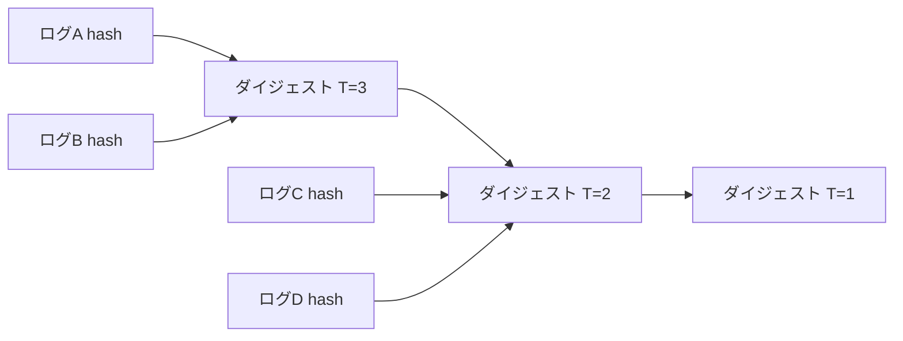
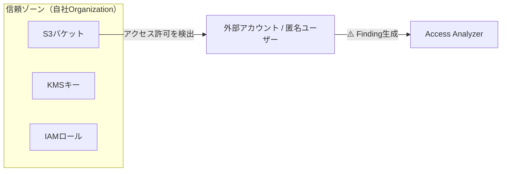
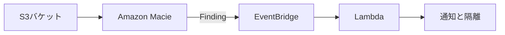
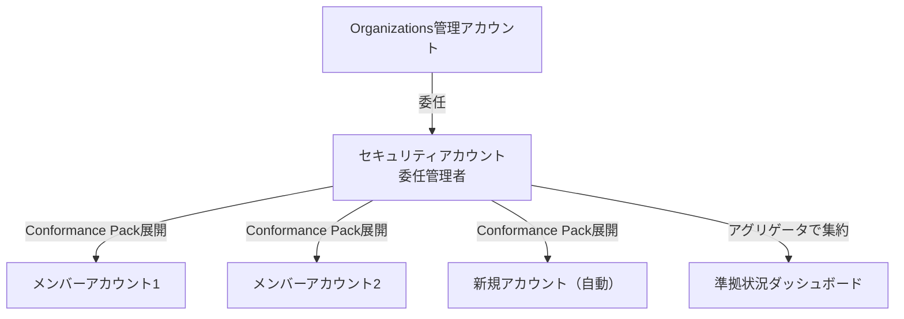
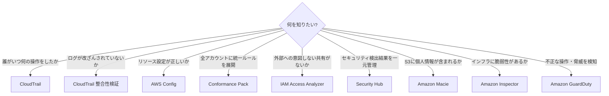

# テーマ3: セキュリティ監査

> 🟡 所要日数: 2日 | 座学 → 問題演習

---

## 座学

## Part 1: CloudTrailログはなぜ「信頼できない」のか

SAAでCloudTrailを学んだとき、「誰がいつ何のAPIを呼んだかを記録するサービス」として理解したはずです。しかし、SAPで問われるのはその先です。「そのログ自体が改ざんされていたら？」という問いです。

セキュリティインシデントが起きたとき、攻撃者はCloudTrailのログを書き換えて証拠を隠滅しようとするかもしれません。あるいは内部の管理者が不正を隠すためにS3のログファイルを削除・改変するかもしれない。ログを記録しているだけでは、そのログが「本物である」ことを証明できません。

**CloudTrail整合性検証（Log File Integrity Validation）**はこの問題を解決します。CloudTrailは1時間ごとに**ダイジェストファイル**を生成し、その時間帯の各ログファイルのSHA-256ハッシュ値を記録します。ダイジェストファイル自体もハッシュで署名され、さらに前のダイジェストファイルへの参照を持つ**チェーン構造**になっています。



ここで重要な区別があります。整合性検証は「**改ざんを検出する**」機能であり「**改ざんを防止する**」機能ではありません。改ざん防止にはS3のオブジェクトロック（WORM: Write Once Read Many）が必要です。「改ざんされたことを証明したい」なら整合性検証、「そもそも改ざんできなくしたい」ならオブジェクトロックという使い分けを覚えておいてください。

---

## Part 2: データイベント記録のコストを制御する詳細イベントセレクタ

SAAでCloudTrailのイベントタイプを学びました。管理イベント（CreateBucket、RunInstancesなどのコントロールプレーン操作）はデフォルトで記録されます。しかしS3のGetObject/PutObjectやLambdaのInvokeといった**データイベント**は、デフォルトでは記録されません。なぜかというと、大規模なシステムでは1日数百万回のS3アクセスが発生し、全て記録するとコストが爆発するからです。

基本イベントセレクタでデータイベントを有効化すると「S3の全バケット全オブジェクト」という粗い単位でしか制御できません。そこでSAPで問われるのが**詳細イベントセレクタ（Advanced Event Selectors）**です。フィールド単位の条件指定ができるため、「特定のバケットだけ記録する」「ログ保存先バケットへの書き込みは除外する（無限ループ防止）」「読み取りだけ記録する」といった細かい制御が可能になります。

```json
{
  "FieldSelectors": [
    { "Field": "eventCategory", "Equals": ["Data"] },
    { "Field": "resources.type", "Equals": ["AWS::S3::Object"] },
    { "Field": "resources.ARN", "NotStartsWith": ["arn:aws:s3:::my-log-bucket/"] }
  ]
}
```

この設定は「S3データイベントを記録するが、ログ保存バケットへのアクセスは除外する」という意味です。またCloudTrailには**インサイトイベント**という第3のタイプもあります。通常とは異なるAPIコールのパターン（突然の大量DeleteObjectなど）を自動検出するもので、異常検知に使います。

---

## Part 3: IAM Access Analyzer — 意図しない「穴」を可視化する

AWSを使っていると、気づかないうちにリソースが外部に公開されてしまうことがあります。S3バケットポリシーを設定するときに `Principal: "*"` を書いてしまった、KMSキーの信頼ポリシーで別アカウントへのアクセスを許可したまま忘れていた——こうした「意図しない外部共有」はセキュリティ事故の温床です。

**IAM Access Analyzer**はこの問題に対処するサービスです。SAAの講座ではほとんど扱われませんでしたが、SAPでは重要です。仕組みはシンプルで、**信頼ゾーン（Zone of Trust）**を定義し、その外部からアクセスできるリソースを継続的にスキャンして検出します。信頼ゾーンはアカウント単位（同一アカウント外へのアクセスを検出）またはOrganization単位（組織外へのアクセスを検出）で設定できます。



分析対象はS3バケット、IAMロールの信頼ポリシー、KMSキー、Lambda関数、SQSキュー、Secrets Managerシークレットです。見つかった外部共有は「Findings（検出結果）」として一覧表示され、意図的なものは「アーカイブ」して除外できます。IAM Policy Simulatorと混同しやすいですが、Policy Simulatorは「特定のIAMポリシーが何を許可するか」をテストするもので、継続的な外部共有検出はできません。

---

## Part 4: Security Hub — セキュリティ検出結果の司令塔

AWSにはGuardDuty、Inspector、Macie、Firewall Managerなど多くのセキュリティサービスがあります。それぞれが独自の「検出結果」を出力しますが、サービスごとにコンソールを開いて確認するのは非現実的です。マルチアカウント環境では尚更です。

**Amazon Security Hub**はこの問題を解決する「統合ダッシュボード」です。SAAの講座では1行しか説明されませんでしたが、SAPでは深く問われます。Security Hubの主な機能は2つです。

1つ目は**セキュリティ基準（Standards）に基づく自動チェック**です。CIS AWS Foundations Benchmark、AWS Foundational Security Best Practices、PCI DSSなどの基準を有効化すると、AWSリソースの設定がその基準に準拠しているかを自動で評価します。CIS Benchmarkでは「ルートアカウントのMFAが有効か」「CloudTrailが全リージョンで有効か」「セキュリティグループでSSHが0.0.0.0/0に開放されていないか」といった項目がチェックされます。

2つ目は**複数サービスの検出結果の集約**です。GuardDutyが脅威を検知、InspectorがEC2の脆弱性を発見、Macieが機密データを検出——これら全ての検出結果がSecurity Hubに集まり、一元的に管理できます。Organizations統合では、セキュリティアカウントをSecurity Hubの委任管理者に指定することで、全メンバーアカウントの状況を1か所で監視できます。

---

## Part 5: Macie と Inspector — 「何を守るか」で使い分ける

**Amazon Macie**と**Amazon Inspector**はどちらも「何かを検出する」サービスですが、守る対象が全く異なります。SAAでは各1行の説明でしたが、SAPではこの違いを正確に理解して使い分けることが問われます。

Macieが守るのは**データの中身**です。S3バケットに保存されているオブジェクトを機械学習でスキャンし、クレジットカード番号、マイナンバー、パスポート番号、メールアドレスなどの個人識別情報（PII）が含まれていないかを検出します。重要なのは、Macieは**S3専用**であり、EBSやRDSは対象外です。また、検出はしますが**自動でデータを削除・暗号化することはしません**。検出結果はEventBridgeに流し、Lambda関数で自動対応ワークフローを組む設計が典型的です。



Inspectorが守るのは**インフラの脆弱性**です。EC2インスタンス、ECRコンテナイメージ、Lambda関数の依存パッケージをCVE（共通脆弱性識別子）データベースと照合し、既知の脆弱性が含まれていないかをスキャンします。Inspector v2はSSM Agentと連携してエージェントレスでスキャンでき、新しいCVEが公開されると自動的に再スキャンします。「S3に個人情報が入っているか」→ Macie、「EC2のOSに脆弱性があるか」→ Inspector、という使い分けを軸に覚えてください。

---

## Part 6: AWS Config の深化 — Conformance Pack と委任管理者

SAAでAWS Configの基本は学びました。「リソースの設定変更履歴を記録し、Configルールで準拠状況を評価する」というものです。SAPではこれをマルチアカウント環境で使う設計が問われます。

**Conformance Pack**は複数のConfigルールと修復アクションをひとまとめにしたパッケージです。「このルールセットを適用すればHIPAA準拠」「このパッケージでCIS BenchmarkのConfig側の要件を満たせる」という形でAWSがサンプルを提供しており、YAMLテンプレートで定義されています。単一アカウントで使う場合はCloudFormationと同様にデプロイしますが、**組織レベルのConformance Pack**を使うと、Organizations管理下の全メンバーアカウントに一括展開でき、新規アカウントが追加された瞬間にも自動適用されます。



**委任管理者（Delegated Administrator）**はSAP頻出の設計パターンです。Organizations管理アカウントは強力な権限を持つため、日常的な操作での利用は最小限にすべきです。Config・Security Hub・GuardDuty・IAM Access Analyzerといったセキュリティサービスの管理権限を専用のセキュリティアカウントに委任することで、管理アカウントへのログインを極力減らしながらセキュリティ運用を実現します。

---

## Part 7: サービス間の使い分けを整理する



CloudTrailとAWS Configの違いは特に頻出です。CloudTrailは「**誰がいつ何をしたか**」の操作ログ（過去の行為の記録）、AWS Configは「**今の設定が正しいか・いつ変わったか**」の状態記録（現在と過去の設定のスナップショット）です。「S3バケットが暗号化されているか確認したい」はConfigの仕事、「S3バケットの暗号化設定を誰が変えたか確認したい」はCloudTrailの仕事です。

---

## 練習問題

### 問題1

ある大手医薬品メーカーは、新薬の治験データ管理システムをAWS上で運用しており、国内の医薬品規制当局（PMDA）および米国FDA（食品医薬品局）による定期査察を毎年受けています。FDA 21 CFR Part 11をはじめとする規制要件では、電子記録の改ざん不可能性と監査証跡の完全性が厳格に求められており、違反が認定された場合は新薬承認の取り消しや巨額の制裁金につながります。今年の査察では「過去1年間のAWS操作ログが一切改ざんされていないこと」の証明が求められる予定です。

CloudTrailを用いてAWS APIコールのログを収集し、専用のS3バケット（`pharma-audit-logs`）に保存しています。セキュリティ担当者はCloudTrailのログ記録自体は適切に設定されていることを確認していますが、「ログの記録」と「ログの信頼性の証明」は別の問題です。S3バケットの管理者権限を持つIAMユーザーがログファイルを書き換えたり、悪意ある内部関係者が対象ファイルを削除したりした場合、現在の構成ではそれを防ぐ手段も、事後に検出する手段もありません。

コンプライアンスチームは「改ざんを事後に検出できる仕組み」と「そもそも改ざんできなくする仕組み」の両方が必要だと判断しています。S3のバージョニングは「削除マーカーで隠蔽」が可能なため管理者による完全削除を防げないこと、バケットポリシーによるDeleteObject拒否もS3管理者がポリシーを変更できてしまうことが問題として挙げられています。

この要件を満たすために必要な設定の組み合わせとして最適なものはどれですか？

<details>
<summary>選択肢を見る</summary>

A. CloudTrailのログファイル整合性検証を有効化し、ログ保存先S3バケットにオブジェクトロック（コンプライアンスモード）を適用してWORMストレージとして構成する

B. CloudTrailのログファイル整合性検証を有効化し、S3バケットでバージョニングを有効化してオブジェクトの削除に削除マーカーが付くよう設定する

C. ログ保存先S3バケットにSSE-KMSによるサーバーサイド暗号化を設定し、バケットポリシーで `s3:DeleteObject` を全プリンシパルに対して明示的にDenyする

D. CloudTrailのインサイトイベントを有効化して異常なAPI操作パターンを自動検出し、EventBridgeとSNSで管理者に通知するアーキテクチャを構成する
</details>

<details>
<summary>正解と解説を見る</summary>

**正解: A**

整合性検証は「改ざんされたかどうかを検出」する機能であり、S3オブジェクトロック（コンプライアンスモード）は「ログファイル自体を削除・上書きから保護（WORM）」する機能です。この2つを組み合わせることで、「改ざん防止」と「改ざん検出」の両方が実現できます。

- B: バージョニングは削除マーカーを付けるだけで、実際のオブジェクトを完全に保護しない。S3管理者権限を持つユーザーは全バージョンを完全に削除できる
- C: 暗号化は転送中・保存中のデータ保護であり、ログの改ざん検出とは無関係。バケットポリシーもIAM管理者が変更できてしまう
- D: インサイトイベントは異常なAPIコールパターンの検出であり、ログファイルそのものの改ざん検出や防止とは関係ない
</details>

---

### 問題2

ある動画配信スタートアップは、月間アクティブユーザー数500万人のUGC（ユーザー生成コンテンツ）プラットフォームを運用しています。ユーザーが投稿した動画ファイルはS3バケット（`ugc-videos`）に保存されており、1日あたり数十万件のPutObject・GetObject操作が発生しています。著作権侵害対応や不正アップロードへの法的対処のため、セキュリティチームはS3データイベントのCloudTrail記録を有効化し、全オブジェクト操作の監査ログを取ることを義務付けました。

しかしログを有効化した翌月、AWSの請求額がCloudTrailのデータイベント記録費用だけで従来の3倍に膨れ上がりました。コスト分析を行ったところ、CloudTrailがログファイルをS3バケット（`cloudtrail-logs`）に書き込む際にも、その書き込みイベント自体がデータイベントとして記録されてしまい、再帰的にログが増大していることが判明しました。つまり「ログのログのログ」という無限連鎖に近い状態が発生しており、実際のユーザー操作ログに対して無意味なログが大量に混入していたのです。

セキュリティチームは「ユーザーデータバケット（`ugc-videos`）のS3操作ログは継続して記録しつつ、ログ保存バケット（`cloudtrail-logs`）へのCloudTrail書き込みイベントは記録対象から除外する」という方針を固めました。データイベントの記録を全面停止することはセキュリティポリシー上不可能であり、S3サーバーアクセスログへの切り替えは情報の詳細度と他サービスとの統合性において劣ると判断されました。

コストを削減しつつ、ユーザーデータのS3操作を記録し続ける方法として最適なものはどれですか？

<details>
<summary>選択肢を見る</summary>

A. CloudTrailのS3データイベント記録を完全に無効化し、管理イベント（バケット作成・削除等のコントロールプレーン操作）のみの記録に変更する

B. CloudTrailのログ配信先をS3からCloudWatch Logsに変更し、S3へのオブジェクト書き込みが発生しない構成にすることでデータイベントの連鎖を断ち切る

C. CloudTrailのイベントフィルタリング設定を、フィールド単位で細かい条件指定が可能な設定に切り替え、ログ保存先バケットへの書き込みイベントを `NotStartsWith` 条件で記録対象から除外する

D. CloudTrailのデータイベント記録をAWSネイティブのS3サーバーアクセスログに切り替え、より低コストでS3への全アクセスを記録する
</details>

<details>
<summary>正解と解説を見る</summary>

**正解: C**

詳細イベントセレクタの `NotStartsWith` 条件でCloudTrailログ保存用バケットのARNを除外すれば、ログバケットへの書き込みイベントが記録されなくなり、コストが大幅に削減されます。ユーザーデータバケットのイベントは引き続き記録されます。

- A: S3データイベントの記録を停止するとコンプライアンス要件（ユーザーコンテンツへのアクセス記録）を満たせなくなる
- B: CloudWatch Logsに送信してもCloudTrailのS3配信自体は継続されるため根本的な解決にならない。またCloudWatch Logsのコストが発生する
- D: S3サーバーアクセスログはCloudTrailと比べて詳細な情報（リクエストパラメータ、IAMユーザー情報等）が欠如しており、他のAWSサービスとの統合も限定的
</details>

---

### 問題3

ある国内大手コンサルティング企業は、50のクライアント案件を独立したAWSアカウントで管理しており、AWS Organizationsで一元統制しています。各プロジェクトチームは独立したAWSアカウント内でS3バケット・IAMロール・KMSキー・Lambda関数などを設定・変更する権限を持っています。業務の性質上、クライアントの機密情報や非公開の分析データがS3に保存されており、それが外部アカウントに誤って公開された場合、重大な情報漏洩インシデントとなりクライアントとの信頼関係が失われます。

セキュリティチームが懸念しているのは「設定ミスによる意図しない外部共有」です。例えばプロジェクトメンバーがS3バケットポリシーに `Principal: "*"` を設定したまま気づかずにいる、あるいはIAMロールの信頼ポリシーに誤って別の外部アカウントIDを入力してしまう、といったヒューマンエラーが実際に何度か発生しています。現在は月次のセキュリティレビューで手動チェックしていますが、50アカウントを人手で確認するのは限界に達しています。

セキュリティチームが求めているのは「Organization外部のアカウントや匿名ユーザーへのアクセスを許可しているリソースを、リアルタイムまたはほぼリアルタイムで自動検出できる仕組み」です。AWS Configルールも検討しましたが、`Principal: "*"` のS3バケットポリシー検出は可能でも、特定の外部アカウントIDへのIAMロール信頼ポリシーの共有や、KMSキーの外部共有までは一括でカバーできません。Amazon Macieはデータの中身の分析であり、リソース設定の外部公開とは別の問題です。

この要件を最も効率的に実現する方法はどれですか？

<details>
<summary>選択肢を見る</summary>

A. 各アカウントにAWS Configのマネージドルールを展開し、S3バケットポリシーに `Principal: "*"` が含まれるリソースを定期的に評価してコンプライアンスレポートを生成する

B. Amazon Macieを全アカウントで有効化し、外部に公開されている可能性のあるS3バケットをスキャンして機密データの漏洩リスクを検出する

C. Security HubのAWS Foundational Security Best Practicesを全アカウントで有効化し、S3バケットのパブリックアクセス設定に関するチェック項目を継続監視する

D. リソースポリシーを継続的に分析し、組織外のアカウントや匿名ユーザーへのアクセスを許可している設定を自動検出するサービスを、信頼ゾーンを組織全体に設定して有効化する
</details>

<details>
<summary>正解と解説を見る</summary>

**正解: D**

IAM Access Analyzerを組織レベルで有効化すると、信頼ゾーンをOrganization全体に設定できます。これにより、Organization外のアカウントやサービスにアクセスを許可しているS3バケット、IAMロール、KMSキー等を継続的に自動検出します。

- A: Configルールでは `Principal: "*"` の検出はできるが、特定の外部アカウントIDへの共有は検出しにくく、IAMロールの信頼ポリシーやKMSキーポリシーまでは網羅できない
- B: Macieはデータの中身（機密データ）を検出するサービスであり、リソースポリシーの外部共有設定の検出とは異なる
- C: CIS BenchmarkはS3のパブリックアクセスブロック設定をチェックするが、特定の外部アカウントIDへの意図的な共有は検出範囲外
</details>

---

### 問題4

ある損害保険会社は、個人向け自動車保険・火災保険・医療保険のシステムをAWS上で運用しており、AWS Organizationsで全国の事業部門に対応する20のAWSアカウントを管理しています。昨年、金融庁によるモニタリングの中で「クラウド環境のセキュリティ設定に関する内部統制が不十分」との指摘を受け、今期中に全AWSアカウントにわたるセキュリティ基準の統一適用と、準拠状況の継続的なモニタリング体制の構築が求められています。

コンプライアンスチームが策定したセキュリティ基準の最低要件は以下の3点です：S3バケットにサーバーサイド暗号化が設定されていること、セキュリティグループでSSH（ポート22）がインターネット全体（0.0.0.0/0）に開放されていないこと、EBSボリュームが暗号化されていること。さらに、非準拠のリソースが検出された場合は人手を介さず自動的に修復される仕組みが必要です。来期には新規事業のためのAWSアカウントが3〜5件追加される予定であり、それらにも同じ基準が自動適用されることが必須要件となっています。

各アカウントに個別にAWS Configルールと修復アクションを手動設定する方式は、既存20アカウント分の初期設定工数だけで数週間かかる見積もりとなり、また新規アカウントへの適用漏れリスクも排除できないとして却下されました。Security HubのAWS Foundational Security Best Practicesも検討しましたが、Security Hubには自動修復機能が組み込まれておらず、EventBridgeとLambdaを組み合わせた追加構築が必要になるため、よりシンプルな方式が求められています。

この要件を最も効率的に実現する方法はどれですか？

<details>
<summary>選択肢を見る</summary>

A. 各アカウントに個別にAWS Configルールと修復アクションを手動設定する

B. セキュリティ基準に対応する複数のConfigルールと修復アクションを1つのテンプレートにまとめ、Organizations全体に一括展開する。管理アカウントへのアクセスを最小化するため、専用のセキュリティアカウントに組織レベルの管理権限を委任する

C. Security HubのAWS Foundational Security Best Practicesを全アカウントで有効化し、自動修復を設定する

D. CloudFormation StackSetsで各アカウントにConfigルールをデプロイする
</details>

<details>
<summary>正解と解説を見る</summary>

**正解: B**

組織レベルのConformance Packを使えば、複数のConfigルールと修復アクションをパッケージとして全メンバーアカウントに一括展開できます。委任管理者を設定することで、管理アカウントへのアクセスを最小限に抑えつつ、セキュリティアカウントから管理できます。新規アカウント追加時も自動適用されます。

- A: 手動設定はスケールしない。新規アカウントにも手動対応が必要
- C: Security Hubはコンプライアンスチェックは行うが、自動修復機能は組み込まれていない。EventBridgeとの連携で構築可能だが、Conformance Packほど直接的ではない
- D: StackSetsも有効だが、Configルール+修復アクションのパッケージ管理にはConformance Packの方が適している。StackSetsはConfig以外のリソースデプロイに適する
</details>

---

### 問題5

ある人材派遣会社は、全国50拠点で約10万人の派遣社員を管理しており、AWS上の複数のS3バケットに派遣社員のプロフィールデータ、就業履歴、給与明細データ、さらにはマイナンバーを含む各種書類のPDFやCSVファイルが分散して保存されています。長年の事業拡大の中でデータ管理が属人化しており、どのバケットにどのような個人情報が含まれているか全社的に把握できていない状況でした。

2024年の個人情報保護法改正により、個人データの取り扱い状況を把握・管理する「個人情報管理台帳」の整備が法的に義務付けられたことを受け、情報システム部門は全S3バケットの個人情報保有状況を棚卸しするプロジェクトを立ち上げました。棚卸し対象には氏名・住所・電話番号・メールアドレスなどの基本的なPIIに加え、マイナンバー・健康保険番号・銀行口座番号といった要配慮個人情報も含まれます。対象バケット数は20以上、オブジェクト数は数十万件に上ります。

手作業でのファイル内容確認は非現実的であり、また各バケットのオブジェクト一覧を取得できるS3インベントリ機能を試したものの、ファイル名・サイズ・暗号化状態などのメタデータは取得できてもファイルの中身は分析できないことが確認されました。AWS Configはリソースの設定状態を評価するサービスであり、S3オブジェクトの内容を解析する機能は持っていません。Amazon Inspectorはインフラの脆弱性スキャンが対象であり、S3内のデータ内容分析は対象外です。

この要件を最も効率的に実現する方法はどれですか？

<details>
<summary>選択肢を見る</summary>

A. Amazon S3インベントリを有効化し、全バケットのオブジェクトのメタデータ（サイズ・暗号化状態・ストレージクラス等）一覧をCSVで出力する

B. AWS Configカスタムルールを作成し、各S3バケットに付与された `contains-pii` タグの有無を評価してコンプライアンス状況を可視化する

C. 機械学習とパターンマッチングを用いてS3バケット内のオブジェクトを自動スキャンし、氏名・マイナンバー・金融口座番号などの個人識別情報が含まれるファイルとその保存場所を特定するAWSサービスを使用する

D. Amazon InspectorをEC2インスタンスおよびLambda関数に対して実行し、S3に接続するアプリケーションの依存パッケージ脆弱性と設定ミスを評価する
</details>

<details>
<summary>正解と解説を見る</summary>

**正解: C**

Amazon Macieは機械学習とパターンマッチングを使い、S3バケット内のデータを自動スキャンして個人識別情報（PII）を検出します。氏名、住所、電話番号、マイナンバーなどの機密データパターンを検出し、どのバケットにどのような機密データが含まれているかをレポートできます。

- A: S3インベントリはオブジェクトのメタデータ（サイズ、暗号化状態等）は提供するが、データの中身（個人情報が含まれるかどうか）は分析しない
- B: タグベースの管理は手動であり、実際のデータ内容と一致している保証がなく、問題文の要件（全バケットの個人情報保有状況の棚卸し）を達成できない
- D: InspectorはEC2・ECR・Lambdaのソフトウェア脆弱性スキャンが対象であり、S3バケット内のデータ内容分析は行わない
</details>

---

### 問題6

ある自動車部品メーカーは、AWS Organizationsを使って国内の製造・販売・物流・IT部門にまたがる15のAWSアカウントを管理しています。これまでOrganizations管理アカウントでSecurity Hub、GuardDuty、AWS Configの設定・管理操作を行っていましたが、管理アカウントには組織構造の変更やSCPの適用・除外といった強力な権限が集中しているため、日常的に多数のメンバーがログインしている状況がセキュリティ上のリスクとして認識されていました。

セキュリティ監査チームが第三者による年次審査を受けた結果、「管理アカウントへの直接アクセスが過剰であり、最小権限の原則が守られていない」と指摘されました。具体的な改善要求は「Security Hub・GuardDuty・AWS Configの日常的な管理・監視操作を、管理アカウントとは別の専用セキュリティアカウントから実施できるようにすること」です。セキュリティチームは今後、管理アカウントへのアクセスを組織構造変更やSCP操作などの最高レベルの操作に限定し、ログイン頻度を大幅に下げる方針を掲げています。

検討された代替案のうち、管理アカウントにセキュリティ監査チーム用IAMロールを作成して最小権限を付与する案は「そもそも管理アカウントへのログイン自体を減らす」という目標を達成できないとして却下されました。CloudFormation StackSetsで設定をデプロイする案は初期展開には有効ですが、継続的なモニタリング・管理の委任とは異なります。AWS Control Towerの導入も有力案でしたが、既存の15アカウント環境への後付け導入は大規模な設定変更を伴うため、短期間での実現が困難と判断されました。

この要件を実現する最適な方法はどれですか？

<details>
<summary>選択肢を見る</summary>

A. Organizations管理アカウントに、Security Hub・GuardDuty・AWS Config専用の最小権限IAMロールを作成し、セキュリティ監査チームにそのロールを付与することで管理アカウントへの操作を制限する

B. AWS Control Towerを導入し、既存15アカウントをControl Towerの管理下に移行した上で、Control TowerのAuditアカウントからセキュリティサービスを一元管理する

C. CloudFormation StackSetsを管理アカウントから実行し、各アカウントのSecurity Hub・GuardDuty・AWS Configの設定を自動デプロイ・更新する

D. 専用のセキュリティアカウントをOrganizationsに登録し、Security Hub・GuardDuty・AWS Configの組織レベル管理権限をそのアカウントに委任することで、管理アカウントへのログインなしに日常的なセキュリティ監視・管理を実施できるようにする
</details>

<details>
<summary>正解と解説を見る</summary>

**正解: D**

Organizations の委任管理者（Delegated Administrator）機能を使えば、管理アカウント以外のアカウントにSecurity Hub、GuardDuty、AWS Config等の組織レベル管理権限を委任できます。これにより、管理アカウントへの直接アクセスを最小化できます。

- A: 管理アカウントに最小権限IAMロールを作成しても、管理アカウントへのログイン自体を減らすという要件を満たさない
- B: Control Towerは有効だが、問題文で「既存環境への後付け導入は短期間での実現が困難」として既に却下されている
- C: StackSetsは設定のデプロイ・更新には有効だが、継続的なモニタリングや管理権限の委任とは異なる
</details>
