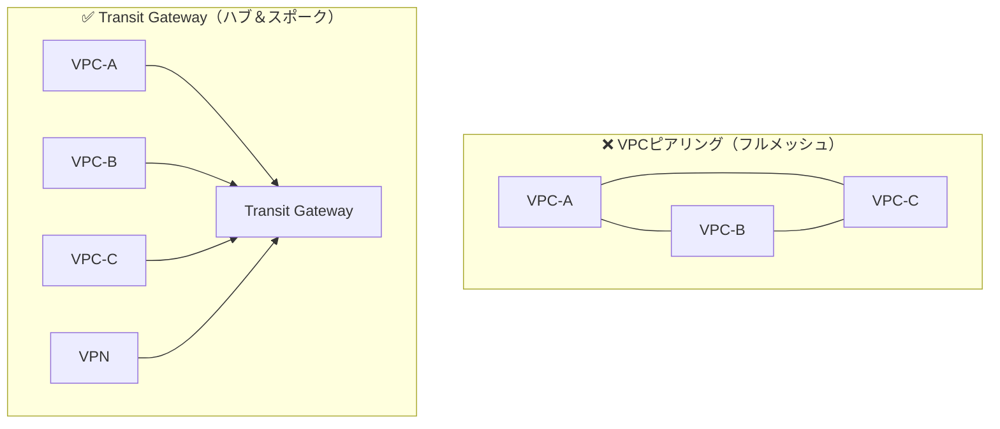
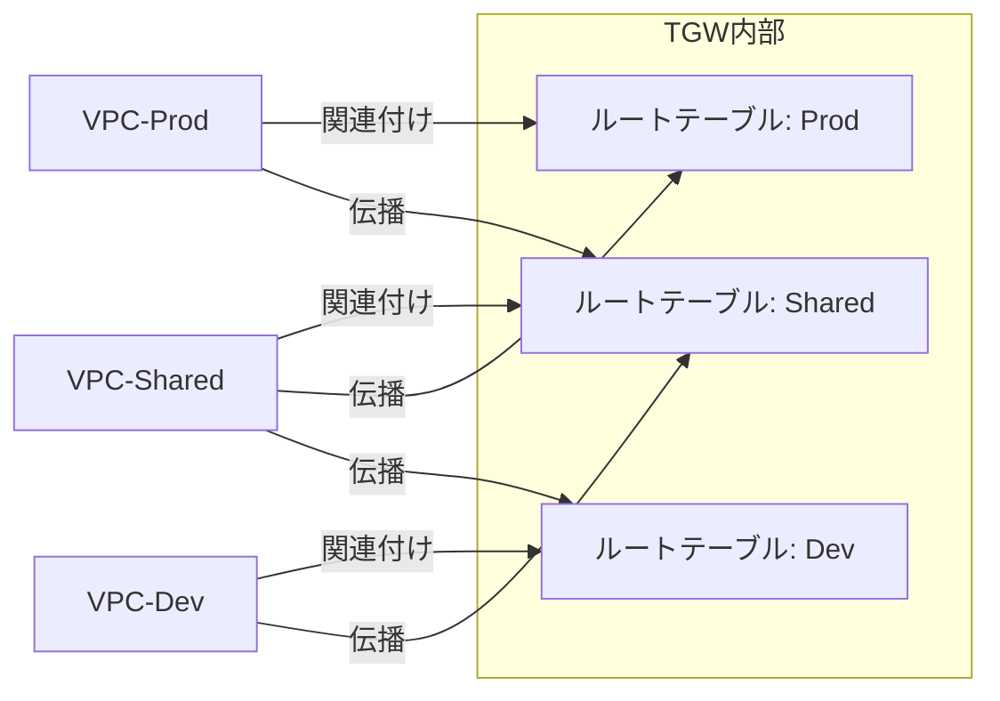
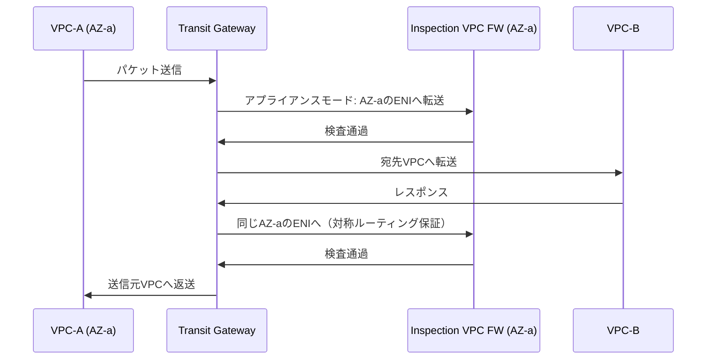
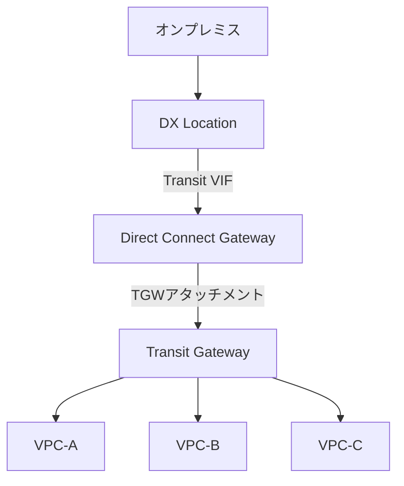
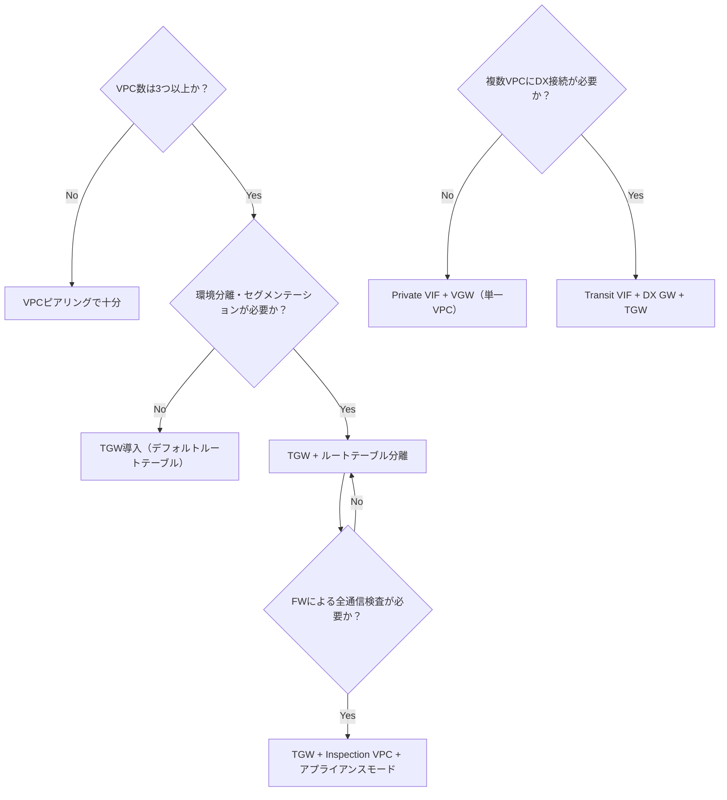

# テーマ4: Transit Gateway

> 🔴 所要日数: 3-4日 | 座学 → ハンズオン → 問題演習

---

## 座学

## Part 1: VPCピアリングの限界とTransit Gatewayの登場

SAAでVPCピアリングを学んだときは「2つのVPCをプライベートに接続する方法」として理解したはずです。2〜3個のVPCであれば問題ないのですが、企業規模が大きくなると深刻な問題が起きます。

VPCが10個あるとき、全VPC間で通信させようとすると何本のピアリング接続が必要でしょうか。答えは $\frac{n(n-1)}{2} = \frac{10×9}{2} = 45$ 本です。20個になると190本、50個になると1,225本。毎回VPCを追加するたびに既存の全VPCとのピアリングを手動で張り直す必要があります。これを「フルメッシュ問題」と呼びます。

さらに、VPCピアリングには**推移的ルーティング（Transitive Routing）ができない**という根本的な制約があります。VPC-AとVPC-Bがピアリングしており、VPC-BとVPC-Cがピアリングしているとしても、VPC-AからVPC-Cへのトラフィックはルーティングされません。VPC-AはVPC-Bとは直接通信できますが、VPC-Bを「経由して」VPC-Cには行けないのです。オンプレミスとVPCをVPNで接続し、VPNのあるVPCを他のVPCと共有したい——という一般的な要件がVPCピアリングでは実現できません。

**AWS Transit Gateway（TGW）**はこれらの問題を根本から解決するために設計されたサービスです。TGWは**ハブ（Hub）**として機能し、全てのVPC・VPN・Direct Connectが**スポーク（Spoke）**としてこのハブに接続します。VPC同士は直接接続せず、全ての通信がTGWを経由します。VPCを追加するときはTGWへの接続を1本増やすだけで済みます。

TGWはリージョナルサービスです。同一リージョン内のVPCを接続するのが基本ですが、後述するTGWピアリングでリージョンをまたいだ接続も可能です。また、VPCやVPN・DXとの接続は**アタッチメント（Attachment）**という単位で管理します。

---

## Part 2: ルートテーブル分離によるネットワークセグメンテーション

TGWが単純なハブだとすると、全アタッチメントが相互に通信できてしまいます。しかし実際の企業では「本番環境と開発環境は通信させてはいけない」「セキュリティ監査VPCからは全環境に届くが、開発環境からセキュリティVPCへは届かない」といった要件があります。

TGWはこれを**TGWルートテーブル**で実現します。TGWのルートテーブルは**VPC側のルートテーブルとは全く別物**です。TGW内部のルーティング判断に使うものであり、「このアタッチメントから入ってきたパケットを、どのルートテーブルで処理するか」を決めます。

各アタッチメントには2つの設定があります。

**関連付け（Association）**: そのアタッチメントからの通信が「どのルートテーブルを参照するか」です。1つのアタッチメントは1つのルートテーブルにのみ関連付けられます。

**伝播（Propagation）**: そのアタッチメントのCIDRを「どのルートテーブルに広告するか」です。1つのアタッチメントのルートを複数のルートテーブルに伝播できます。

この構成で何が起きるかを追ってみましょう。VPC-ProdのルートテーブルにはVPC-Sharedの経路のみがあります。VPC-DevへのCIDRはVPC-Prodのルートテーブルに存在しないため、VPC-ProdからVPC-Devへのパケットは**TGW内で経路なし（ブラックホール）**となります。逆もしかりです。一方、VPC-SharedのルートテーブルにはProdもDevも伝播されているため、Shared→Prod、Shared→Devは両方通信できます。これが**ルートテーブル分離によるセグメンテーション**です。

一つ注意が必要です。TGWのルートテーブルを設定しても、**VPC側のルートテーブルにTGW向けのルートがないと通信できません**。TGW側で「VPC-AへのCIDRはアタッチメントAに転送」と設定していても、VPC-Bのルートテーブルに「VPC-AのCIDRはTGW経由」という設定がなければ、VPC-Bからのパケットがそもそもに届きません。TGWの設定をしても通信できない場合は、VPC側のルートテーブルの設定漏れを疑ってください。

---

## Part 3: ハブ&スポーク設計パターン — Inspection VPCとアプライアンスモード

企業のセキュリティ要件として「全VPC間の通信をファイアウォールで検査したい」というものがあります。これを実現するパターンが**Inspection VPC（検査VPC）**です。

考え方はシンプルです。TGWのルートテーブルを操作して、VPC-AからVPC-Bへのトラフィックを直接転送するのではなく、一度Inspection VPCを経由させます。Inspection VPC内にAWS Network FirewallやサードパーティのFWアプライアンスを配置し、そこでパケットを検査・フィルタリングしてから宛先VPCへ転送します。

ここで**アプライアンスモード（Appliance Mode）**が重要になります。デフォルトのTGWは、同じフロー（同じ送信元・宛先・ポートの組み合わせ）であっても、Availability Zoneによってルーティングが変わることがあります。たとえばVPC-AのAZ-aからInspection VPCへ入ったパケットが、戻りのとき（レスポンス）はAZ-bのパスを通ることがあります。ステートフルなファイアウォールはフローの往復を同じパスで処理しないと動作しません。行きのパケットと戻りのパケットが別のFWインスタンスを通ると、セッションテーブルが一致せず通信が切れます。

アプライアンスモードを有効にすると、TGWは**同一フローの行きと戻りが必ず同じAZのENIを経由するよう対称ルーティングを保証**します。これによりステートフルFWが正しく動作します。

アプライアンスモードはTGWの**アタッチメント単位**で設定します。全アタッチメントに適用するのではなく、Inspection VPCへのアタッチメントのみに有効化します。

---

## Part 4: クロスリージョン・クロスアカウント接続

### TGWピアリング（リージョン間接続）

東京リージョンと大阪リージョンにそれぞれTGWがある場合、それらを**TGWピアリング**で接続できます。各TGWは引き続き自分のリージョンのVPCのハブとして機能しながら、リージョン間でもパケットを転送できるようになります。

TGWピアリングの最重要注意点は**ルート伝播が機能しない**ことです。通常のアタッチメント（VPCやVPN）はTGWルートテーブルにCIDRを自動伝播できますが、ピアリングアタッチメントはこれができません。対向リージョンのVPC CIDRへの経路は**静的ルートとして手動で追加**する必要があります。「TGWピアリングを設定したのに通信できない」の原因はほぼこれです。

### TGW共有（AWS RAM）

同一リージョン内でも複数アカウントにまたがる構成では、TGWを共有して使います。**AWS Resource Access Manager（RAM）**でTGWを他のAWSアカウントに共有すると、共有された側のアカウントは自分のVPCをそのTGWにアタッチできます。

これにより、各アカウントが自分のTGWを持つのではなく、1つのTGWを組織全体で共有できます。ネットワークチームが一元的にTGWを管理し、各アカウントのVPCはそこにアタッチするだけという運用が可能になります。

RAM共有とTGWピアリングの使い分けを混同しないようにしてください。

| 用途 | 方法 | ルート伝播 |
|------|------|-----------|
| 同一リージョン・複数アカウントのVPC接続 | TGW共有（RAM） | 自動伝播可能 |
| 異なるリージョン間のTGW接続 | TGWピアリング | 静的ルートのみ |

---

## Part 5: オンプレミス接続 — Direct Connect + TGW

SAAでDirect Connectを学んだとき、「オンプレミスからVPCへの専用線接続」として理解したはずです。ここで重要なのが、Direct Connectと複数VPCを接続する際の**VIF（Virtual Interface）の種類**です。

**Private VIF + VGW（Virtual Private Gateway）**の構成では、1つのVGWが1つのVPCに対応します。5つのVPCに接続したければ5つのVGWと5つのPrivate VIFが必要です。1つのDirect Connect接続が持てるVIFの数には上限があるため、VPC数が増えるとスケールしません。

**Transit VIF + Direct Connect Gateway + TGW**の構成はこれを解決します。

3つの要素の役割を整理します。

**Direct Connect Gateway**はグローバルリソース（リージョンに依存しない）で、オンプレミスとAWSをつなぐ橋渡し役です。1つのDX Gatewayに複数のTGW（異なるリージョン）を関連付けられます。

**Transit VIF**はDirect Connect接続上の仮想インターフェースで、DX GatewayへのBGPセッションを張ります。Private VIFがVGW行きなのに対し、Transit VIFはDX Gateway行きです。

**Transit Gateway**はリージョナルリソースで、DX Gateway経由で届いたオンプレミスのトラフィックを各VPCに振り分けます。VPC数が増えてもTGWに追加アタッチするだけでオンプレミスからアクセスできます。

冗長化も重要です。DX接続自体の冗長化は「異なるDXロケーションから2本の専用線」が最も堅牢です。ただしコストが2倍になるため、コスト優先なら「DX + Site-to-Site VPN」の組み合わせが現実的です。平常時はDX（BGPのプリファレンスが高い）が使われ、DX障害時にVPNにフェイルオーバーします。VPNはDXより帯域・遅延の面で劣りますが、バックアップとして十分機能します。

---

## Part 6: サービス選択の判断基準まとめ

試験で特に狙われるポイントを整理しておきます。

- **VPCピアリングで推移的ルーティング** → 不可。TGWが必要
- **TGWピアリングでルート自動伝播** → 不可。静的ルートのみ
- **ステートフルFWが正しく動かない** → アプライアンスモードを確認
- **TGW設定済みなのに通信できない** → VPC側ルートテーブルの設定漏れを確認
- **RAM共有 vs TGWピアリング** → 同一リージョンのクロスアカウントならRAM、リージョン間ならピアリング
- **複数VPCにDX接続** → Transit VIF + DX Gateway + TGW（Private VIFではスケールしない）

---

## ハンズオン

### 目標
3つのVPCを作成し、Transit Gatewayで接続。ルートテーブル分離で「本番→開発の通信が遮断」「本番/開発→共有VPCは通信可能」を体験する。

### 前提条件
- TGW料金が発生（約$0.05/時間/アタッチメント）。短時間で完了し、すぐクリーンアップすること

### 手順概要

1. **VPCを3つ作成**: VPC-Prod（10.1.0.0/16）、VPC-Dev（10.2.0.0/16）、VPC-Shared（10.3.0.0/16）。各VPCにサブネットを1つ作成。

2. **Transit Gatewayを作成**: デフォルトルートテーブルの関連付け・伝播を**無効**にして作成（手動制御のため）。

3. **TGWアタッチメントを3つ作成**: 各VPCに対してVPCタイプのアタッチメントを作成。

4. **TGWルートテーブルを3つ作成して設定**:
   - RT-Prod: VPC-Prodを関連付け、VPC-Sharedのみ伝播
   - RT-Dev: VPC-Devを関連付け、VPC-Sharedのみ伝播
   - RT-Shared: VPC-Sharedを関連付け、VPC-ProdとVPC-Dev両方を伝播

5. **各VPCのルートテーブルにTGW向けルートを追加**:
   - VPC-Prod/Dev: 10.3.0.0/16 → TGW
   - VPC-Shared: 10.1.0.0/16 → TGW、10.2.0.0/16 → TGW

6. **動作確認**（各VPCにEC2を配置してpingで確認）:
   - VPC-Prod → VPC-Shared: 成功 ✅
   - VPC-Dev → VPC-Shared: 成功 ✅
   - VPC-Prod → VPC-Dev: 失敗 ✅（ルートテーブル分離が機能）

7. **クリーンアップ**: EC2 → アタッチメント → ルートテーブル → TGW → VPCの順に削除。

---

## 練習問題

### 問題1

ある大手小売企業では、本番環境（6 VPC）、ステージング環境（4 VPC）、開発環境（5 VPC）の計15 VPCをAWS上で運用しています。これまでVPCピアリングで必要なVPCを接続していましたが、VPCの追加ごとに接続数が増え、新メンバーがルーティングを把握できない状態になっています。

経営から「本番環境と開発環境のVPC間の通信を完全に遮断し、一方で3つの環境が共通で使うセキュリティログ集約VPC（10.99.0.0/16）には全環境からアクセスできるようにしてほしい」という要件が出ました。

ネットワークチームが調査したところ、セキュリティポリシー上、SCPによるネットワーク設定の制御は認められていないことが判明しました。また、NACLによる制御は各環境のCIDRが頻繁に再割り当てされるためメンテナンスが困難だと判断されました。

この要件を最小の運用負荷で実現する構成として最も適切なものはどれですか？

選択肢を見る

A. ハブ型ネットワーク接続サービスを導入し、環境ごとに独立したルーティングドメインを3つ作成する。各ドメインには自環境VPCのCIDRと共有ログVPCのCIDRのみを伝播させ、環境をまたいだ経路を排除する

B. VPCピアリングを維持したまま各VPCのセキュリティグループで送信元CIDRを制限し、環境間のインバウンドを全ポート拒否するルールを追加する

C. 環境ごとに別々のAWSアカウントに分離し、Resource Access Managerで共有ログVPCのリソースのみを全アカウントに共有する

D. 全15 VPCからのトラフィックをNetwork Firewall配置済みの集中検査VPCに集め、環境間のフローを全て拒否するルールをFW側で定義する

正解と解説を見る

**正解: A**

Transit Gatewayのルートテーブル分離が正解の構成です。「本番用RT・ステージング用RT・開発用RT」の3つを作成し、それぞれに自環境のVPCを関連付け、共有ログVPCのCIDRのみを伝播させます。本番RTに開発VPCのCIDRが存在しないため、TGW内部でパケットは経路なし（ブラックホール）となり、ルーティングレベルで通信が遮断されます。

- B: セキュリティグループによる制御はVPC増加時に全VPCのルールを更新する必要があり運用負荷が増大します。またフルメッシュ管理の問題も解決されません
- C: アカウント分離は有効な手段ですが、既存VPCの移設は大きな工数が発生します。要件は「最小の運用負荷で実現」であり、選択肢Aの方が適切です
- D: FW経由の集中検査は高いセキュリティが得られますが、TGWのアプライアンスモード設定など複雑な構成が必要です。また単純に「通信遮断」するだけであればルートテーブル分離で十分で、FW検査コストも余分に発生します

---

### 問題2

あるグローバル金融機関では、東京リージョン（ap-northeast-1）とフランクフルトリージョン（eu-central-1）にそれぞれTransit Gatewayを導入し、TGWピアリングで接続しました。東京側のTGW（TGW-Tokyo）には東京リージョンの4つのVPC（10.1.0.0/16〜10.4.0.0/16）がアタッチされており、フランクフルト側のTGW（TGW-Frankfurt）にも3つのVPC（172.16.0.0/16〜172.18.0.0/16）がアタッチされています。

担当者はTGWピアリングのアタッチメントを作成し、両TGWで承認手続きを完了させました。さらに東京側TGWのルートテーブルのVPCアタッチメントから自動伝播を有効にし、フランクフルト側も同様に設定しました。しかし、東京のVPCからフランクフルトのVPCへのpingが全て失敗します。

ネットワークエンジニアがアタッチメントの状態を確認したところ、全アタッチメントは「Available」になっていました。VPC側のルートテーブルにも相手リージョンのCIDRへのTGW向けルートは追加済みです。

この問題の原因として最も可能性が高いものはどれですか？

選択肢を見る

A. TGWピアリングはクロスリージョン通信をサポートしていないため、Direct Connect Gatewayを経由した構成に変更する必要がある

B. VGW（Virtual Private Gateway）が各VPCに設定されていないため、リージョン間のルーティングが機能していない

C. リージョン間のTGW接続では経路の自動通知が機能しないため、両TGWのルートテーブルに対向リージョンのVPC CIDRを宛先、ピアリングアタッチメントをターゲットとする静的ルートを手動で追加する必要がある

D. フランクフルトリージョンのTGWがAWS Resource Access Managerで東京アカウントに共有されていないため、ピアリングのルーティングが確立できていない

正解と解説を見る

**正解: C**

TGWピアリングアタッチメントでは**ルート伝播（Route Propagation）が機能しません**。通常のVPCアタッチメントやVPNアタッチメントはTGWルートテーブルにCIDRを自動伝播できますが、ピアリングアタッチメントはこの機能をサポートしていません。対向リージョンのVPC CIDRへの経路は静的ルートとして手動で追加する必要があります。

問題文では「自動伝播を有効にした」と書かれていますが、これはVPCアタッチメント側の設定であり、ピアリングアタッチメントに対しては効果がありません。TGW-TokyoのルートテーブルにはフランクフルトのCIDR（172.16.0.0/16〜172.18.0.0/16）の静的ルートを、TGW-Frankfurtのルートテーブルには東京のCIDR（10.1.0.0/16〜10.4.0.0/16）の静的ルートをそれぞれ手動で追加する必要があります。

- A: TGWピアリングはクロスリージョン通信をサポートしています。Direct Connect Gatewayはオンプレミスとの接続に使用するものです
- B: VGWはSite-to-Site VPNやDirect Connect（Private VIF）とVPCを接続するコンポーネントです。TGWを使う場合にVGWは不要です
- D: AWS RAMはTGWを**同一リージョン内で別アカウントに共有**する際に使います。リージョン間のTGWピアリングにRAMは不要です

---

### 問題3

ある地方銀行では、東京リージョンのオンプレミスデータセンターとAWSをDirect Connect（1 Gbps）で接続しています。現在の構成はPrivate VIFとVGWを使って1つのVPC（VPC-Core: 10.0.0.0/16）にのみ接続しており、そこからオンプレミスのシステムとAWS上のコアバンキングアプリケーションが通信しています。

デジタル化推進計画の一環として、新たに6つのVPCを追加することになりました（勘定系・融資系・外為系・リスク管理・データ分析・BCP待機の各VPC）。オンプレミスからこれら全VPCにアクセスできるようにする必要があります。

セキュリティ部門から「既存のDirect Connect接続の物理回線は継続使用すること」「追加のDirect Connect回線契約は経営承認が必要なため今期の対応は難しい」という制約が示されました。また、ネットワーク担当から「VPCピアリングは推移的ルーティングをサポートしていないため、VPC-Coreを中継点とする構成は採用不可」との回答がありました。

この制約を踏まえ、最小のDirect Connect回線数でスケーラブルに全7 VPCへのオンプレミスアクセスを実現する構成はどれですか？

選択肢を見る

A. 既存のPrivate VIFはそのままにし、新たに6本のPrivate VIFを追加して各VPCにVGWを設定する

B. 既存のDirect Connect接続をVPC-Coreに維持したまま、6つの新規VPCをVPC-CoreとVPCピアリングで接続し、オンプレミスからのトラフィックをVPC-Core経由でルーティングする

C. 既存のDirect Connect接続を廃止し、Site-to-Site VPN接続を7本作成して各VPCに接続する

D. 既存のDirect Connect接続にTransit VIFを追加し、グローバルスコープで動作するゲートウェイサービス経由で、7つ全てのVPCを集約するハブ型ネットワーク接続サービスにルーティングする

正解と解説を見る

**正解: D**

「Transit VIF → Direct Connect Gateway → Transit Gateway → 各VPC」の構成です。1本のDirect Connect接続でTransit VIFを設定し、DX Gatewayを経由して、Transit GatewayにアタッチされたすべてのVPCへのオンプレミスアクセスを実現します。新規VPCを追加する場合もTGWにアタッチするだけで済みます。

- A: 7本のPrivate VIFを設定する構成ですが、Direct ConnectのVIFには1アカウントあたり上限があります（デフォルト50）。また、VPCごとに独立したBGPセッションを管理する運用負荷も大きく、スケーラブルではありません
- B: 問題文でネットワーク担当から「VPCピアリングは推移的ルーティングをサポートしていない」と明示されており、この方式は採用不可です
- C: VPNはDirect Connectと比べて帯域・遅延の安定性が低く、銀行の基幹系業務には適しません。また既存DX接続の廃止はコスト・信頼性両面でデメリットがあります

---

### 問題4

あるヘルスケアIT企業では、8つのVPCをTransit Gatewayで接続し、HIPAA準拠のために全VPC間の通信をAWS Network Firewallで検査することを義務付けられています。Inspection VPC（10.100.0.0/16）を作成してAWS Network Firewallを3つのAvailability Zoneに配置し、TGWのルートテーブルを設定してVPC間の通信が必ずInspection VPCを経由するように構成しました。

テスト環境で動作確認を行ったところ、Network FirewallのステートフルルールでBlockすべき通信が通過してしまっています。ステートレスルールは正常に動作しています。ログを調査したところ、VPC-AからVPC-Bへのリクエストパケットはfw-endpoint-az-aを通過しているが、VPC-BからVPC-Aへのレスポンスパケットは別のAZ（az-b）のfw-endpoint-az-bを通過していることが判明しました。

問題文中の構成はNetwork Firewallが各AZに正しく配置されており、TGWのルートテーブルもInspection VPCを経由するよう設定されています。

この問題を解決するために追加・変更すべき設定はどれですか？

選択肢を見る

A. Network Firewallのルールグループをステートレス専用に変更し、ステートフルなセッション追跡を無効化することでAZをまたいだ非対称フローを許容する

B. TGWのInspection VPCへのアタッチメントに、同一TCPフローの往復パケットが必ず同じAvailability ZoneのFWエンドポイントを経由するよう保証する設定を有効にする

C. Network FirewallのエンドポイントをAZ-aのみに集約し、全トラフィックを単一のAZで処理することで対称ルーティングを強制する

D. VPCフローログを有効化してパケットの非対称ルーティングを検出し、NACLでレスポンスパケットを正しいAZのENIに誘導するルールを追加する

正解と解説を見る

**正解: B**

**アプライアンスモード（Appliance Mode）**をTGWのアタッチメントに有効化します。これにより、同一フローの行きと戻りのパケットが必ず同じAZのENIを経由するよう対称ルーティングが保証されます。ステートフルなFWはフローのセッションテーブルを1つのインスタンスで管理するため、往復が同じパスを通ることが前提です。

- A: ステートフルルールを無効化するとHIPAA準拠要件（コネクション追跡に基づく高度なフィルタリング）を満たせなくなります。問題の「解決」ではなく「回避」であり、セキュリティ要件を損ないます
- C: AZを1か所に集約すると単一障害点になります。HIPAA準拠環境では可用性も要件であり、Multi-AZ構成を崩すことは適切ではありません
- D: VPCフローログは「検出」ツールであり、ルーティングの問題を解決しません。NACLで誘導することもできません（NACLはAZ内のサブネット単位のフィルタリングであり、TGW内のルーティングパスを変更する機能はありません）

---

### 問題5

あるクラウドマネージドセキュリティサービス会社では、東京リージョンに自社のセキュリティ管理VPC群（5 VPC）を持ち、顧客20社のAWSアカウントから自社のセキュリティサービスを利用してもらう構成を計画しています。顧客は各自のAWSアカウントにVPCを持っており、自社のセキュリティVPCとプライベートに通信する必要があります。

要件を整理すると、顧客VPCと自社セキュリティVPCは双方向で通信できる必要があります。一方、顧客間（顧客A社のVPCと顧客B社のVPCなど）は通信できてはいけません。コスト効率も考慮し、管理の一元化も求められています。

セキュリティ担当から「顧客アカウントへの経路情報の漏洩を防ぐこと」という追加要件が出ています。

この要件を満たす最適な構成はどれですか？

選択肢を見る

A. 自社アカウントのTransit Gatewayをリソース共有サービスで各顧客アカウントに共有し、顧客ごとに独立したルーティングテーブルを設定することで顧客間の経路伝播を遮断する

B. 各顧客アカウントに独立したTransit Gatewayを作成し、自社のTransit GatewayとTGWピアリングで接続することで顧客間通信を防ぐ

C. 自社VPCと各顧客VPCをVPCピアリングで1対1に接続し、顧客側のルートテーブルに他顧客VPCへの経路を追加しないことで顧客間通信を防ぐ

D. AWS PrivateLinkで自社のセキュリティサービスをエンドポイントサービスとして公開し、顧客VPCからVPCエンドポイントで接続する

正解と解説を見る

**正解: A**

AWS Resource Access Manager（RAM）でTGWを顧客アカウントに共有し、顧客ごとに個別のTGWルートテーブルを割り当てます。各顧客のルートテーブルには自社セキュリティVPCへの経路のみを伝播させ、他顧客のVPC CIDRは伝播させません。これにより顧客間の経路情報が漏れず、通信も遮断されます。管理も1つのTGWで一元化できます。

- B: 顧客ごとにTGWを作成してTGWピアリングすると、20個のTGWと20本のピアリングが必要になります。コスト（TGW時間課金 × 20 + ピアリング課金 × 20）が大幅に増加し、管理も複雑化します。RAMで共有する方が適切です
- C: VPCピアリングでは自社の5 VPC × 20顧客 = 最大100本のピアリングが必要です。スケーラビリティに欠け、管理負荷が高くなります
- D: AWS PrivateLinkは顧客から自社サービスへの**一方向**アクセスには有効ですが、双方向のプライベート通信には対応していません。セキュリティサービスが顧客VPCにアクセスする必要がある場合（エージェントへの接続など）には使えません

---

### 問題6

ある大手メディア企業では、東京リージョンのオンプレミス放送センターとAWS環境をDirect Connect（1 Gbps）で接続しています。Transit Gatewayを導入し、DX Gateway経由で6つのVPCへのオンプレミスアクセスを実現しています。

BCP（事業継続計画）の見直しにより、「Direct Connect接続が完全に失われた場合でも、オンプレミスからAWS環境へのアクセスを維持できること」という要件が新たに追加されました。セキュリティ部門からは「代替接続でもオンプレミスからAWS内のプライベートIPアドレスへの通信が維持できること」という条件もあります。

ネットワーク担当が調査したところ、予算委員会から「現在のDirect Connect接続と同等の帯域を持つ2本目の専用線追加は月額コストが2倍になるため今年度は承認できない」との回答がありました。また、同一のDXロケーションからの冗長化ではロケーション施設全体の障害に対応できないことも確認済みです。

コスト制約と要件を満たす最適なバックアップ構成はどれですか？

選択肢を見る

A. 既存のDirect Connect接続とは異なるDXロケーションから2本目の1 Gbps専用線を追加し、同一のDirect Connect Gatewayに接続してアクティブ/アクティブ構成にする

B. AWS Global Acceleratorを活用し、インターネット経由の通信をAWSネットワークバックボーンで最適化することでDirect Connect障害時の代替接続とする

C. 既存のTransit Gatewayにインターネット経由の暗号化トンネル接続を追加し、平常時はDirect Connect（BGPルートのプリファレンスで優先）、障害時は自動的に暗号化トンネル経由にフェイルオーバーする構成にする

D. Direct Connect接続の帯域を1 Gbpsから2 Gbpsにアップグレードし、接続の信頼性を高める

正解と解説を見る

**正解: C**

Site-to-Site VPN接続をTransit Gatewayに追加し、DX + VPN冗長構成を実現します。平常時はDirect Connectを使用し（BGPのAS-PATH属性やMED値でDXを優先させる）、DX障害時はVPN経由に自動フェイルオーバーします。VPNはプライベートIPアドレスへの通信を維持でき（IPsec暗号化トンネル）、コストはDX接続の月額と比べて大幅に低く抑えられます。

- A: 異なるDXロケーションからの2本目専用線は最も堅牢な冗長化ですが、問題文で「月額コストが2倍になるため承認できない」と明示されています。コスト制約を満たしません
- B: AWS Global AcceleratorはパブリックエンドポイントへのTCPアクセスをAWSバックボーン経由で最適化するサービスです。オンプレミスからAWSプライベートIPアドレスへの接続には使えません。インターネット経由でVPCのプライベートIPに直接アクセスはできません
- D: 帯域のアップグレードは接続の冗長化ではありません。DX接続自体が物理的に切断された場合（光ケーブル切断、機器障害など）の対応にはなりません

