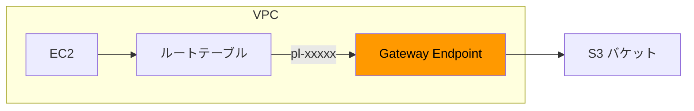
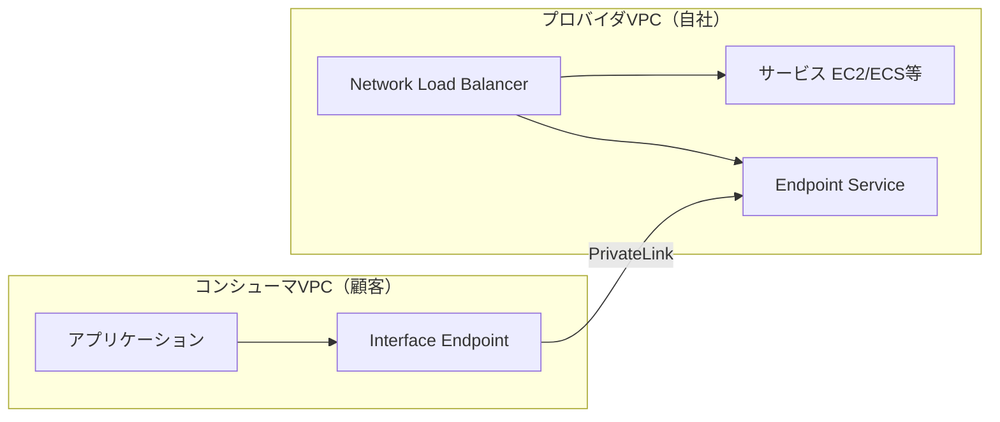
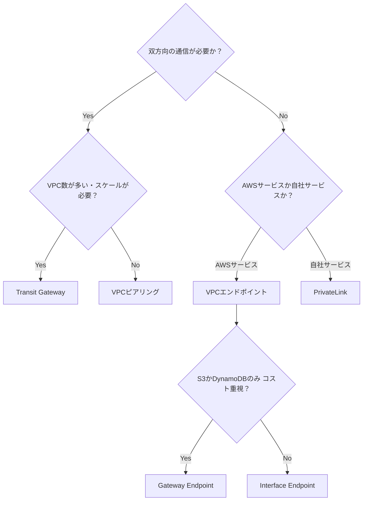

# テーマ5: PrivateLink + VPCエンドポイント

> 🟡 所要日数: 2日 | 座学 → 問題演習

---

## 座学

## Part 1: なぜVPCエンドポイントが必要なのか

AWSのサービス（S3、DynamoDB、SSMなど）はデフォルトでインターネット経由のAPIエンドポイントを持っています。VPC内のEC2インスタンスからS3にアクセスしようとすると、インターネットゲートウェイを経由してパブリックIPアドレスを持つS3エンドポイントに届きます。

これには2つの問題があります。ひとつは**セキュリティ**です。プライベートサブネットに置いたDBサーバーやバックエンドが、インターネットに出ていくのは最小権限の原則に反します。もうひとつは**コスト**です。NAT Gatewayを経由するとデータ処理料金（$0.045/GB）が発生します。大量のS3アクセスをNAT Gateway経由でやると請求が大きくなります。

**VPCエンドポイント**は、AWSサービスへのアクセスをAWSのプライベートネットワーク内で完結させる仕組みです。インターネットにもNAT Gatewayにも出ません。

---

## Part 2: Gateway Endpoint と Interface Endpoint の違い

VPCエンドポイントには2種類あり、仕組みが根本から異なります。

**Gateway Endpoint**は、**S3とDynamoDBにのみ**対応しています。仕組みはVPCのルートテーブルに特別なエントリを追加することです。S3のIPアドレス群はAWSの**マネージドプレフィックスリスト**（`pl-xxxxxxxx`）でまとめられており、Gateway Endpointを作成するとルートテーブルに「S3のCIDRはAWS内部ルートで転送」という経路が追加されます。完全に無料で利用できます。ただし、アクセスできるのは同じVPC内からのみです。オンプレミスからDirect Connect/VPNを経由してのアクセスはできません。

**Interface Endpoint**は、**S3・DynamoDBを含むほぼ全てのAWSサービス**に対応しています（Secrets Manager、SSM、KMS、ECR、CloudWatch Logs など多数）。仕組みはルートテーブルではなく、**指定したサブネット内にENI（Elastic Network Interface）を作成する**ことです。このENIにはプライベートIPアドレスが割り当てられ、アプリケーションはこのIPアドレスを通じてAWSサービスにアクセスします。

Interface EndpointはGateway Endpointと異なり、**セキュリティグループを適用できます**。「特定のEC2インスタンスからのみSSM APIへのアクセスを許可する」といった細かい制御が可能です。また、**オンプレミスからDirect Connect/VPN経由でのアクセスも可能**です（DNSの設定が必要、詳細はPart 3）。ただし、時間課金（$0.01/時間/AZ）とデータ処理課金（$0.01/GB）が発生します。

| 比較項目 | Gateway Endpoint | Interface Endpoint |
|---------|-----------------|-------------------|
| 対応サービス | **S3、DynamoDBのみ** | ほぼ全てのAWSサービス |
| 仕組み | ルートテーブルにエントリ追加 | サブネット内にENI作成 |
| コスト | **無料** | 時間課金＋データ処理課金 |
| セキュリティグループ | 不可 | **適用可能** |
| オンプレからのアクセス | **不可** | **可能**（DNS設定要） |
| IPアドレス | なし | プライベートIP |

S3はどちらのタイプも使えます。コストを重視しVPC内からのみアクセスするならGateway Endpoint、オンプレからもアクセスしたい・セキュリティグループで制御したいならInterface Endpointを選択します。

---

## Part 3: Interface EndpointのDNS解決

Interface Endpointを作成しても、アプリケーションが `s3.ap-northeast-1.amazonaws.com` などのデフォルトのDNS名を使っている場合、そのままでは引き続きインターネット経由のIPが返ります。Interface Endpointを経由させるためには**DNS解決**の設定が重要です。

**プライベートDNSを有効にする**と、標準的なAWSサービスのDNS名（例: `ssm.ap-northeast-1.amazonaws.com`）がVPC内でInterface EndpointのプライベートIPアドレスに解決されるようになります。アプリケーションのコードを変更せず、既存のDNS名のままでInterface Endpointを経由させられます。VPC設定で「DNS解決を有効にする」と「DNSホスト名を有効にする」の両方がオンになっている必要があります。

**オンプレミスからInterface Endpointへのアクセス**はもう少し複雑です。オンプレミスのDNSサーバーはデフォルトでAWS VPCのDNSを使わないため、AWSサービスのDNS名がパブリックIPを返してしまいます。解決策は**Route 53 Resolverのインバウンドエンドポイント**です。オンプレミスのDNSサーバーに「AWSサービスのドメイン（例: *.amazonaws.com）はRoute 53 Resolverのインバウンドエンドポイントに転送する」という条件付きフォワーダーを設定します。これによりオンプレのDNSクエリがVPCのDNSで解決され、Interface EndpointのプライベートIPが返ります。

---

## Part 4: AWS PrivateLink — 自社サービスをプライベートに公開する

VPCエンドポイントはAWSが提供するサービスへのアクセスに使いますが、**AWS PrivateLink**は自社で構築したサービスを他のVPCや顧客アカウントにプライベートに公開する仕組みです。

PrivateLinkを使うと、サービスプロバイダ（公開する側）とコンシューマ（使う側）のVPCがCIDRをルーティングで共有せずに、サービスへのプライベートアクセスを実現できます。VPCピアリングのように「VPC全体を相互接続」するのではなく、「特定のサービスだけを公開・接続」します。

**プロバイダ側の設定**:
1. サービスをNLBの背後に配置する（ALBも可）
2. NLBを指定して「エンドポイントサービス」を作成する
3. どのAWSプリンシパル（アカウント、組織）にアクセスを許可するかを設定する

**コンシューマ側の設定**:
1. プロバイダのエンドポイントサービス名を指定してInterface Endpointを作成する
2. プロバイダが「手動承認」設定の場合は承認が下りるまで待つ

アクセスは**一方向**（コンシューマ→プロバイダのみ）です。プロバイダ側からコンシューマのVPCへのアクセスは一切できません。これにより、VPCのCIDRが重複していても問題なく接続でき、コンシューマは自分のVPCに他社のトラフィックが入ってくる心配がありません。

**エンドポイントポリシー**も重要です。Interface Endpointにはリソースベースのポリシーを設定でき、「このエンドポイントを通じて特定のS3バケットにしかアクセスできない」という制限が可能です。たとえば企業のVPCからS3へのアクセスを自社バケットに限定し、データ持ち出し防止（DLP）を実現できます。

---

## Part 5: PrivateLink vs VPCピアリング vs Transit Gateway — 使い分け

試験で狙われるポイントを整理します。

- **「VPC内からS3、インターネット経由を避けてコスト最小化」** → Gateway Endpoint（無料）
- **「オンプレからS3にプライベートアクセス」** → Interface Endpoint（Gateway EndpointはDX/VPN経由不可）
- **「自社サービスを顧客にプライベート公開、顧客VPCへのアクセス不要」** → PrivateLink
- **「CIDRが重複するVPC同士を接続」** → PrivateLink（VPCピアリングはCIDR重複不可）
- **「共有サービスVPCから各VPCへのアクセスも必要（双方向）」** → TGW（PrivateLinkは一方向のみ）
- **「S3エンドポイントを作ったがオンプレからアクセスできない」** → Gateway EndpointをInterface Endpointに変更し、Route 53 Resolverを設定する

---

## 練習問題

### 問題1

ある製造業の企業では、東京リージョンに本番VPC（プライベートサブネット）を持ち、製造ラインのセンサーデータを毎秒S3バケットに書き込むシステムを運用しています。現在はNAT Gatewayを経由してS3にアクセスしていますが、データ量が増加した結果、NAT Gatewayのデータ処理料金が月額数十万円に膨らみ、問題になっています。

インフラチームが調査したところ、S3へのアクセスはこのVPC内のEC2インスタンスからのみで、オンプレミスや別リージョンからのアクセスはないことが確認されました。また、S3アクセスに対するセキュリティグループによる制御は現時点では不要であるとセキュリティ担当から回答を得ました。

コストを最小化しつつS3へのプライベートアクセスを実現する方法として最も適切なものはどれですか？

選択肢を見る

A. プライベートサブネットのルートテーブルにS3のCIDRを宛先とするインターネットゲートウェイ向けのルートを追加し、S3へのアクセスをインターネット経由に変更する

B. サブネット内にプライベートIPを持つネットワークインターフェースを作成してS3への接続を確立し、時間課金のエンドポイントを通じてNAT Gatewayを迂回する

C. ルートテーブルにS3のマネージドプレフィックスリストを宛先とするエントリを追加し、追加料金なしでS3へのトラフィックをAWS内部経路に転送する

D. CloudFrontディストリビューションをS3バケットの前段に置き、CloudFront経由でアクセスすることでNAT Gatewayを迂回する

正解と解説を見る

**正解: C**

S3のGateway Endpointが正解です。Gateway EndpointはS3とDynamoDBに対応しており、VPCルートテーブルにS3のマネージドプレフィックスリストへのエントリを追加するだけで、NAT Gatewayを経由せずAWS内部ネットワークでS3にアクセスできます。追加料金は一切かかりません。

- A: S3のパブリックIPへのルートにIGWを設定しても、プライベートサブネットのインスタンスはパブリックIPを持たないためインターネットゲートウェイ経由では通信できません
- B: これはInterface Endpointの説明です。S3へのVPC内のみのアクセスでセキュリティグループ制御が不要なケースでは、無料のGateway Endpointが最適です。Interface Endpointは時間課金が発生し、コスト最小化の要件に反します
- D: CloudFrontはS3バケットへの静的コンテンツ配信には使えますが、アプリケーションからの動的なデータ書き込み（PutObject）には適していません

---

### 問題2

ある銀行では、オンプレミスのデータセンターと東京リージョンのVPCをDirect Connect（1 Gbps）で接続しています。コンプライアンス要件により、全ての通信はインターネットを経由してはいけないと規定されています。オンプレミスの基幹システムからAWS上の複数のマネージドサービス（Secrets Manager、SSM Parameter Store、KMS）に安全にアクセスする必要があります。

インフラ担当が調査したところ、「S3には以前からGateway Endpointを作成しているが、Direct Connect経由でオンプレミスからS3にアクセスしようとすると名前解決が公開IPアドレスになってしまう」という問題を発見しました。今回の新規サービス（Secrets Manager、SSM、KMS）については同じ問題を起こしたくないと考えています。

オンプレミスから各サービスへインターネットを経由せずにプライベートにアクセスするための最適な構成はどれですか？

選択肢を見る

A. Direct Connectのパブリック仮想インターフェース（Public VIF）を使用し、AWSサービスへのアクセスを専用線経由にする

B. S3のGateway Endpointをそのまま活用し、Secrets Manager、SSM、KMSについても同様のGateway Endpointを作成することでDirect Connect経由のアクセスを実現する

C. 各サービス用のInterface Endpointをサブネット内に作成しプライベートDNSを有効化する。さらにVPC内にRoute 53 Resolverのインバウンドエンドポイントを配置してオンプレミスのDNSサーバーから条件付きフォワードを設定する

D. 全てのマネージドサービスへのアクセスをLambda関数経由にプロキシし、オンプレミスからはLambdaのAPIエンドポイントにのみアクセスする

正解と解説を見る

**正解: C**

Interface Endpoint + Route 53 Resolverの組み合わせが正解です。Gateway EndpointはVPC内からのアクセスのみ対応しており、Direct Connect/VPN経由のオンプレミスからのアクセスには対応していません（発見した問題がまさにこれです）。Interface EndpointはサブネットにENIを作成するため、Direct Connect経由でプライベートIPに到達できます。ただしオンプレミスのDNSが標準のAWSエンドポイント名をパブリックIPに解決してしまうため、Route 53 Resolverのインバウンドエンドポイントへ条件付きフォワードを設定してVPCのDNSで解決させる必要があります。

- A: Public VIFはAWSのパブリックIPサービスへのアクセスをDirect Connect経由にするものですが、トラフィックはAWSのパブリックエンドポイントに届きます。Interface Endpointの方がセキュリティポリシー上明確にプライベートな接続です
- B: Gateway EndpointはS3とDynamoDBのみ対応しています。Secrets Manager、SSM、KMSにはGateway Endpointは存在しません
- D: Lambdaプロキシは要件外のアーキテクチャの変更が必要であり、LambdaエンドポイントはパブリックなAPIエンドポイント（execute-api.amazonaws.com）を使うため「インターネット経由ではない」要件を満たしません

---

### 問題3

あるSaaSスタートアップが、機械学習を使ったデータ分析サービスをAWS上で提供しています。顧客は大企業が中心で、コンプライアンス上の理由から「自社のデータがインターネットを経由して外部のサービスに渡ることは認められない」という要件があります。顧客のAWS環境（VPC）から自社のデータ処理サービスに安全に接続できる仕組みを構築する必要があります。

スタートアップ側で懸念していることが2つあります。1つ目は「顧客のVPCのCIDRが自社VPCと重複している場合がある」こと。2つ目は「顧客に自社VPCへの完全なネットワークアクセスを与えたくない（データ処理APIにのみアクセスを限定したい）」ことです。

これらの要件を同時に満たす構成として最も適切なものはどれですか？

選択肢を見る

A. 自社サービスをNLBの背後に配置し、エンドポイントサービスを作成して顧客が自分のVPCからプライベートな接続を確立できるようにする。顧客VPCとのCIDR重複は問題にならず、顧客からのアクセスは自社サービスへの一方向に限定される

B. VPCピアリングで自社VPCと各顧客VPCを接続し、ルートテーブルで顧客がアクセスできるサブネットを絞り込む

C. Transit Gatewayを使って自社VPCと顧客VPCを接続し、TGWルートテーブルで顧客間の通信を遮断する

D. CloudFrontをサービスのフロントエンドに置き、HTTPS経由でAPIを公開することで「インターネット経由」の問題を解決する

正解と解説を見る

**正解: A**

AWS PrivateLinkのエンドポイントサービスが正解です。NLBをフロントエンドにしてエンドポイントサービスを作成すると、顧客はInterface Endpointを作成するだけで自社サービスにプライベートに接続できます。PrivateLinkはCIDRの重複に無関係（VPCのルーティングを共有しない）であり、顧客から自社VPCへのアクセスは一方向（顧客→自社サービスのみ）で、自社VPCの他のリソースへのアクセスは技術的に不可能です。

- B: VPCピアリングはCIDRの重複があると作成できません（条件の1つ目に違反）。またVPCピアリングは双方向の接続であり、自社VPCへの完全なアクセス制限はセキュリティグループに依存します
- C: TGWもCIDRが重複する場合に問題が起きます。またTGWは双方向のルーティングを可能にするため、顧客VPCへの自社からのアクセスも生じます
- D: CloudFrontを経由しても、インターネット経由であることに変わりはありません。顧客の要件「インターネットを経由してはいけない」を満たせません

---

### 問題4

ある医療機関では、患者データを管理するVPC（10.0.0.0/16）を持ち、PrivateLinkを使って院内システムの開発を行うITパートナー企業（別のAWSアカウント）に自社データAPIサービスへのアクセスを提供しています。

先日、パートナー企業から「Interface Endpointを作成してデータAPIに接続しようとしているが、アプリケーションが `api.hospital-internal.local` というDNS名で接続を試みると名前解決に失敗する」という報告がありました。医療機関側のエンドポイントサービスにはプライベートDNS名の設定がされていません。ITパートナーのVPC設定は「DNS解決：有効」「DNSホスト名：有効」になっています。

IT企業のVPC内の設定変更のみで、既存のアプリケーションコード（`api.hospital-internal.local` への接続）のまま動作させるために必要な対応はどれですか？

選択肢を見る

A. ITパートナーのVPCのパブリックDNS解決を有効化することで、Interface EndpointへのDNSクエリがパブリックDNSを通じて解決されるようにする

B. 医療機関のエンドポイントサービスにPrivate DNS Nameを登録し、ITパートナーのVPCで「プライベートDNS名を有効にする」設定を行うことで、`api.hospital-internal.local` がInterface EndpointのプライベートIPに解決されるようにする

C. VPCピアリングで両社のVPCを直接接続し、医療機関のVPC内のDNSサーバーから名前解決ができるようにする

D. ITパートナーのVPCにRoute 53プライベートホストゾーンを作成し、`api.hospital-internal.local` のAレコードをInterface EndpointのDNS名に向けるCNAMEレコードを登録する

正解と解説を見る

**正解: D**

ITパートナーのVPCにRoute 53プライベートホストゾーンを作成し、カスタムDNS名（`api.hospital-internal.local`）をInterface EndpointのエンドポイントDNS名にCNAMEレコードで向けます。アプリケーションのコード変更なしに、既存のDNS名でInterface Endpoint経由の接続ができます。問題文に「ITパートナーのVPC内の設定変更のみ」とあるため、医療機関側の変更が必要な選択肢は除外されます。

- A: パブリックDNS解決を有効化してもInterface EndpointのプライベートIPアドレスはパブリックDNSには登録されません。意味がありません
- B: エンドポイントサービスへのPrivate DNS Name設定は医療機関側の変更が必要です。また `hospital-internal.local` のような内部ドメインはパブリックDNSで所有権確認ができないため、この方法は機能しません
- C: VPCピアリングはネットワーク層の接続であり、DNS名前解決を自動的に共有する機能はありません。ピアリングを作成しただけでは名前解決の問題は解決しません

---

### 問題5

ある金融サービス企業では、厳格なデータガバナンスポリシーにより「VPCからのS3アクセスは承認された自社バケットのみに限定し、従業員が個人的なS3バケットや外部のS3バケットへデータを持ち出すことを技術的に防止する」という要件があります。

セキュリティ担当が設計を検討した結果、VPCにS3のInterface Endpointを作成しました。全てのS3アクセスをこのエンドポイント経由に強制するバケットポリシーとルートテーブルの設定は完了しています。次に、このエンドポイントを通じたアクセス先を自社バケットのみに制限する設定が必要です。

この設定として最も適切なものはどれですか？

選択肢を見る

A. VPC内の全EC2インスタンスにアタッチされたIAMロールのポリシーで、承認されたS3バケットのARNのみを許可リストに追加し、その他のバケットへのアクセスを明示的に拒否する

B. Interface Endpointにリソースベースのアクセスポリシーをアタッチし、承認された自社S3バケットARNへのアクセスのみを許可し、他の全てのS3リソースへのアクセスを明示的に拒否する

C. 承認されたS3バケットに「このVPCからのアクセスのみ許可する」バケットポリシーを追加し、VPC全体に限定する

D. AWS Configルールを作成して、承認外のS3バケットへのアクセスを検出し、アクセスがあった場合にLambdaで該当のIAMロールを即座に無効化する

正解と解説を見る

**正解: B**

Interface EndpointにアタッチするエンドポイントポリシーでS3のアクセス先を制限します。エンドポイントポリシーはこのエンドポイントを経由する全てのリクエストに適用され、承認されたS3バケットへのアクセスのみを許可し、他は拒否できます。IAMポリシーで許可されていても、エンドポイントポリシーで拒否されていればアクセスはできません。これにより技術的にデータ持ち出しを防止できます。

- A: IAMポリシーによる制限も有効な手段ですが、全EC2インスタンスのIAMロールを個別に管理する必要があり、新しいインスタンスの追加時に設定漏れが生じるリスクがあります。エンドポイントポリシーはエンドポイント単位で一元管理できます。また問題文は「エンドポイントを通じたアクセス先を制限する設定」を聞いており、エンドポイントポリシーが最適です
- C: バケットポリシーで「VPCからのみ許可」は逆の制御（バケット側の制限）です。従業員が自社VPCを経由して外部のバケットにアクセスすることは防止できません
- D: AWS Configは設定変更（S3バケットの設定変更など）を検出するものです。S3 APIの呼び出し（GetObject、PutObjectなど）を検出する機能はなく、「技術的に防止する」要件を満たしません

---

### 問題6

あるエンタープライズ企業では、セキュリティツール（脆弱性スキャン、ログ分析、CSPM）を共有サービスVPC（10.100.0.0/16）に集約し、複数の事業部門VPC（10.1〜10.5.0.0/16）からこれらのサービスにアクセスさせる計画を立てています。

アーキテクチャ検討会で2つの案が出ました。

**案1:** エンドポイントサービスを使い、各事業部門VPCに共有サービスVPCの各サービスへのInterface Endpointを作成する。

**案2:** Transit Gatewayを使い、全VPCをTGWにアタッチする。TGWルートテーブルで事業部門VPC→共有サービスVPCへの一方向アクセスのみ許可し、事業部門間の通信を遮断する。

技術リードから「共有サービスからも各事業部門VPCへのアクセスが必要（セキュリティエージェントの管理・アップデートのため）」という追加情報が提供されました。

この要件を踏まえた場合、最も適切なアーキテクチャはどれですか？

選択肢を見る

A. 案1を採用し、事業部門→共有サービスの方向に加え、共有サービス→事業部門の方向にも各事業部門VPCがエンドポイントサービスを作成してアクセスを実現する

B. 案1のみを採用する。エンドポイントサービスを設定すれば双方向に対応できる

C. 案2を採用し、TGWルートテーブルで共有サービスVPCからも各事業部門VPCへのルーティングを許可する。事業部門間の通信はルートテーブル分離で遮断を維持する

D. どちらの案も採用せず、全事業部門VPCにセキュリティエージェントをデプロイしてSSM Session Manager経由でアウトバウンド管理に限定する

正解と解説を見る

**正解: C**

Transit Gatewayが正解です。エンドポイントサービス（PrivateLink）は**一方向（コンシューマ→プロバイダ）のみ**のアクセスモデルです。「共有サービスVPCから各事業部門VPCへのアクセスも必要」という要件が追加されたため、案1だけでは対応できません。Transit Gatewayを使うと双方向のルーティングが可能で、TGWルートテーブルで「事業部門間の通信は遮断、共有サービスVPCとの通信は双方向許可」という設計ができます。

- A: 各事業部門VPCがそれぞれエンドポイントサービスを作成する方法は技術的には可能ですが、5つの事業部門があれば5セットのNLB+エンドポイントサービス+Interface Endpointが必要になります。コストと管理の複雑さが大きく、実用的ではありません
- B: エンドポイントサービスは双方向に対応していません。プロバイダ（共有サービス）からコンシューマ（事業部門）への通信は技術的に不可能です
- D: SSM Session Managerはサーバー管理には有効ですが、セキュリティスキャンやCSPMなどのサービスが事業部門VPCのリソースにネットワークレベルでアクセスする要件には対応できません

