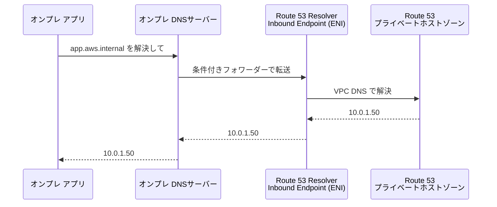
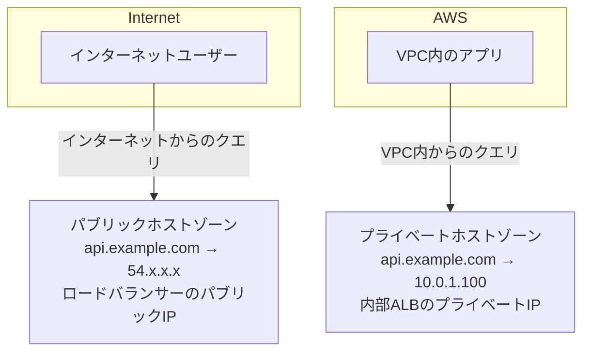

# テーマ6: Route 53高度設計

> 🟡 所要日数: 2日 | 座学 → 問題演習

---

## 座学

## Part 1: SAAからの差分 — SAPで問われる3つの領域

SAAでは「ルーティングポリシー7種類」「ヘルスチェック」「フェイルオーバー」を学びました。これらはSAPでも前提知識として必要ですが、SAPではそれ以上のことが問われます。

SAP固有で深く問われるのは主に3つの領域です。**ハイブリッドDNS**（オンプレミスとAWSのDNS名前解決を統合する）、**Private Hosted Zone の高度な設計**（複数VPC・複数アカウントへの関連付け）、そして**Split-horizon DNS**（同じドメインをVPC内とインターネットで異なるIPに解決させる）です。

---

## Part 2: ハイブリッドDNS — Route 53 Resolver

SAAではRoute 53 ResolverのInbound/Outbound Endpointを軽く説明しました。SAPではこの仕組みを深く理解している必要があります。

**問題の背景**: VPCには、VPC CIDR + 2のIPアドレスにDNSリゾルバーが存在します（例: 10.0.0.2）。このリゾルバーはVPC内の名前解決（プライベートホストゾーン、EC2のDNS名）を処理します。しかし、オンプレミスのDNSサーバーはAWS VPCのDNSを直接クエリできません。逆も同様で、VPC内からオンプレミスのDNS名（例: `db01.corp.internal`）を解決することもデフォルトではできません。

**Inbound Endpoint（オンプレ → AWS）**:

オンプレのDNSサーバーに「`aws.internal` へのクエリはInbound EndpointのIPに転送する」という**条件付きフォワーダー（Conditional Forwarder）**を設定します。Inbound Endpointは指定したサブネットにENIとして作成され、プライベートIPアドレスを持ちます。

**Outbound Endpoint（AWS → オンプレ）**:

VPC内のEC2インスタンスがオンプレミスのDNS名（例: `db01.corp.internal`）を解決したいケースです。Route 53 Resolverに**フォワーディングルール**を作成します。「`corp.internal` へのクエリはオンプレのDNSサーバー（192.168.1.53）に転送する」という設定です。Outbound EndpointはVPCのサブネットにENIとして作成され、オンプレのDNSサーバーへのクエリの送信元IPとして機能します。

**Resolver Rules（フォワーディングルール）はRAMで共有できます**。1つのアカウントでルールを管理し、AWS RAMで組織内の他アカウントのVPCにも同じルールを適用できます。これにより、マルチアカウント環境でもDNS設定を一元管理できます。

---

## Part 3: Private Hosted Zone — マルチVPC・クロスアカウント

**Private Hosted Zone**はVPC内でのみ機能するDNSゾーンです。`api.internal` のようなプライベートなDNS名をVPCのリソースのプライベートIPアドレスに解決させられます。インターネットからは解決できません。

1つのPrivate Hosted ZoneをVPCに**関連付け（Association）**することで使えるようになります。重要なのは、**複数のVPCに関連付けられる**ことです。同じゾーンを複数のVPCに関連付ければ、全てのVPCで同じプライベートDNS名が使えます。

**クロスアカウントの関連付け**はマネジメントコンソールからは操作できません。CLIを使います。

1. ゾーンを持つアカウント（アカウントA）で、関連付けたいVPC（アカウントB）のVPC IDに対してauthorize-vpc-association-with-hosted-zoneを実行する
2. アカウントBで、Private Hosted ZoneのIDとVPC IDを指定してassociate-vpc-with-hosted-zoneを実行する

この2段階の操作でクロスアカウント関連付けが完了します。

**Shared VPC環境での考慮点**: AWS RAMでVPCを共有している場合、共有されたVPCはそのOwnerアカウントのPrivate Hosted Zoneに自動では関連付けられません。上記のCLI手順で明示的に関連付ける必要があります。

---

## Part 4: Split-horizon DNS — 内外で異なるIPを返す

**Split-horizon DNS**（スプリットホライゾンDNS）は、**同じドメイン名でも、クエリの発生元によって異なる応答を返す**設計パターンです。

典型的なユースケースは「VPC内からは内部IPを返し、インターネットからはパブリックIPを返す」というものです。

同じ `api.example.com` というドメインに対して、パブリックホストゾーンとプライベートホストゾーンの**両方を作成**します。VPCに関連付けられたプライベートホストゾーンが優先され、VPC内からのクエリはプライベートIPを返します。VPC外（インターネット）からのクエリはパブリックホストゾーンが応答し、パブリックIPを返します。

**なぜこれが必要か？** VPC内のアプリケーションが同じエンドポイントへ通信するとき、パブリックIPへのリクエストはインターネットゲートウェイを経由してAWSに戻ってくる（ヘアピン接続）ことになり、NAT Gateway料金が発生する上に遅延も増えます。プライベートIPで直接通信させる方が効率的です。

---

## Part 5: ルーティングポリシーの組み合わせ

SAPでは、複数のルーティングポリシーを組み合わせた複雑な設計が問われます。

**レイテンシー + フェイルオーバーの組み合わせ**: 東京とバージニアにデプロイしたグローバルアプリで、「最も近いリージョンに向け、そのリージョンが落ちたら別リージョンにフェイルオーバーする」という設計です。レイテンシールーティングポリシーでリージョンを選択し、各リージョンのレコードにヘルスチェックを設定します。ヘルスチェックが失敗したリージョンのレコードはDNS応答から外れます。

**加重 + ヘルスチェックの組み合わせ**: カナリアリリース時に新バージョンに5%のトラフィックを流す設計です。加重ルーティングで重みを設定し、ヘルスチェックを組み合わせることで、新バージョンが障害を起こした場合に自動でトラフィックが旧バージョンに戻ります。

**ヘルスチェックの応用**:
- **エンドポイントヘルスチェック**: HTTP/HTTPSエンドポイントに実際にリクエストを送り、レスポンスコードやレスポンスボディで正常/異常を判定する
- **計算型ヘルスチェック（Calculated Health Check）**: 複数のヘルスチェックをAND/ORで組み合わせて1つの論理ヘルスチェックを作る。「Aが正常かつBが正常の場合のみ正常」という設定が可能
- **CloudWatchアラームとの統合**: CloudWatchアラームが「ALARM」状態になったらヘルスチェックを失敗させる。インフラレベルの障害ではなくアプリレベルの問題（キューの深さが閾値超え、エラー率上昇など）でフェイルオーバーさせたいときに使う

---

## 練習問題

### 問題1

ある物流企業では、オンプレミスの倉庫管理システム（WMS）と東京リージョンのAWSを Direct Connect（1 Gbps）で接続しています。AWSには在庫管理APIをECS上で動かしており、プライベートホストゾーン `api.logistics.internal` にマッピングされています。

倉庫管理システムからAWS上の在庫APIに `api.logistics.internal` という内部DNS名で接続しようとしていますが、オンプレミスのDNSサーバーはこのドメインを解決できません。オンプレミスのDNSはBind 9で動いており、外部ドメインへの条件付きフォワーダーを設定できる状態にあることが確認されています。

オンプレミスのアプリケーションを変更せず（URLのハードコードは現実的でない）、`api.logistics.internal` を解決できるようにする最適な構成はどれですか？

選択肢を見る

A. オンプレミスのBind 9に `api.logistics.internal` のAレコードを手動で追加し、AWSのリソースのプライベートIPアドレスに向ける

B. VPCのサブネット内にENIを持つDNSクエリ受付ポイントを作成し、オンプレミスのDNSサーバーに `logistics.internal` ドメインへのクエリをそのIPに転送する条件付きフォワーダーを設定する

C. AWSのRoute 53プライベートホストゾーンをパブリックホストゾーンに変更し、インターネット経由でオンプレミスからDNS解決できるようにする

D. Direct Connectのパブリック仮想インターフェースを使い、オンプレミスからRoute 53のパブリックDNSエンドポイントにクエリを送信する

正解と解説を見る

**正解: B**

Route 53 Resolver Inbound Endpointが正解です。VPCの指定サブネットにENIとしてInbound Endpointを作成し、オンプレミスのBind 9に「`logistics.internal` ドメインへのクエリはInbound EndpointのプライベートIPに転送する」という条件付きフォワーダーを設定します。Inbound EndpointはDirect Connect経由で到達可能であり、クエリをRoute 53プライベートホストゾーンで解決し、`api.logistics.internal` のプライベートIPを返します。

- A: 手動でAレコードを追加する方法は、AWSのリソースIP変更時（ECSタスクの入れ替えなど）にオンプレミスDNSの手動更新が必要になります。運用コストが高く、Route 53の動的管理と乖離が生じます
- C: プライベートホストゾーンをパブリックに変更すると内部DNS名がインターネットに公開されてしまい、セキュリティ上問題があります。また、パブリックIPを持たないプライベートIPアドレスをインターネットのDNSで返しても意味がありません
- D: Route 53のパブリックDNSエンドポイントはプライベートホストゾーンのレコードを返しません。プライベートホストゾーンはVPCに関連付けられた環境でのみ機能します

---

### 問題2

あるメーカーでは、東京リージョンのVPC内のアプリケーション（ECSコンテナ）が、オンプレミスデータセンターのActive Directory（AD）に `ldap://dc01.corp.internal` という名前で接続して認証を行っています。しかし、VPC内のECSコンテナはデフォルトでRoute 53 Resolverを使うため、オンプレ側のDNS管理下にある `corp.internal` ドメインを解決できません。

これまでは環境変数にDCのIPアドレスをハードコードしていましたが、ADサーバーのIP変更予定があり、DNS名での解決に切り替える必要があります。マルチアカウント環境を採用しており、このVPCの他にも同じADにアクセスする別アカウントのVPCが複数存在します。

全てのVPCから一元的に `corp.internal` ドメインを解決できるようにする最適な構成はどれですか？

選択肢を見る

A. 全てのVPCのDHCPオプションセットを変更し、DNSサーバーをオンプレミスのADサーバーのIPアドレスに設定する

B. 各VPCのRoute 53 Resolverに `corp.internal` へのフォワーディングルールを個別に作成し、それぞれのVPCでオンプレのDNSサーバーに転送する

C. Route 53プライベートホストゾーンに `corp.internal` ゾーンを作成し、全てのECSタスクのIPアドレスを手動で管理する

D. 中央管理アカウントにRoute 53 Resolver Outbound Endpointと `corp.internal` へのフォワーディングルールを作成し、AWS RAMでそのルールを他の全アカウントのVPCに共有する

正解と解説を見る

**正解: D**

中央アカウントでOutbound Endpointとフォワーディングルールを1つ作成し、AWS RAMで複数アカウントのVPCに共有する方法が最適です。各VPCのRoute 53 ResolverはRAMで共有されたルールを参照するため、`corp.internal` へのクエリが自動的にOutbound Endpoint経由でオンプレDNSに転送されます。DNS設定を一元管理でき、新しいVPCにも即座に適用できます。

- A: DHCPオプションセットのDNSサーバーをオンプレADのIPに変更すると、Route 53プライベートホストゾーンの解決（EC2のDNS名、VPCエンドポイントのDNS名など）ができなくなります。AWS内部のDNS名前解決が壊れます
- B: 各VPCに個別にフォワーディングルールを作成する方法は機能しますが、VPCが増えるたびに手動設定が必要です。RAM共有と比較すると管理コストが高くスケーラブルではありません
- C: Route 53に `corp.internal` のプライベートホストゾーンを作成してADサーバーのIPを管理することは技術的には可能ですが、ADのDNSとRoute 53の2か所で管理することになり、IP変更時に両方を更新する手間が発生します。問題の解決（DNS名で解決、一元管理）の要件を十分に満たしません

---

### 問題3

あるEコマース企業では、`api.shop.example.com` というドメインでREST APIを外部顧客と社内システムの両方に公開しています。外部顧客向けにはApplication Load Balancer（パブリック、54.100.x.x）を経由させ、社内システム向けには内部ALB（プライベート、10.0.2.100）に直接向けさせたいという要件があります。

これまでは社内システムもパブリックALBを経由していたため、VPCを出てNAT GatewayとIGWを経由してパブリックALBに到達するという非効率な経路になっており、月額でNAT Gatewayの料金が数十万円発生していました。DNSのキャッシュやTTLの問題があるため、アプリケーション側でのURL切り替えは採用できないとのことです。

同じドメイン名を維持しながらVPC内からは内部ALBに向け、コストを削減する構成はどれですか？

選択肢を見る

A. `api.shop.example.com` のパブリックホストゾーンに加えて、同じドメイン名でプライベートホストゾーンを作成し、内部ALBのプライベートIPアドレスのAレコードをVPCに関連付けられたゾーンに登録する

B. パブリックALBにVPCのプライベートIPアドレスを追加し、社内システムがRoute 53のAレコードをキャッシュから読んでもプライベートIPに解決されるようにする

C. `api.shop.example.com` のCNAMEレコードを `internal.shop.example.com` に向け直し、社内システムのアプリケーションコードのURLを `internal.shop.example.com` に変更する

D. 社内システムのVPCにリバースプロキシを配置して `api.shop.example.com` へのリクエストをインターセプトし、内部ALBに転送する

正解と解説を見る

**正解: A**

Split-horizon DNS（スプリットホライゾンDNS）が正解です。パブリックホストゾーンには `api.shop.example.com → 54.100.x.x（パブリックALB）` のAレコードを置き、プライベートホストゾーンには同じ `api.shop.example.com → 10.0.2.100（内部ALB）` のAレコードを置いてVPCに関連付けます。VPC内からのDNSクエリはプライベートホストゾーンが優先されるため、自動的に内部ALBのプライベートIPが返ります。アプリケーションコードの変更も、ALBの設定変更も不要です。

- B: ALBにVPCのプライベートIPアドレスを追加することはできません。ALBはElastic Load Balancingのマネージドサービスであり、IPアドレスは自動管理されます
- C: URLの変更を要求していますが、問題文で「アプリケーション側でのURL切り替えは採用できない」と明示されています
- D: リバースプロキシの追加は運用コストと複雑さが増します。Split-horizon DNSで同等の効果を得られるため、プロキシ追加は過剰設計です

---

### 問題4

ある大手IT企業では、AWS Organizationsを使ってマルチアカウント構成を採用しています。ネットワーク専用アカウントに共有サービスVPC（10.100.0.0/16）があり、`shared.corp.internal` プライベートホストゾーンで社内共有APIを管理しています。

新しいビジネスアカウント（別のAWSアカウント）にVPC（10.5.0.0/16）が作成され、そのVPC内のアプリケーションから `shared.corp.internal` のAPIにアクセスできるようにしてほしいという要件が来ました。

セキュリティ要件として「プライベートホストゾーンのDNSレコードをビジネスアカウントの管理者が閲覧・変更できてはいけない」という条件があります。

この要件を満たす最も適切な方法はどれですか？

選択肢を見る

A. ネットワークアカウントのプライベートホストゾーンをAWS RAMでビジネスアカウントに共有する

B. ネットワークアカウントのVPCとビジネスアカウントのVPCをVPCピアリングで接続し、ビジネスアカウントのVPCでRoute 53プライベートホストゾーンの関連付けを自動的に継承させる

C. ネットワークアカウント側でビジネスアカウントのVPC IDに対してホストゾーン関連付けを承認し、その後ビジネスアカウント側でAPIを使用してホストゾーンとVPCの関連付け操作を実行する

D. ネットワークアカウントのプライベートホストゾーンをパブリックホストゾーンにコピーし、ビジネスアカウントがパブリックDNSで解決できるようにする

正解と解説を見る

**正解: C**

Route 53のクロスアカウントプライベートホストゾーン関連付けが正解です。この操作はマネジメントコンソールからは実行できません。CLI（またはAPI）で2段階の操作が必要です。①ネットワークアカウントで `aws route53 create-vpc-association-authorization` を使ってビジネスアカウントのVPCを承認し、②ビジネスアカウントで `aws route53 associate-vpc-with-hosted-zone` を使ってVPCを関連付けます。ビジネスアカウントの管理者はDNSレコードの閲覧・変更権限を持たず、ホストゾーンの内容にはアクセスできません（関連付け操作のみ）。

- A: Route 53プライベートホストゾーンはAWS RAMで共有できません。RAMは他のリソースタイプ（サブネット、TGWなど）の共有に使います
- B: VPCピアリングを作成してもRoute 53のプライベートホストゾーンは自動的に継承されません。ピアリングはネットワーク層の接続であり、DNS設定とは独立しています
- D: プライベートDNSレコードをパブリックに公開することはセキュリティ上問題があります。また、パブリックIPを持たない内部IPアドレスをパブリックDNSで返しても意味がありません

---

### 問題5

あるゲーム会社では、`game.example.com` でオンラインゲームのAPIサーバーを提供しています。東京（ap-northeast-1）、バージニア（us-east-1）、フランクフルト（eu-central-1）の3リージョンにAPIサーバーを配置しており、プレイヤーに最も近いリージョンのサーバーに自動的に接続させたいと考えています。

また、特定リージョンのサーバー全体が障害を起こした場合は、次に近いリージョンに自動フェイルオーバーさせる要件があります。さらに、新しいゲームエンジンのバージョンアップ時には、東京リージョンのサーバーに全体の10%のトラフィックを新バージョンに流してテストしたいと考えています。

これらの複数の要件を満たすRoute 53の設定はどれですか？

選択肢を見る

A. 3リージョン全てに地理的ルーティングポリシーのレコードを設定し、ヘルスチェックを組み合わせることで、障害時に別の地域ルーティングに自動フェイルオーバーさせる。バージョンテストには加重ポリシーで東京の10%を新バージョンALBに向ける

B. 3リージョンにレイテンシールーティングポリシーのレコードを設定し、それぞれにヘルスチェックを組み合わせることで障害時のリージョンをDNS応答から除外する。東京リージョンには加重ポリシーのレコードを2つ（旧バージョン90%、新バージョン10%）作成してレイテンシーレコードから参照させる

C. シンプルルーティングポリシーで3つのIPアドレス（各リージョンのALB IP）を全て登録し、DNSラウンドロビンでトラフィックを均等に分散させる

D. CloudFrontのオリジングループに3リージョンのALBを登録し、CloudFrontが自動的に最適なオリジンを選択してフェイルオーバーさせる

正解と解説を見る

**正解: B**

レイテンシールーティング + ヘルスチェック + 加重ルーティングの組み合わせが正解です。

1. 各リージョンにレイテンシールーティングポリシーのAliasレコードを作成し、ヘルスチェックを設定します。これにより、最も低レイテンシーのリージョンが選ばれ、障害が発生したリージョンはDNS応答から外れます

2. 東京リージョン向けのレイテンシーレコードのエイリアス先に加重ルーティングのレコードセットを置きます（旧バージョンALBに重み90、新バージョンALBに重み10）。これにより東京に来たトラフィックの10%が新バージョンに流れます

- A: 地理的ルーティングは「ユーザーが属する地域」（国・大陸）でルーティングを決めます。レイテンシーを基準に最速リージョンを選ぶ要件にはレイテンシールーティングの方が適しています
- C: シンプルルーティングはヘルスチェックを使えません。障害時のフェイルオーバーもバージョンテストのトラフィック制御もできません
- D: CloudFrontはHTTPSコンテンツのキャッシュ・配信に特化したサービスです。ゲームのリアルタイムAPIのようなキャッシュ不可のTCP通信には適していません。また加重ルーティングでのバージョンテスト制御はRoute 53の方が適しています

---

### 問題6

ある金融機関では、AWS上のシステムとオンプレミスのシステムを組み合わせたハイブリッドクラウド構成を運用しています。DR（災害復旧）計画として、オンプレミスの基幹システムで障害が発生した場合に、AWSのリージョン（東京）にあるスタンバイシステムに自動的に切り替わる仕組みを構築したいと考えています。

オンプレミスシステムのヘルスチェックはHTTPベースでは難しく、代わりにCloudWatchメトリクス（カスタムメトリクス）でオンプレミスのシステム死活を監視していることが確認されています。オンプレミスのCloudWatchエージェントが毎分メトリクスを送信しており、5分間メトリクスが途絶えた場合にアラームがトリガーされます。

Route 53のヘルスチェックと組み合わせて自動フェイルオーバーを実現する最適な設計はどれですか？

選択肢を見る

A. Route 53のHTTPヘルスチェックをオンプレミスサーバーのプライベートIPアドレスに向け、Direct Connect経由でヘルスチェックを行う

B. CloudWatchカスタムメトリクスを監視するアラームを作成し、アラーム状態になったときにLambdaでRoute 53のAレコードをオンプレミスIPからAWSのIPに書き換える

C. Route 53ヘルスチェックの種類として「CloudWatchアラームの状態を監視する」タイプを選択し、そのアラームが「ALARM」状態になったときにヘルスチェックを失敗とみなすよう設定する。このヘルスチェックをフェイルオーバーポリシーのプライマリレコードに関連付ける

D. CloudWatchイベントルールでCloudWatchアラームの状態変化を検知し、SNSで担当者に通知して手動でDNSを切り替えてもらう

正解と解説を見る

**正解: C**

Route 53の「CloudWatchアラームとの統合ヘルスチェック」が正解です。Route 53ヘルスチェックには「CloudWatchアラームの状態を監視する」タイプがあります。指定したCloudWatchアラームが「ALARM」状態になるとヘルスチェックが失敗と判断されます。このヘルスチェックをフェイルオーバーポリシーのプライマリレコード（オンプレIPを指す）に関連付けることで、アラーム発火 → ヘルスチェック失敗 → DNSフェイルオーバーの自動連鎖が実現します。Lambda、SNSなどのコード実装は不要です。

- A: Route 53のHTTPヘルスチェックはインターネット上のRoute 53ヘルスチェッカーからリクエストを送信します。オンプレミスのプライベートIPアドレスはインターネットからアクセスできないため、この方法は機能しません。VPCのエンドポイントを経由してのヘルスチェックも現在のRoute 53では直接サポートしていません
- B: Lambdaを使ったDNSレコードの書き換えは機能しますが、Lambda関数のメンテナンス・エラーハンドリング・冪等性の確保など実装コストが高くなります。Route 53のCloudWatchアラーム統合ヘルスチェックを使えばコードレスで同等の機能が実現できます
- D: 手動での切り替えは「自動フェイルオーバー」の要件を満たしていません

