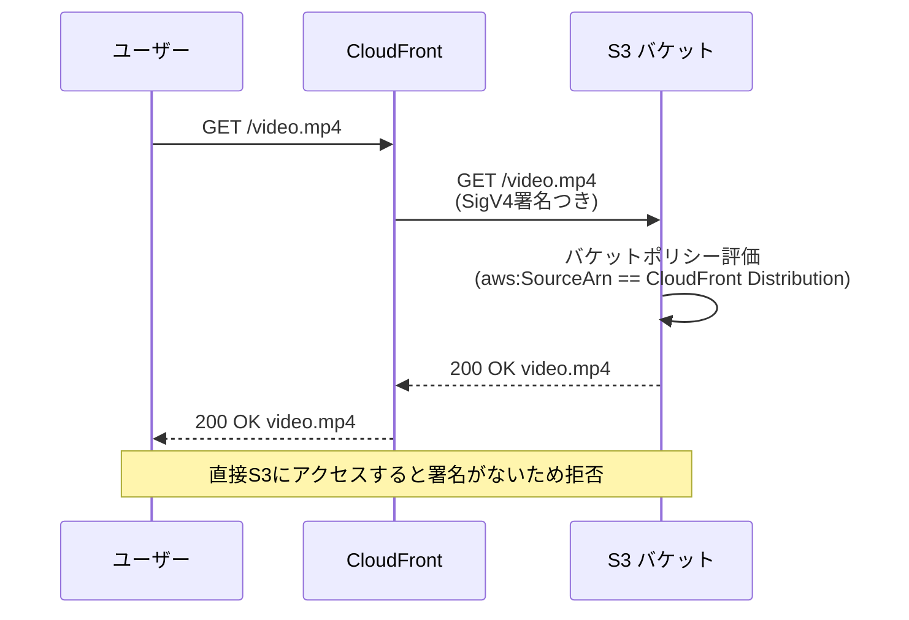
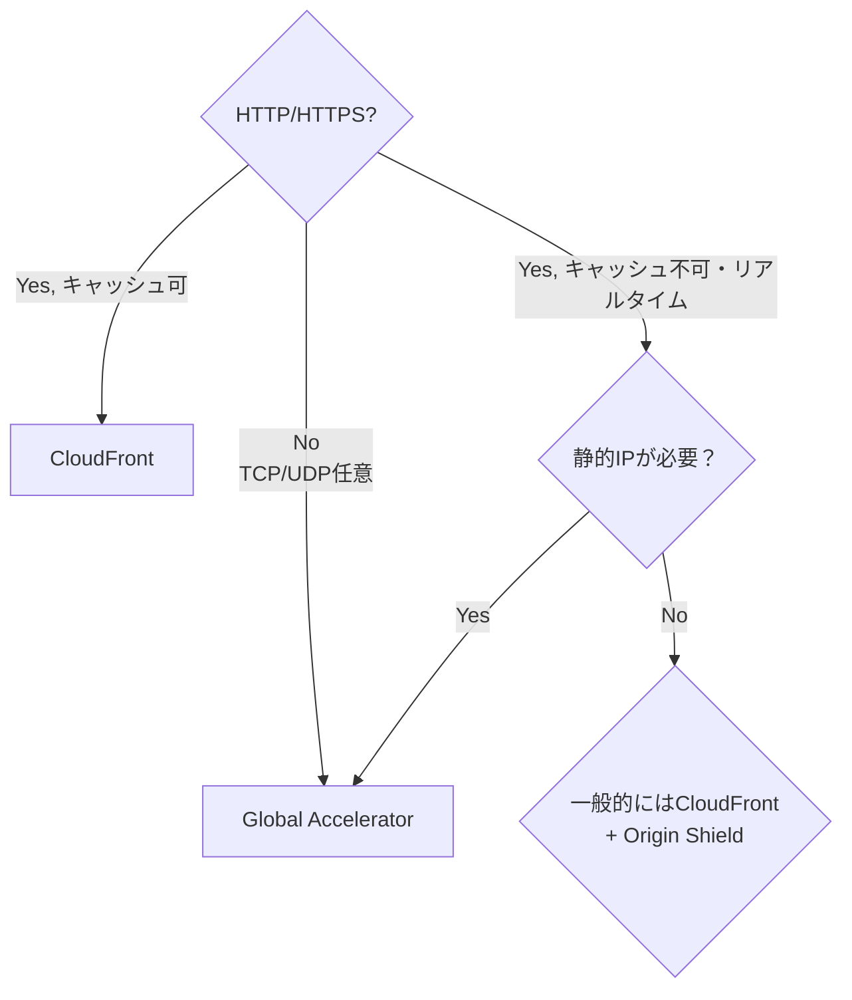

# テーマ7: CloudFront + Global Accelerator + Lambda@Edge

> 🟡 所要日数: 2日 | 座学 → 問題演習

---

## 座学

## Part 1: SAAからの差分 — SAPで深く問われるエッジサービス

SAAでCloudFrontとGlobal Acceleratorの基本は学びました。CloudFrontはCDN（コンテンツキャッシュ）、Global AcceleratorはAWSバックボーンによる経路最適化——ここまでは前提知識です。

SAPで問われるのは次の領域です。**オリジン保護の高度な手法**（OAC、Signed URL、オリジンフェイルオーバー）、**エッジコンピューティングの使い分け**（Lambda@Edge vs CloudFront Functions）、そして**CloudFront vs Global Acceleratorの判断**（TCP/UDPか、静的IPが必要か、キャッシュが効くか）です。

---

## Part 2: オリジン保護 — OACとSigned URL/Signed Cookie

CloudFrontの前段にディストリビューションを置いても、S3バケットやALBのURLを直接知られてしまうとCloudFrontを迂回して直接アクセスされる可能性があります。「CloudFront経由のリクエストだけを受け付け、直接アクセスは拒否する」設定が必要です。

**Origin Access Control（OAC）**はS3オリジン向けの機能です。CloudFrontが署名付きでS3へリクエストを送り、S3バケットポリシーでCloudFrontの署名がある場合のみ許可する仕組みです。旧来の**Origin Access Identity（OAI）**の後継で、OACはSigV4署名をサポートし、KMS暗号化されたS3オブジェクト（SSE-KMS）にも対応しています。新規設計ではOACを選びます。

ALBオリジンの場合はOACではなく、**カスタムヘッダー + ALBリスナールール**で保護します。CloudFrontから「`X-Custom-Auth: <秘密トークン>`」のようなカスタムヘッダーを付けてリクエストし、ALBはこのヘッダーがない場合は拒否します。

**Signed URLとSigned Cookie**はさらに一歩進んだ保護です。「特定のユーザーだけが、特定の期間だけコンテンツにアクセスできる」を実現します。

- **Signed URL**: 単一のファイルにアクセスするための署名付きURL。「このURLは1時間だけ有効、IPアドレスxxx.xxx.xxx.xxxからのみアクセス可能」などの条件を付けられます
- **Signed Cookie**: 複数のファイルを含むディレクトリ全体にアクセスするためのクッキー。動画配信やプライベートサイトで、複数のセグメントファイルやアセットに一括で権限を与えたいときに使います

**使い分け**: 1つのファイル（PDF、画像）ならSigned URL、複数ファイルへのアクセス権をまとめて制御したいならSigned Cookie。

---

## Part 3: オリジンフェイルオーバー — Origin Group

CloudFrontの**オリジングループ**は、プライマリオリジンに障害が発生したときに自動的にセカンダリオリジンに切り替える機能です。

プライマリオリジン（例: us-east-1のALB）からのレスポンスが指定のHTTPステータスコード（500番台、403、404など）を返した場合、CloudFrontは自動的にセカンダリオリジン（例: us-west-2のALB）にリクエストを再送信します。ユーザーから見ると1回のリクエストで結果が返ってきたように見えます。

これはRoute 53のフェイルオーバールーティングとは異なります。Route 53はDNSレベルのフェイルオーバーでTTLの影響を受け、切り替わりに数分〜数十分かかります。CloudFrontオリジングループはHTTPレベルの即時フェイルオーバーです。

ただしオリジングループには制約があります。GETとHEAD、OPTIONSリクエストのみフェイルオーバー対象で、POST・PUT・DELETEなど更新系リクエストはフェイルオーバーされません（更新の重複を避けるため）。

---

## Part 4: エッジコンピューティング — Lambda@Edge vs CloudFront Functions

CloudFrontではエッジロケーションで簡単なロジックを実行できます。選択肢は2つあり、性質が大きく異なります。

**CloudFront Functions**は2021年に登場した軽量ランタイムで、JavaScript（ECMAScript 5.1準拠）のみ対応します。実行時間は1ミリ秒未満、メモリは2MBに制限されますが、毎月200万リクエストまで無料、それ以降も100万リクエストあたり$0.10と非常に安価です。実行できるのは**Viewer Request**と**Viewer Response**のみ。典型的な用途はHTTPヘッダー操作、URLリライト、シンプルな認証チェックです。

**Lambda@Edge**は通常のLambda関数をエッジで実行するサービスです。Node.jsまたはPythonで書け、実行時間は最大30秒（Origin Request/Response）または5秒（Viewer Request/Response）、メモリも最大10GBまで使えます。4つのトリガーポイント（Viewer Request、Origin Request、Origin Response、Viewer Response）で実行可能。HTTPヘッダーだけでなく、リクエストボディの読み書き、外部APIの呼び出し、DynamoDBアクセスなども可能です。料金はCloudFront Functionsより高額です。

| 比較項目 | CloudFront Functions | Lambda@Edge |
|---------|---------------------|-------------|
| 言語 | JavaScript のみ | Node.js / Python |
| 実行時間 | < 1ミリ秒 | 最大30秒 |
| トリガー | Viewer Request/Response のみ | 4つのトリガーポイント |
| 外部API呼び出し | 不可 | 可能 |
| ステートフルな処理 | 不可 | 可能（VPC接続も可） |
| 料金 | 非常に安価 | Lambda相当 |
| 典型ユースケース | ヘッダー操作、URLリライト、軽量認証 | A/Bテスト、動的レスポンス生成、画像変換 |

**使い分けの基本**: 「シンプルなヘッダー/URL操作なら CloudFront Functions」、「外部サービス呼び出し・リクエストボディ操作が必要なら Lambda@Edge」。

---

## Part 5: Global Accelerator — CloudFrontとの違いと使い分け

**Global Accelerator**はユーザーに**固定の静的Anycast IPアドレス2つ**を提供し、ユーザーに最も近いエッジロケーションからAWSバックボーン経由でオリジンにトラフィックを届けるサービスです。CloudFrontと混同しやすいですが、目的が根本的に異なります。

CloudFrontは**HTTP/HTTPSコンテンツのキャッシュ配信**が目的です。エッジロケーションにコンテンツのコピーを置き、ユーザーに近い場所から返します。静的コンテンツの配信・キャッシュ可能なAPIレスポンスに最適です。

Global Acceleratorは**TCP/UDPの経路最適化**が目的です。キャッシュはしません。ゲームのリアルタイム通信、VoIP、ライブストリーミング、カスタムTCPプロトコル——つまりHTTPでない通信、キャッシュ不可の動的通信に使います。

**Global Acceleratorの独自機能**:

**Custom Routing**は、特定のユーザーを特定のエンドポイントに確定的にルーティングする機能です。オンラインゲームやVoIPで、特定のプレイヤーを特定のゲームサーバーに振り分けたい場合に使います。通常のGlobal Acceleratorは最寄りのリージョンに自動振り分けしますが、Custom Routingでは「ユーザーID → サーバーID」のマッピングを事前に決めた上でルーティングします。

**Client Affinity**（クライアントアフィニティ）は、同じ送信元IPからのリクエストを同じエンドポイントに送り続ける機能です。セッション情報をサーバーサイドで持つ場合に有効です。

**静的IPのユースケース**: 金融機関や大企業のファイアウォールでは、アクセス先を「特定のIPアドレス」でホワイトリスト登録することがあります。CloudFrontのエッジロケーションのIPは変動するためホワイトリスト登録が難しいですが、Global Acceleratorは2つの固定Anycast IPを提供するのでホワイトリスト登録ができます。

---

## 練習問題

### 問題1

ある動画配信サービス企業では、S3バケットに保存した映像コンテンツをCloudFront経由で配信しています。最近、セキュリティ監査でS3バケットのURLが漏洩し、CloudFrontを経由せずにS3から直接コンテンツがダウンロードされていることが判明しました。

セキュリティチームの要件は3つあります。1つ目は「S3への直接アクセスを完全に拒否し、CloudFront経由のリクエストのみ許可する」こと。2つ目は「S3オブジェクトはKMSのカスタマー管理キーで暗号化されている（SSE-KMS）」こと。3つ目は「既存のCloudFrontディストリビューション設定をなるべく変更せずに実装する」ことです。

この要件を満たす最適な構成はどれですか？

選択肢を見る

A. S3バケットを「パブリックアクセスをブロック」に設定し、CloudFrontディストリビューションをHTTPSのみに強制する

B. CloudFrontでカスタムヘッダー（例: X-Secret-Token）を付与してS3にリクエストを送り、S3バケットポリシーでそのヘッダー値の検証を行う

C. Origin Access Identity（OAI）をCloudFrontに設定し、S3バケットポリシーでOAIからのアクセスのみを許可する

D. Origin Access Control（OAC）をCloudFrontに設定し、S3バケットポリシーでCloudFrontディストリビューションのARNに基づくSigV4署名検証を許可するポリシーを追加する

正解と解説を見る

**正解: D**

Origin Access Control（OAC）が正解です。OACはOAIの後継機能で、SSE-KMS暗号化されたS3オブジェクトにも対応しており、SigV4署名による検証を行います。S3バケットポリシーで `AWS:SourceArn` 条件を使ってCloudFrontディストリビューションのARNからのアクセスのみを許可します。これにより直接アクセスは拒否され、CloudFront経由のアクセスのみが許可されます。

- A: パブリックアクセスブロックだけでは、CloudFrontもS3にアクセスできなくなります。適切な認可の仕組みが必要です
- B: S3はカスタムHTTPヘッダーに基づくバケットポリシーの評価をサポートしていません。これはALBオリジンのような他のオリジンタイプで使う手法です
- C: OAIは動作しますが、SSE-KMS暗号化されたオブジェクトに対しては機能しません。AWSはOAIを非推奨とし、OACに移行することを推奨しています

---

### 問題2

ある教育プラットフォームでは、有料会員向けに講義動画をCloudFront経由で配信しています。動画は複数のHLSセグメント（.tsファイル）とマニフェストファイル（.m3u8）で構成されており、1本の動画あたり数百個のファイルがS3バケットに格納されています。

プロダクトマネージャから「非会員による動画ダウンロードを防ぎたい。会員がログインしたらその会員のみが動画にアクセスでき、24時間で自動的にアクセス権が失効する仕組みにしたい」という要件が出ました。プレーヤーが自動で連続ダウンロードする全セグメントについて、会員ごとに認証を行う必要があります。

この要件を最もシンプルに実装できる方法はどれですか？

選択肢を見る

A. 各セグメントファイルに対して個別の署名付きURLを生成し、プレーヤーが各URLを使ってダウンロードするようにプレーヤーを改修する

B. 動画ディレクトリ全体に対するアクセス権を持つ署名付きCookieを発行し、認証後にブラウザに設定することで、すべてのセグメントファイルのリクエスト時に自動的に認証情報が付与されるようにする

C. CloudFrontディストリビューションの地理的制限（Geo Restriction）を使って有料会員の地域のみを許可し、それ以外からのアクセスを拒否する

D. AWS WAFを使って会員ログイン後のIPアドレスをホワイトリストに登録し、非会員のアクセスを拒否する

正解と解説を見る

**正解: B**

Signed Cookie（署名付きCookie）が正解です。Signed Cookieはディレクトリ全体（例: `/videos/course123/*`）へのアクセス権をまとめて付与できる機能で、HLSセグメントのように「1つのコンテンツが多数のファイルで構成される」ケースに最適です。会員ログイン時にバックエンドが24時間有効な署名付きCookieを発行してブラウザに設定すれば、プレーヤーが自動的にリクエストするすべてのセグメントファイルに認証情報が付与されます。

- A: 個別の署名付きURLを生成する方法は、数百個のセグメントごとにURL生成が必要になり、マニフェストファイルを動的に書き換える必要があります。プレーヤーの改修も必要で実装が複雑です
- C: Geo Restrictionは地域ベースの制限であり、個人認証には使えません。非会員のIPが会員と同じ地域ならアクセスできてしまいます
- D: ユーザーのIPアドレスは動的に変化し、モバイル回線や共有ネットワークでは複数ユーザーが同じIPを使うため、IPベースのホワイトリストは実用的ではありません

---

### 問題3

あるSaaS企業では、グローバルに配信するWebアプリケーションで、**全てのリクエスト**に対してHTTPヘッダーのチェック（`X-Forwarded-For` の検証、セキュリティヘッダーの追加、簡単なURLリライト）をエッジロケーションで実行したいと考えています。

調査の結果、1日あたり約10億リクエストを処理しており、この処理はミリ秒以下で完了する必要があります。外部APIの呼び出しは不要で、JavaScriptでヘッダーとURLの操作だけを行えば十分です。

コストを最小化しつつ要件を満たすエッジ処理の実装方法はどれですか？

選択肢を見る

A. CloudFront FunctionsをViewer Requestトリガーに設定し、JavaScriptでヘッダー操作とURLリライトを実装する

B. Lambda@Edgeを Viewer Request トリガーに設定し、Node.jsでヘッダー操作とURLリライトを実装する

C. ALBリスナールールでヘッダー操作を実装し、エッジではなくオリジン側で全ての処理を行う

D. API Gatewayをエッジの前段に配置し、リクエストマッピングテンプレートでヘッダー操作を行う

正解と解説を見る

**正解: A**

CloudFront Functionsが最適です。1日10億リクエストという超大量処理、ミリ秒以下の実行時間要件、外部API呼び出し不要、ヘッダーとURLの単純操作——これらは全てCloudFront Functionsの得意領域です。毎月200万リクエストまで無料、それ以降も100万リクエストあたり$0.10と非常に安価で、10億リクエスト/日の環境ではLambda@Edgeと比較して月額コストが桁違いに安くなります。

- B: Lambda@Edgeでも実装は可能ですが、CloudFront Functionsと比較して料金が大幅に高くなります（Lambda@Edgeは100万リクエストあたり$0.60）。外部API呼び出しや複雑な処理が必要ない場合、Lambda@Edgeはオーバースペックです
- C: オリジン側のALBでヘッダー操作を行うと、エッジロケーションで処理する利点（低遅延、オリジン負荷軽減）を失います。問題文は「エッジロケーションで実行」が要件です
- D: API Gatewayをエッジの前段に置く構成は標準的ではなく、意味のない複雑性を追加します。API Gatewayはエッジ処理には設計されていません

---

### 問題4

あるメディア企業では、us-east-1リージョンのALBをCloudFrontのオリジンとしてニュースサイトを配信しています。災害対策として、us-west-2リージョンにも同じALB構成を構築済みです。

DR要件として、us-east-1のALBが障害（5xxエラーが多発）を起こした場合、30秒以内にus-west-2のALBからコンテンツを配信できるようにしたいと考えています。DNSのTTLによる遅延を考慮するとRoute 53のフェイルオーバールーティングでは要件を満たせません。

この要件を満たす最適な構成はどれですか？

選択肢を見る

A. Route 53のレイテンシールーティングでus-east-1とus-west-2のALBに振り分け、TTLを0秒に設定してフェイルオーバーの遅延をなくす

B. Global Acceleratorにus-east-1とus-west-2のALBをエンドポイントとして登録し、ヘルスチェック失敗時に自動的にフェイルオーバーさせる

C. CloudFrontのオリジングループを作成してus-east-1のALBをプライマリ、us-west-2のALBをセカンダリに設定。プライマリから5xxレスポンスを受けた場合にCloudFrontが自動的にセカンダリに再リクエストする

D. CloudFrontディストリビューションを2つ作成し、Route 53のフェイルオーバールーティングで切り替える

正解と解説を見る

**正解: C**

CloudFrontのオリジングループが正解です。プライマリオリジン（us-east-1 ALB）から指定のHTTPステータスコード（500、502、503、504など）を受信した場合、CloudFrontは自動的にセカンダリオリジン（us-west-2 ALB）にリクエストを再送信します。これはHTTPレベルの即時フェイルオーバーで、DNS TTLの影響を受けません。ユーザーから見れば1回のリクエストで結果が返ってくるように見えます。

- A: TTLを0秒に設定しても、DNSリゾルバのキャッシュ挙動により完全に即時の切り替えは保証されません。また、DNS解決のたびに問い合わせが発生しパフォーマンスが劣化します
- B: Global AcceleratorはTCP/UDP経路最適化サービスで、ALBへの到達経路を改善しますが、HTTPレスポンスステータスコードに基づく切り替えロジックは持ちません。ALB自体がヘルスチェックで落ちた場合にのみエンドポイントがフェイルオーバーし、アプリケーション層のエラー（5xxを返すが到達可能）は検知できません
- D: 2つのディストリビューション + Route 53の組み合わせはDNS TTLの問題が残ります

---

### 問題5

あるグローバル企業では、世界中のユーザーに向けて2つのサービスを提供する計画です。

**サービスA**: 静的なマーケティングWebサイトと、ユーザーの商品閲覧履歴に基づくパーソナライズされたAPI。APIレスポンスのキャッシュ可能な部分（商品詳細、カテゴリ一覧など）は積極的にキャッシュしたい。

**サービスB**: リアルタイムマルチプレイヤーゲームサーバー。UDPプロトコルを使い、低遅延で安定した通信が必要。プレイヤーの地理的位置に応じた最適リージョンへの接続が必要。

この2つのサービスに対する最適な配信戦略はどれですか？

選択肢を見る

A. 両方のサービスをCloudFrontで配信する。CloudFrontはUDPもサポートしており、ゲーム通信にも対応できる

B. サービスAはCloudFrontで静的コンテンツとAPIをキャッシュ配信する。サービスBはGlobal Acceleratorを使ってAWSバックボーン経由でゲームサーバーに直接ルーティングする

C. 両方のサービスをGlobal Acceleratorで配信する。Global Acceleratorは低遅延でTCP/UDP両方をサポートし、HTTPSコンテンツ配信にも適している

D. サービスAはRoute 53のGeolocationルーティングで地域ごとのALBに振り分け、サービスBは各リージョンにElastic IPを配置する

正解と解説を見る

**正解: B**

CloudFrontとGlobal Acceleratorを用途別に使い分ける構成が正解です。

- **サービスA（Webサイト + キャッシュ可能なAPI）**: CloudFrontはHTTP/HTTPSコンテンツのキャッシュ配信に特化しており、静的ファイルとキャッシュ可能なAPIレスポンスの両方を効率的にエッジに配信できます。キャッシュによりオリジンへのリクエストが減り、パフォーマンスとコストが改善します
- **サービスB（リアルタイムゲーム、UDP）**: Global AcceleratorはTCP/UDPトラフィックをAWSバックボーン経由でルーティングし、キャッシュしません。ゲーム通信のようなリアルタイム性が必要でキャッシュ不可の通信に適しています

- A: CloudFrontはHTTP/HTTPSのみをサポートし、UDPには対応していません
- C: Global AcceleratorはHTTPSコンテンツのキャッシュ機能を持ちません。サービスAのキャッシュ可能なコンテンツに対してはCloudFrontの方が効率的です
- D: Route 53のGeolocationルーティングは有効な手段ですが、AWSバックボーン経由の最適化はされずパブリックインターネット経由になります。サービスBのリアルタイム通信要件を満たしません

---

### 問題6

ある大手金融機関では、複数のパートナー銀行とAPI連携する基盤を構築しています。パートナー銀行のファイアウォールは「接続先IPアドレスのホワイトリスト方式」で管理されており、自社のAPI基盤のIPアドレスをパートナーに事前に通知する必要があります。

当初はALBを直接エンドポイントとして公開する案がありましたが、ALBのIPアドレスは動的に変化するためホワイトリスト運用に適しません。Elastic IPを固定する構成も検討しましたが、リージョン障害時のDR要件（別リージョンへの自動切り替え）を満たせないことが判明しました。

さらに、金融取引APIはHTTPSを使うものの大量の短時間TCP接続が発生するため、キャッシュではなくTCP接続の経路最適化が求められます。

これらの要件を満たす最適な構成はどれですか？

選択肢を見る

A. CloudFrontの静的IPアドレス機能を有効化し、パートナーにCloudFrontのIPを通知する

B. NLBを各リージョンに配置し、それぞれにElastic IPを割り当てる。Route 53のフェイルオーバールーティングでDRを実現する

C. API GatewayにカスタムドメインとWAFを組み合わせ、パートナーにAPI Gatewayのエンドポイントを通知する

D. Global Acceleratorを構成し、プライマリリージョンとDRリージョンのNLB/ALBをエンドポイントとして登録する。パートナーには自動で割り当てられる2つの固定Anycast IPアドレスを通知する

正解と解説を見る

**正解: D**

AWS Global Acceleratorが正解です。Global Acceleratorは**2つの固定Anycast IPアドレス**を自動的に提供し、これらのIPは永続的に変わりません。パートナーにはこの2つのIPをホワイトリスト登録してもらえば、背後のリージョンやALB/NLBが変わっても影響を受けません。

また、プライマリリージョンに障害が発生したときは、Global Acceleratorのヘルスチェックが失敗を検知して自動的にDRリージョンのエンドポイントにフェイルオーバーします。IP自体は変わらないため、パートナー側のホワイトリスト更新は不要です。TCP/UDPの経路最適化もAWSバックボーン経由で実現され、金融取引APIのレイテンシ要件にも応えられます。

- A: CloudFrontに「静的IPアドレス機能」というサービスはありません。CloudFrontのエッジロケーションのIPは動的に変わります
- B: 各リージョンのNLBにElastic IPを割り当てると、パートナーにはプライマリとDRの2つのIPを通知できます。しかしフェイルオーバー時には「DRのIPに切り替えた」ことをパートナーが知る必要があり、DNSキャッシュの遅延も発生します。またNLBをリージョン間でIPごとに管理する運用負荷があります
- C: API Gatewayのエンドポイント（execute-api.amazonaws.com）は固定IPではなく、マネージドサービスでIPが変動します。ホワイトリスト登録に適しません

