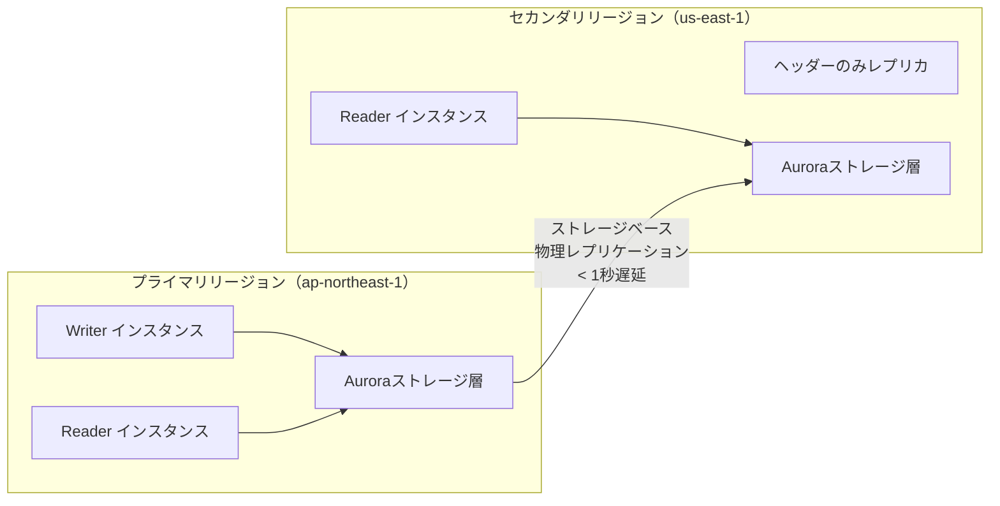
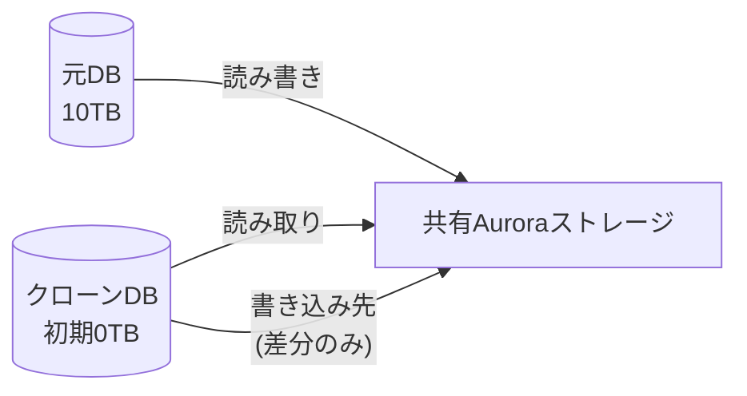

# テーマ8: Aurora高度設計

> 🔴 所要日数: 3-4日 | 座学 → ハンズオン → 問題演習

---

## 座学

## Part 1: SAAからの差分 — Auroraで深く問われる5領域

SAAでは「Auroraは3AZに6コピー」「最大5倍の性能」「MySQL/PostgreSQL互換」「クラスターエンドポイント/リーダーエンドポイント」までを学びました。

SAPでさらに問われるのは次の5つです。**Aurora Global Database**（リージョン間レプリケーション）、**Aurora Serverless v2**（自動スケーリング）、**Database Cloning**（コピーオンライトの高速クローン）、**Backtrack**（高速ポイントインタイム巻き戻し）、**Custom Endpoint**（ワークロード別の接続先分離）。いずれもSAAではほとんど触れなかった機能です。

---

## Part 2: Aurora Global Database — リージョン間レプリケーション

**Aurora Global Database**は、1つのプライマリリージョンに書き込み、複数のセカンダリリージョン（最大5つ）に**1秒以下のレプリケーション遅延**でデータを複製する機能です。通常のクロスリージョンリードレプリカと根本的に異なる仕組みで動きます。

通常のクロスリージョンリードレプリカはSQLバイナリログを別リージョンに転送してリプレイする方式で、遅延が数秒〜数十秒になることがあります。Global Databaseは**ストレージ層での物理レプリケーション**を使い、レプリケーション専用インフラでプライマリリージョンのDBインスタンスに負荷をかけません。

**ユースケース**:
1. グローバルユーザーに対する低レイテンシ読み取り（各リージョンのReaderを使う）
2. リージョン障害時の高速DR（セカンダリリージョンを昇格してプライマリにする、**RPO数秒、RTO分単位**）
3. データ分析のリージョン分離

**Managed Planned Failover**と**Unplanned Failover**の2種類があります。前者は計画的な切り替えでデータ損失なし、後者は障害時の切り替えで秒単位のデータ損失の可能性があります。

---

## Part 3: Aurora Serverless v2 — 細かい自動スケーリング

**Aurora Serverless v2**は、CPU・メモリを**0.5 ACU（Aurora Capacity Unit）単位で自動スケール**するサーバーレスAuroraです。v1とは全く別のアーキテクチャで、運用モデルも大きく異なります。

1 ACUは約2 GiBのメモリに相当し、最小0.5 ACUから最大128 ACU（256 GiBメモリ相当）まで動的にスケールします。スケーリングは**秒単位で完了**し、アプリケーションからは連続的な接続を維持したままキャパシティが変わります。

**ユースケース**:
- 予測困難なトラフィック変動があるアプリ（新しいサービス、季節変動のあるEコマース）
- ピーク時のみ負荷が高い開発・テスト環境
- SaaSのマルチテナント環境（テナントによって負荷が異なる）

**通常のプロビジョンドAuroraとServerless v2の混在**も可能です。クラスター内で「Writerはプロビジョンドで固定、Readerはサーバーレスで変動」といった構成が作れます。

v1との違い: v1はスケーリングに数秒〜数分かかり、スケール中にコネクションが切れることがありました。v1はIAM DB認証、Performance Insights、Data APIなどの制約もありました。v2ではこれらの制約が解消されています。新規環境ではv2を選びます。

---

## Part 4: Database Cloning — コピーオンライトの高速クローン

本番DBのデータを使った開発・テスト環境が欲しい——この要件に対する素朴な答えは「スナップショットを取って別クラスターで復元する」です。しかし数TBのDBではスナップショットの復元に数時間かかり、ストレージコストも2倍になります。

**Database Cloning**はこれを解決します。**コピーオンライト方式**でクローンを作成し、元DBと同じストレージを共有します。クローンに対して書き込みを行ったブロックだけが新しいストレージに書かれます。

**メリット**:
- クローン作成は**数分で完了**（10TB DBでも）
- ストレージコストは**差分のみ**（クローンで書き換えたブロックだけ課金）
- 元DBのパフォーマンスに影響しない

**制約**:
- 同一AWSアカウント・同一リージョン内のみ
- 元DBとクローンで最大15個のクローン階層まで

**ユースケース**:
- 本番データを使った機能テスト（本番に影響を与えない）
- スキーマ変更のリハーサル
- データ分析用の一時コピー

---

## Part 5: Backtrack — 高速な過去時点復元

**Aurora Backtrack**は、Aurora MySQL互換で使える**最大72時間前までの任意の時点に、DBクラスター全体を数分で巻き戻す**機能です。

誤ったUPDATE文を実行してテーブルのデータが壊れたとき、通常のポイントインタイムリカバリ（PITR）では新しいクラスターを作ってデータを復元し、アプリの向き先を変更する必要があります。これには時間がかかります。

Backtrackは既存クラスターをそのまま過去の状態に戻します。クラスターIDもエンドポイントも変わらず、アプリケーションの再接続設定は不要です。戻すのも進めるのも可能で、「1時間前に戻す → やっぱり30分前の方がいい → 進める」といった操作もできます。

**制約**:
- Aurora MySQL互換のみ（PostgreSQL互換は未サポート）
- クラスター作成時にBacktrackを有効化する必要がある（後から有効化不可）
- Global Databaseと併用できない

**PITRとBacktrackの比較**:

| 項目 | PITR | Backtrack |
|------|------|-----------|
| 復元方法 | 新しいクラスターに復元 | 既存クラスターを巻き戻す |
| 復元時間 | データサイズに比例（数時間） | 数分 |
| エンドポイント変更 | 必要 | 不要 |
| 対応エンジン | RDS全般 + Aurora | Aurora MySQL のみ |
| 期間 | 最大35日（バックアップ保持期間依存） | 最大72時間 |

---

## Part 6: Custom Endpoint — ワークロード別の接続先分離

デフォルトのAuroraには**クラスターエンドポイント**（Writer）と**リーダーエンドポイント**（Reader群をラウンドロビン）があります。しかしSAPレベルでは、これでは不十分なケースがあります。

たとえば「重いレポートクエリは専用の大きなインスタンスで処理し、通常のWebアプリは小さいインスタンス群で処理する」という要件です。リーダーエンドポイントに両方のリーダーを入れるとラウンドロビンで両方に振り分けられてしまいます。

**Custom Endpoint**は、特定のインスタンス群だけを指すカスタムDNSエンドポイントです。「`reporting.cluster-xxx.region.rds.amazonaws.com` は大型インスタンス2台のみに振り分ける」「`web.cluster-xxx.region.rds.amazonaws.com` は小型インスタンス5台に振り分ける」という構成ができます。

インスタンスの追加・削除があったときも、Custom Endpoint定義の中で「どのインスタンスに含めるか」のリストを更新するだけです。

---

## 練習問題

### 問題1

ある医療機関では、東京リージョンに患者レコード管理システムをAurora MySQL互換（プロビジョンド）で運用しています。金融庁のDR規制により、「東京リージョン全体が停止した場合でもRPO 5秒以内、RTO 1分以内で大阪リージョンから業務を継続できること」という要件が新たに設定されました。

現在は東京リージョンのAuroraにクロスリージョンリードレプリカ（大阪リージョン）を作成しており、バイナリログベースのレプリケーションで**平均10秒程度**の遅延があります。この構成ではRPO要件（5秒以内）を満たせません。また、フェイルオーバー時はアプリケーションの接続先変更が必要でRTO要件も厳しい状態です。

要件を満たす最適な構成はどれですか？

選択肢を見る

A. クロスリージョンリードレプリカをMulti-AZ配置にし、レプリケーション遅延を減らす

B. Aurora Global Databaseを構成し、東京リージョンをプライマリ、大阪リージョンをセカンダリとしてストレージベースの物理レプリケーションを行う。災害時はManaged Planned FailoverまたはUnplanned Failoverで大阪リージョンを昇格させる

C. DynamoDBグローバルテーブルを使い、東京と大阪のリージョン間でアクティブ-アクティブレプリケーションを行う

D. 東京リージョンのAuroraをMulti-AZで運用し、大阪リージョンには毎時スナップショットをコピーしてDR用のスタンバイクラスターを維持する

正解と解説を見る

**正解: B**

Aurora Global Databaseが正解です。ストレージ層での物理レプリケーションを行い、通常1秒未満のレプリケーション遅延でセカンダリリージョンにデータを複製します。これによりRPO 5秒以内が実現できます。災害時はセカンダリリージョンを分単位で昇格でき、RTO 1分以内も達成可能です。

- A: Multi-AZ配置はリージョン内の冗長化であり、リージョン間のレプリケーション遅延を直接改善しません。バイナリログベースのレプリケーション方式自体がGlobal Databaseと比較して遅いのが本質的な問題です
- C: DynamoDBはNoSQLであり、患者レコードのようなリレーショナルデータのスキーマ・SQLクエリを前提としたシステムには適しません。またRDBからDynamoDBへのマイグレーションはアプリケーション全体の大規模改修を要します
- D: 毎時スナップショットのコピーではRPOが1時間になり、要件（5秒以内）を全く満たしません

---

### 問題2

あるEコマースベンチャーでは、東京リージョンにAurora PostgreSQL互換（プロビジョンド、db.r6g.large × 2）で商品管理DBを運用しています。通常は1日数千クエリ程度のアクセスで負荷は低いのですが、毎週金曜日のタイムセール時に10倍以上のアクセスがあり、現在の構成ではCPU使用率が100%に張り付いてクエリ遅延が発生します。

アクセス増加のパターンが予測困難で、経営から「常に最大負荷に対応できる大きなインスタンスを用意するのはコストの無駄。必要なときだけスケールする仕組みがほしい」という要件が出ました。過去に使ったAurora Serverless v1は、スケーリング中にコネクションが切れる問題があり採用を断念しました。

運用負荷を増やさずこの要件を満たす構成はどれですか？

選択肢を見る

A. EventBridgeのスケジュールルールを作成し、毎週金曜日の特定時刻にLambdaでAuroraのインスタンスクラスを自動でアップグレードする

B. Aurora Auto Scalingを使いリードレプリカの数を自動調整する。書き込みエンドポイントの負荷は別途アプリケーションでキューイングして緩和する

C. Aurora MySQL互換に移行し、Aurora MySQL固有のバーストキャパシティ機能で一時的な負荷増加に対応する

D. Aurora Serverless v2に移行し、0.5 ACU〜64 ACUの範囲で秒単位の自動スケーリングを有効にする。コネクションは維持されたままキャパシティが動的に変化する

正解と解説を見る

**正解: D**

Aurora Serverless v2が正解です。v2はv1と異なるアーキテクチャで、0.5 ACU単位で秒単位のスケーリングが行われ、**コネクションを維持したまま**キャパシティが動的に変動します。v1の問題（スケーリング時のコネクション切断）は解消されています。プロビジョンドと同等の機能（IAM DB認証、Performance Insightsなど）も使えます。

- A: Lambda+スケジュールによるインスタンスクラス変更は、変更中にダウンタイムが発生します（フェイルオーバー時間分）。また「予測困難なパターン」の要件に合わず、金曜以外の突発的な負荷増加に対応できません
- B: リードレプリカのAuto Scalingは読み取り負荷には有効ですが、書き込み負荷（商品管理DBの更新）には効果がありません。また「アプリケーションでキューイング」は運用負荷を増やします
- C: Aurora MySQLに「バーストキャパシティ機能」というものはありません。データベースエンジンの変更は既存アプリケーションの大規模改修が必要です

---

### 問題3

あるフィンテック企業では、東京リージョンにAurora MySQL互換で8 TBの顧客取引DBを本番運用しています。新機能のQAテスト・パフォーマンステスト・セキュリティスキャンのために、**本番と全く同じデータ**を使ったテスト環境を毎週作成したいという要件が出ました。

運用チームから制約が提示されています。1つ目は「テスト環境の作成は1時間以内に完了すること」。2つ目は「本番のパフォーマンスに影響を与えないこと」。3つ目は「ストレージコストを最小化すること（本番データを丸ごとコピーする方式だと毎週8 TBの追加ストレージコストが発生する）」。

この要件を満たす最適な方法はどれですか？

選択肢を見る

A. 本番DBの夜間スナップショットを取得し、毎週月曜日にそのスナップショットから新しいAuroraクラスターを復元する

B. 本番DBのリードレプリカを作成し、毎週月曜日にそのリードレプリカをマスターに昇格して独立したクラスターにする

C. Auroraのデータベースクローン機能を使い、本番クラスターからコピーオンライト方式のクローンを作成する。書き込んだ差分ブロックのみが新しいストレージ領域に保存され、元のクラスターとストレージを共有する

D. DMS（Database Migration Service）を使って本番DBからテスト用DBに継続的にレプリケーションし、テスト実施時にレプリケーションを停止してテスト環境として使う

正解と解説を見る

**正解: C**

Auroraのデータベースクローン（Database Cloning）が正解です。コピーオンライト方式で、8 TB DBのクローンも数分で作成できます（実データのコピーは行われない）。本番DBへの読み取り負荷もほぼゼロ、ストレージコストはクローン側で書き換えたブロックの差分のみ発生します。3つの制約（1時間以内、本番影響なし、ストレージコスト最小）を全て満たします。

- A: 8 TBのスナップショットからの復元は数時間〜十数時間かかる可能性があり、「1時間以内」要件を満たせません。またストレージコストは毎週8 TBの追加が発生します
- B: リードレプリカをマスターに昇格すると、元のクラスターのレプリケーション構成が崩れ、本番運用に影響が出ます。毎週繰り返す運用には適しません
- D: DMSによる継続的レプリケーションはリアルタイム性が必要なユースケース向けで、本番DBへの負荷・運用の複雑さの両方が高くなります。本件のように「本番と同じデータのコピーが欲しい」という要件にはオーバースペックです

---

### 問題4

ある広告代理店では、Aurora MySQL互換に顧客キャンペーンの管理データを保存しています。誤って実行されたUPDATEクエリにより、数万件のキャンペーンレコードが意図しないステータスに書き換えられてしまいました。誤操作から30分が経過しており、その間に正当な更新も多数発生しています。

運用チームは「誤操作の5分前の時点にDBを戻したい」と考えています。ただし条件として、「既存のアプリケーション接続設定（エンドポイント）を変更せずに数分以内で巻き戻すこと」「その後の運用で、戻しすぎたら再度進めることも可能にしたい」「ダウンタイムは最小限にしたい」という要件があります。

このクラスターは作成時にBacktrack機能が有効化されており、保持期間は24時間に設定されています。

この要件を満たす最適な方法はどれですか？

選択肢を見る

A. Auroraの巻き戻し機能を使い、指定した過去のタイムスタンプにクラスター全体を巻き戻す。エンドポイントは変わらず数分で完了し、必要なら時間を進めることも可能

B. 自動スナップショットから新しいクラスターを作成してポイントインタイムリカバリを行い、アプリケーションの接続先を新クラスターに変更する

C. リードレプリカをマスターに昇格させ、そのレプリカを新しい本番として運用する

D. 手動でバックアップを取得し、同名のクラスターを削除してから復元することで元のエンドポイントを維持する

正解と解説を見る

**正解: A**

Aurora Backtrack（巻き戻し）が正解です。Backtrackは最大72時間前までの任意の時点にクラスター全体を数分で巻き戻せる機能で、エンドポイント・クラスターID・インスタンスIDも変わらずアプリケーション設定の変更は不要です。戻した後に「時間を進める」ことも可能で、「5分前に戻す → やっぱり10分前にする → 3分進める」といった操作も可能です。問題文にBacktrack有効化（保持期間24時間）が明記されているため、30分前の時点に巻き戻せます。

- B: PITRで新クラスターに復元する方式はデータサイズに比例して時間がかかり、かつアプリケーションの接続先変更が必要です。要件「既存のエンドポイントを変更せずに数分以内」を満たしません
- C: リードレプリカの昇格は誤操作の影響を元に戻すものではありません。誤操作したデータがレプリカに伝搬していれば昇格しても意味がなく、これは耐障害性のための手法です
- D: 同名のクラスターを削除する操作はリスクが高く、復元に長時間かかります。ダウンタイム最小化要件を満たしません

---

### 問題5

ある保険会社では、Aurora PostgreSQL互換クラスターで保険契約の管理を行っています。クラスターにはWriterが1台、Readerが5台構成されています。

最近、マーケティング部門が月次で大規模な分析レポートクエリを実行するようになりました。このレポートクエリは実行に30分以上かかり、実行中は特定のReaderのCPU使用率が100%に張り付きます。このため、通常のWebアプリケーションが利用する他のReaderでクエリ遅延が発生しています。

リードレプリカエンドポイント（デフォルトのReaderエンドポイント）を使うと、クエリがラウンドロビンで全Readerに分散されてしまうため、レポート用Readerを分離できません。

アプリケーション側のコード変更を最小限に抑えつつ、ワークロードを分離する最適な方法はどれですか？

選択肢を見る

A. Webアプリケーション用のReaderをクラスターから分離し、別のAuroraクラスターとしてデプロイする。アプリケーションの接続先を別クラスターに変更する

B. レポート用Readerにインスタンス親和性の高いセキュリティグループを設定し、マーケティング部門のIPアドレスのみからの接続を許可する

C. 大型のレポート専用インスタンス（db.r6g.4xlarge）1〜2台と、小型のWebアプリ用インスタンス群をクラスター内に配置し、それぞれを指す独自のDNSエンドポイントを作成してマーケティング部門とWebアプリで使い分ける

D. Aurora Auto Scalingを使ってレポートクエリ実行時に自動的にReaderを増やし、クエリ終了後に縮小する

正解と解説を見る

**正解: C**

Auroraの**Custom Endpoint**が正解です。Custom Endpointは、特定のインスタンス群だけを指すカスタムDNSエンドポイントを作成する機能です。「レポート用エンドポイントは大型インスタンス2台のみに振り分ける」「Webアプリ用エンドポイントは小型インスタンス5台に振り分ける」という構成が可能です。マーケティング部門はレポート用エンドポイントに接続し、Webアプリは別のエンドポイントに接続することで、ワークロードが明確に分離されます。アプリケーション側は接続先DNSを1つ変えるだけで済みます。

- A: クラスターを分離するとレプリケーション構成を別途構築する必要があり、整合性の確保が難しくなります。またクラスター間のデータ同期に遅延やコストが発生します
- B: セキュリティグループはネットワーク層の制御であり、ワークロードごとのインスタンス振り分けには使えません。リーダーエンドポイントのラウンドロビンは変わらず解決しません
- D: Auto Scalingで数を増やしても、全Readerへのラウンドロビン振り分けは変わらないため、重いレポートクエリが他のReaderにも降ってきます。ワークロード分離の根本解決になりません

---

### 問題6

あるグローバルSaaS企業では、アジア・ヨーロッパ・アメリカの3つの地域で顧客にサービスを提供しています。現在のDB構成はAurora MySQL互換のプロビジョンドクラスターがバージニアリージョン（us-east-1）に集約されており、書き込みも読み取りも全てこのクラスターで処理しています。

SLA要件として「どの地域のユーザーでも読み取りクエリのレイテンシを100 ms以下にすること」「地域障害時には30分以内に別リージョンでサービス復旧できること」が求められています。現状、アジアとヨーロッパのユーザーから「レスポンスが遅い」という不満が出ています。

CTO から「書き込みはバージニアリージョンに集約するポリシーは維持するが、各地域からの読み取りは地元で処理したい」という方針が示されました。

この要件を満たす最適な構成はどれですか？

選択肢を見る

A. 各地域にAurora Serverless v2のクラスターを配置し、毎時DMSで全地域にデータを同期する

B. Aurora Global Databaseを構成し、プライマリリージョン（us-east-1）にWriter、セカンダリリージョン（ap-northeast-1・eu-central-1）にそれぞれReaderを配置する。各地域のユーザーは地元のセカンダリリージョンのReaderに接続し、書き込みはバージニアのWriterに向ける。障害時はセカンダリリージョンを昇格する

C. CloudFrontを使い、Auroraへのクエリをキャッシュすることで各地域のレイテンシを改善する

D. 各地域にMulti-AZのAuroraクラスターを独立配置し、アプリケーション層で書き込みをバージニアに、読み取りを各地域に振り分ける

正解と解説を見る

**正解: B**

Aurora Global Databaseが正解です。プライマリリージョン（us-east-1）のWriterへの書き込みは、ストレージベースの物理レプリケーションで各セカンダリリージョンに1秒未満で反映されます。アジア・ヨーロッパの各リージョンにReaderを配置することで、各地域のユーザーは地元で読み取りでき、レイテンシ要件（100 ms以下）を満たせます。リージョン障害時はセカンダリリージョンを昇格でき、30分以内のRTOも達成可能です。

- A: DMSで毎時同期するとRPOが1時間になり、またレプリケーション遅延でデータ整合性の問題が発生します。Global Databaseのようなストレージレベルの低遅延レプリケーションと比較して劣ります
- C: CloudFrontはHTTPコンテンツのキャッシュサービスで、SQLクエリに対するキャッシュ機能はありません。またデータベース内容は頻繁に変化するためキャッシュ自体が適切ではありません
- D: 独立したクラスターを各地域に配置しアプリケーション層で振り分ける方法は機能しますが、地域間のデータ同期は別途構築する必要があり、Global Databaseのマネージド機能を使うより運用負荷が大幅に高くなります

