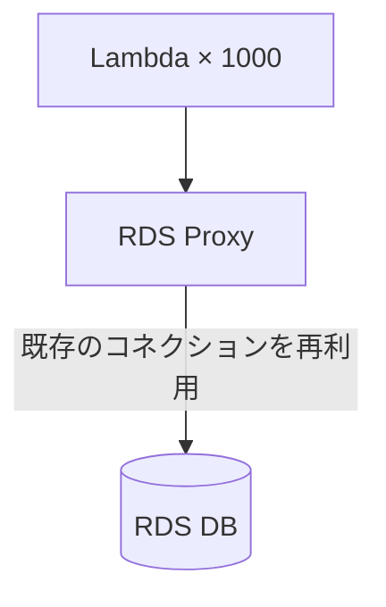
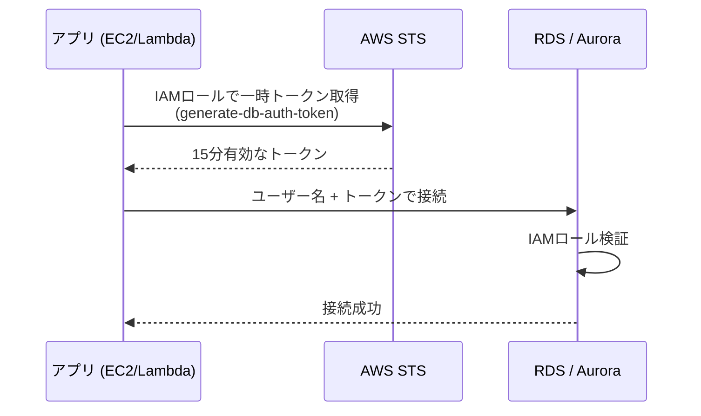

# テーマ9: RDS + RDS Proxy + DMS

> 🟡 所要日数: 2日 | 座学 → ハンズオン → 問題演習

---

## 座学

## Part 1: SAAからの差分 — SAPで問われる3つの領域

SAAでRDSの基本（Multi-AZ、リードレプリカ、自動バックアップ、パラメータグループ）は学びました。SAPでは次の3つを深掘りします。

**RDS Proxy**（コネクションプーリングによる接続管理）、**DMS**（異種DB間マイグレーションと継続的レプリケーション）、**IAMデータベース認証**（パスワードレスアクセス）です。SAAではこれらに触れていないため、ゼロから説明します。

---

## Part 2: RDS Proxy — コネクションプーリングと高可用性

**問題の背景**: Lambda関数は同時実行数に比例してDB接続数を増やします。1000個のLambdaが同時に起動すると、DBへの同時接続も1000になります。RDSには最大接続数（`max_connections`）の制限があり、例えばdb.m5.largeなら170程度。Lambdaが爆発的にスケールするとすぐに上限に達し、`Too many connections`エラーが発生します。またTLS/SSLハンドシェイクや認証プロセスで、接続確立に数十〜数百ミリ秒がかかります。

**RDS Proxy**はこれを解決するフルマネージドのコネクションプーリングサービスです。アプリケーションはRDS Proxyに接続し、Proxyが実際のDBコネクションをプールして使い回します。

**主な機能**:

1. **コネクションプーリング**: Proxyは少数（数十〜数百）のDBコネクションをプールし、アプリからのリクエストを使い回す。Lambdaが1000本立ち上がってもDBへの接続数は制限内に収まる

2. **自動フェイルオーバーの高速化**: Multi-AZのフェイルオーバー時、通常はDNSの伝播遅延（30秒〜数分）がある。Proxyを経由すると、Proxyがフェイルオーバーを検知して数秒でスタンバイに切り替える。**フェイルオーバー時間を最大66%短縮**

3. **Secrets Managerとの統合**: DBパスワードをコードに書かず、Secrets Managerから自動取得。自動ローテーションにも対応

4. **IAM認証の統合**: Proxy自体をIAM認証に設定し、パスワードレス接続を実現

**対応エンジン**: RDS MySQL / PostgreSQL / MariaDB、Aurora MySQL / PostgreSQL互換。

**使うべきケース**: Lambda + RDSの組み合わせ、コンテナ（Fargate/ECS）でスケールするアプリ、接続数が予測困難なサーバーレスワークロード。

---

## Part 3: DMS（Database Migration Service）

**DMS**は異なるデータベース間でデータを移行・レプリケーションするマネージドサービスです。オンプレのOracleからAurora PostgreSQLへ、SQL ServerからDynamoDBへ、といった大規模な移行を中断時間最小限で実行できます。

**基本コンポーネント**:

- **レプリケーションインスタンス**: DMSが実行されるEC2インスタンス。移行処理を担当する
- **エンドポイント**: ソースDBとターゲットDBへの接続情報
- **タスク**: 実行する移行作業の定義（フルロード、フルロード + CDC、CDCのみ）

**移行タイプ**:

1. **Full Load**: ソースの全データを一括でターゲットにコピー
2. **Full Load + CDC**: 初期フルロード後、ソースの変更を継続的にターゲットに適用（CDC = Change Data Capture）
3. **CDC Only**: すでに初期データがあり、変更分だけ継続レプリケーションする場合

**Schema Conversion Tool（SCT）との使い分け**: 異種DB間移行（例: Oracle → PostgreSQL）ではスキーマ（テーブル定義、ストアドプロシージャなど）の変換が必要です。DMSはデータ移行を担当し、SCTはスキーマ変換を担当します。両者を組み合わせて使います。

**ユースケース**:
- オンプレミスDBからAWSへの移行（中断時間を最小にしたい）
- 異種DBエンジン間の移行
- 本番DBから分析用DBへの継続レプリケーション
- マルチリージョン間のデータ同期

---

## Part 4: IAMデータベース認証

**IAMデータベース認証**は、DBのユーザー名/パスワードの代わりにIAMロールを使ってRDS/Auroraに接続する仕組みです。

**メリット**:
- DBパスワードをアプリケーション内に保存不要（セキュリティ向上）
- IAMロール経由の統一された認証管理
- トークンは15分有効で自動失効

**制約**:
- 接続確立時のみIAM認証が必要（接続中のクエリには影響なし）
- 1秒あたり200接続まで（制限）
- DBユーザー自体は事前に作成し、`AWSAuthenticationPlugin`を有効化しておく必要がある

**RDS Proxyと組み合わせる**と、Proxy経由で接続するアプリケーションもIAM認証を使えます。パスワードの管理が完全に不要になります。

---

## 練習問題

### 問題1

あるスタートアップでは、サーバーレスアーキテクチャを採用し、API Gateway + Lambda + RDS MySQL（db.m5.large、最大接続数170）の構成でモバイルアプリのバックエンドを運用しています。サービスが人気を博し、ピーク時には1秒あたり500個のLambda関数が同時実行されるようになりました。

DB接続エラー `Too many connections` が頻発し、DBインスタンスクラスを上げて `max_connections` を増やしても、ピークトラフィックにはすぐ追いつかず、結局同じエラーが再発します。また、Multi-AZフェイルオーバー時にアプリケーション側が古いエンドポイントに接続し続け、復旧までに2〜3分かかることも問題視されています。

最小のアプリケーション改修でこれらの問題を同時に解決する構成はどれですか？

選択肢を見る

A. LambdaにリザーブドコンカレンシーLimitを設定して同時実行数を制限し、接続数が上限を超えないようにする

B. Lambda関数内でコネクションプールライブラリを実装し、関数の実行間で接続を再利用する

C. RDSとLambdaの間にフルマネージドのコネクションプーリングサービスを配置し、Lambdaはこのサービスに接続する。フェイルオーバー時もこのサービスが接続先を自動切り替えする

D. RDS MySQLをAmazon DynamoDBに移行してスキーマレス化し、接続数制限のないNoSQLに切り替える

正解と解説を見る

**正解: C**

RDS Proxyが正解です。RDS ProxyはLambdaとRDSの間に配置するフルマネージドのコネクションプーリングサービスで、Lambdaからの大量のリクエストを少数のDB接続にプールして処理します。これにより `Too many connections` エラーが解消されます。さらに、Multi-AZフェイルオーバー時にはProxyが検知して自動的に新しいプライマリに接続を切り替えるため、アプリケーション側の切り替え時間が数秒に短縮されます（最大66%短縮）。

- A: リザーブドコンカレンシーでの制限は、ユーザー体験を損ない（API呼び出しが失敗する）根本解決になりません
- B: Lambdaの実行モデル上、コンテナの再利用は保証されず、各Lambda実行で独立した接続が必要になる場合があります。コネクションプールライブラリをLambda内に書いても効果は限定的で、かつ実装コストが高いです
- D: NoSQLへの移行は大規模なアプリケーション改修が必要で「最小のアプリケーション改修」の要件に反します

---

### 問題2

ある金融機関では、オンプレミスデータセンターのOracle Database（12c、データ量約2 TB）をAWSに移行する計画を進めています。AWS側のターゲットはAurora PostgreSQL互換を選定しました。

業務要件として「移行作業によるサービス停止は最長4時間以内」「オンプレOracleのストアドプロシージャ（約200個）もPostgreSQLに変換する必要がある」「移行前後のデータ整合性を検証する仕組みが必要」とされています。

移行期間は2週間程度を見込んでおり、その間オンプレOracleへの書き込みが続くため、書き込み内容を継続的にAWSに同期する必要があります。

この要件を満たす最適な移行戦略はどれですか？

選択肢を見る

A. AWS SCT でスキーマとストアドプロシージャをPostgreSQL用に変換し、DMSのFull Load + CDCタスクで初期データをAurora PostgreSQLにロードしつつ、継続的にソースの変更をレプリケーションする。カットオーバー時にアプリケーション接続先を切り替える

B. Oracle Data Pumpでエクスポートしたダンプファイルを毎日S3にアップロードし、Aurora PostgreSQLで毎日インポートすることで継続的に同期する

C. AWS DataSyncを使ってオンプレOracleのデータファイル（.dbf）をAWSに同期し、Aurora PostgreSQLでマウントする

D. AWS Database Migration Serviceのみを使い、スキーマとデータを一度に変換・移行する

正解と解説を見る

**正解: A**

AWS SCT + DMS（Full Load + CDC）の組み合わせが正解です。

1. **SCT（Schema Conversion Tool）**: Oracleのスキーマ（テーブル定義、インデックス、ストアドプロシージャ）をPostgreSQLの構文に変換する
2. **DMS Full Load + CDC**: 初期データをAurora PostgreSQLに一括ロードし、その後はオンプレOracleの変更をCDC（Change Data Capture）で継続的にターゲットに反映する

これにより2週間の移行期間中もオンプレへの書き込みがAWSに同期され続け、カットオーバー時のダウンタイムは数分〜数時間に抑えられます。DMSには移行前後のデータ整合性検証機能（Validation）も組み込まれています。

- B: 毎日のダンプファイル同期では1日のデータ損失が発生し、4時間のダウンタイム要件を満たせません
- C: DataSyncはファイルレベルの同期サービスです。OracleのデータファイルをPostgreSQLでマウントすることはできません（DBエンジンが完全に異なる）
- D: DMSはデータ移行ツールであり、スキーマ変換（特にストアドプロシージャの変換）には対応していません。異種DB間の移行ではSCTと組み合わせる必要があります

---

### 問題3

ある医療機関のシステム部では、Aurora MySQL互換にアプリケーションから接続する際、DBユーザーのパスワード管理が課題となっていました。現在はアプリケーションの設定ファイルに平文でパスワードが記載されており、セキュリティ監査で指摘を受けています。

要件は、アプリケーション（EC2上のWebサーバー）がDBに接続する際に、パスワードを使わずIAMロールベースで認証すること、および接続時のトークンが短時間で自動失効すること（キーの漏洩リスクを最小化する）です。

現在のDBユーザーはMySQL標準のパスワード認証で作成されています。

最も適切な実装方法はどれですか？

選択肢を見る

A. AWS Secrets ManagerにDBパスワードを格納し、アプリケーションが起動時にSecrets Managerから取得する

B. DBユーザーに`AWSAuthenticationPlugin`を有効化し、EC2インスタンスにIAMロールをアタッチする。アプリケーションは `generate-db-auth-token` で15分有効な一時トークンを取得し、そのトークンをパスワードとしてDBに接続する

C. DBへの接続前にアプリケーションがAWS STSで短期認証情報を取得し、その認証情報を使ってAurora APIを直接呼び出す

D. VPCエンドポイント経由でのアクセスに限定し、IAMポリシーでVPCエンドポイントへのアクセスを制御することで、DBパスワードの漏洩を防ぐ

正解と解説を見る

**正解: B**

IAMデータベース認証が正解です。DBユーザーに`AWSAuthenticationPlugin`を有効化すると、MySQLの標準パスワード認証の代わりにIAMロールベースの認証が使えます。EC2のIAMロールから `aws rds generate-db-auth-token` API（または SDK）で15分有効な一時トークンを生成し、そのトークンをパスワードとしてDBに接続します。トークンは15分で自動失効し、キーの漏洩リスクを最小化できます。

- A: Secrets Managerによるパスワード管理は現実的な手法ですが、「パスワードを使わずIAMロールベースで認証する」という要件を満たしません。またパスワードの自動ローテーションはあるものの、認証自体はパスワードベースのままです
- C: Aurora APIでのクエリ実行はRDS Data APIとして存在しますが、Aurora Serverlessのみ対応であり、通常のプロビジョンドAuroraでは使えません。また接続方式が従来のMySQLクライアントから大きく変わるためアプリ改修が必要です
- D: VPCエンドポイントでのネットワーク制御は有効な追加対策ですが、パスワード認証そのものを置き換える仕組みではありません

---

### 問題4

あるEコマース企業では、オンプレミスのSQL Serverをマスターとして運用しており、分析チームが毎朝本番データのコピーを取得して分析業務に使っています。最近、分析用のAWS環境が整備され、「本番SQL Serverの変更を数分以内にAWS上のRedshiftに反映し、分析をAWSで行う」構成に移行したいと考えています。

要件として、本番SQL Serverへの影響を最小化すること（CPU負荷5%以下）、Redshiftへの反映遅延は5分以内、スキーマはSQL ServerとRedshiftで同等にすることが求められています。SQL Server側はCDC（Change Data Capture）を有効化できる状態にあります。

最適な構成はどれですか？

選択肢を見る

A. 毎朝SQL Serverからbcpコマンドでデータをエクスポートし、S3にアップロードしてRedshiftにCOPYコマンドでロードする

B. SQL ServerにLinked Server機能を設定し、RedshiftのJDBC経由で直接クエリする

C. DMSを使い、ソースエンドポイントとしてSQL Server（CDC有効）、ターゲットエンドポイントとしてRedshiftを指定し、Full Load + CDCタスクで継続的にレプリケーションする

D. AWS GlueのJDBCコネクタを使い、5分間隔でSQL Serverから差分データを抽出してRedshiftに書き込む

正解と解説を見る

**正解: C**

DMSのFull Load + CDCが正解です。SQL ServerはDMSのソースとしてCDC対応しており、Redshiftはターゲットとしてネイティブサポートされています。CDCは SQL Serverのトランザクションログから変更を読み取るため、本番DBへのCPU負荷は最小限（通常5%未満）です。変更は数秒〜数分でRedshiftに反映されます。

- A: 毎朝のバッチ同期では「5分以内の反映」要件を満たせません
- B: SQL ServerからRedshiftへのLinked Serverは公式にはサポートされておらず、設定できても本番SQL Serverの負荷が増加します
- D: Glue + JDBC による5分間隔の差分抽出も可能ですが、差分判定のためのクエリがSQL Serverに負荷をかけます。また実装コストが高く、DMSの方が公式サポートのある適切な手段です

---

### 問題5

ある広告代理店では、キャンペーン管理システムをRDS for PostgreSQL（Multi-AZ構成）で運用しています。アプリケーションはECS Fargateで動いており、Fargateタスクが数十〜数百個並列実行されることがあります。

最近、DBのフェイルオーバーテストを実施したところ、Multi-AZのスタンバイへの切り替えに2〜3分かかり、その間アプリケーションがエラーを返す状態が続きました。ビジネス側からは「フェイルオーバーによるダウンタイムを30秒以内に短縮してほしい」という要求が出ています。

さらに、DBパスワードのローテーションをSecrets Managerで自動化したいという要件もあります。ECS Fargateのタスクごとにパスワードを取得するのは運用コストが高いため、一元的に管理したいとのことです。

この2つの要件を同時に満たす構成はどれですか？

選択肢を見る

A. RDS Proxyを作成しFargateタスクをProxy経由でDBに接続する。ProxyはSecrets Managerと統合してパスワードを取得し、フェイルオーバー時も自動で新しいプライマリに切り替える

B. RDSのMulti-AZをMulti-AZ Cluster Deploymentsにアップグレードし、2つのスタンバイによる高速フェイルオーバーを実現する。パスワードはFargateタスクごとにSecrets Managerから取得する

C. ECS Fargateのタスク定義でHealth Checkを短くし、タスク自体をフェイルオーバーさせる

D. Aurora PostgreSQL互換に移行し、Auroraの高速フェイルオーバー機能を使う

正解と解説を見る

**正解: A**

RDS Proxyが正解です。RDS Proxyは2つの要件を同時に解決します。

1. **高速フェイルオーバー**: Multi-AZフェイルオーバー時、ProxyがDNSの伝播を待たずに数秒で新しいプライマリに接続を切り替えます（ダウンタイム最大66%短縮、通常30秒以内）
2. **Secrets Manager統合**: Proxyは自動的にSecrets Managerからパスワードを取得し、ローテーション時も自動で対応します。Fargateタスク側はProxyに接続するだけで、Secrets ManagerへのアクセスやDBパスワードの管理が不要になります

- B: Multi-AZ Cluster Deploymentsは3ノード構成で高速フェイルオーバーを提供しますが、Secrets Managerとの統合はFargateタスク側で個別に実装する必要があります。要件の「一元管理」を満たすにはProxyの方が適切です
- C: ECSタスク側のヘルスチェックはアプリケーションの正常性確認であり、DB接続の切り替えを直接改善するものではありません
- D: Aurora移行は大規模な変更で、要件（現状のPostgreSQL + 最小の変更）に対して過剰です。Aurora自体はフェイルオーバーが速いですが、Auroraを使う場合でもRDS Proxyと組み合わせるのが定石です

---

### 問題6

ある大手小売企業では、オンプレミスのOracle Database（数TB）と複数のMySQLサーバー（各数百GB）を運用しており、これらを全てAWSに移行する計画です。移行先はAurora PostgreSQL互換（Oracle移行先）とAurora MySQL互換（MySQL移行先）です。

移行期間中、オンプレミスとAWSの両環境でデータが同期される必要があり、カットオーバー時にダウンタイムを最小化したいと考えています。さらに、移行完了後も一部の外部連携システム（オンプレミス側にあるサブシステム）とAWS環境の間でデータ同期を続けたいという要件もあります。

移行チームから「単発の移行ツールではなく、継続的なデータ同期ができる仕組みを導入したい」という要望が出ています。

この要件を満たす最適なツール・構成はどれですか？

選択肢を見る

A. AWS Snowball Edgeを使ってオンプレミスデータを物理的にAWSに輸送し、S3経由でRDSにインポートする。継続的な同期はLambdaで自社実装する

B. AWS DataSyncでDBファイルをAWSに同期し、移行完了後もDataSyncで継続的にファイルレベルの同期を行う

C. DMSのレプリケーションインスタンスを長期運用する構成を採用し、移行期間中はFull Load + CDCで継続同期する。移行完了後もCDCタスクを継続実行してオンプレミスと AWS 環境の継続的なレプリケーションを維持する

D. オンプレミスのDBをそのままEC2に移行し、データベースエンジンレベルのレプリケーション機能（Oracle GoldenGate、MySQL Replicationなど）を使う

正解と解説を見る

**正解: C**

DMSの継続運用が正解です。DMSのFull Load + CDCタスクは、一度完了して停止するだけでなく、長期にわたって継続実行できます。移行完了後もCDCタスクを動かし続けることで、オンプレミスとAWS環境の継続的なレプリケーションが維持できます。オンプレミス側のサブシステムとAWS環境の間で双方向または一方向のデータ同期を維持できます。

- A: Snowball Edgeは初期データ転送に適していますが、継続的な同期には別途仕組みを実装する必要があります。Lambdaでの自社実装は運用負荷が非常に高く、CDC相当の機能を再実装するのは非現実的です
- B: DataSyncはファイルレベルの同期サービスで、DBのトランザクションを安全に同期することはできません。ファイルをコピーすると不整合なデータが生成される可能性があります
- D: Oracle GoldenGateなどのエンジン固有のレプリケーションツールはライセンス費用が高額で、AWSへの移行後もオンプレミス側にOracleライセンスを維持する必要があります。DMSのマネージドサービスの方がコスト・運用の両面で有利です

