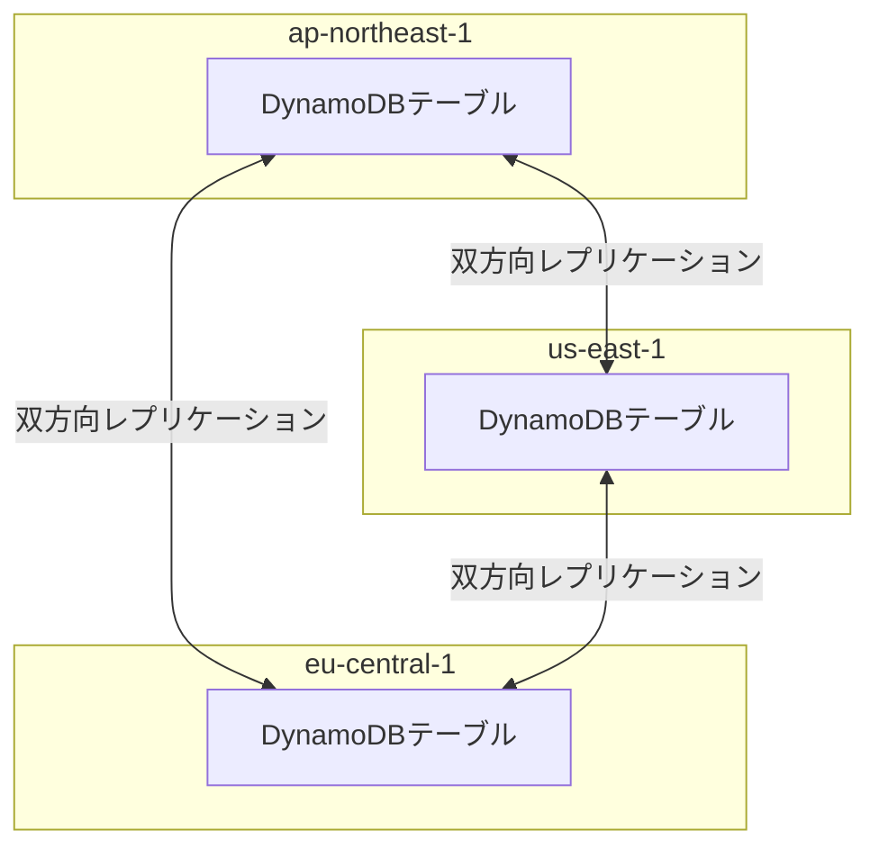

# テーマ10: NoSQL使い分け（DynamoDB中心）

> 🟡 所要日数: 2日 | 座学 → 比較表整理 → 問題演習

---

## 座学

## Part 1: SAAからの差分 — DynamoDBで問われる設計領域

SAAでDynamoDBの基本（キーバリュー、パーティションキー/ソートキー、Streams、DAX）は学びました。SAPでは次の領域が深く問われます。

**Global Tables**（マルチリージョンアクティブ-アクティブレプリケーション）、**キャパシティモード**（Provisionedとオンデマンドの選択）、**パーティションキー設計**（ホットパーティション問題）、**条件式とトランザクション**（整合性保証）、**PITR**（ポイントインタイムリカバリ）、**TTL**（自動削除）。

---

## Part 2: DynamoDB Global Tables — マルチリージョンアクティブ-アクティブ

**DynamoDB Global Tables**は、複数のリージョン間で**アクティブ-アクティブ**のレプリケーションを提供します。どのリージョンでも書き込み・読み取りが可能で、変更は通常1秒未満で他のリージョンに反映されます。

Aurora Global Databaseとの違いは、Aurora Global Databaseは**プライマリリージョンのみが書き込み可能**（セカンダリは読み取り専用）なのに対し、DynamoDB Global Tablesは**全リージョンが書き込み可能**なアクティブ-アクティブ構成という点です。



**競合解決**: 同じアイテムが複数リージョンで同時に更新された場合、**Last Writer Wins**（最後の書き込みが勝つ）でタイムスタンプベースで解決されます。強い整合性が必要なアプリケーションでは、この挙動を考慮した設計が必要です。

**ユースケース**: グローバルに展開するモバイルアプリ、マルチリージョンのゲーム、リージョン障害時のDR要件。

**有効化の制約**: Global Tablesを有効化するにはテーブルのStreamを有効化する必要があります（既存テーブルに後から追加可能）。

---

## Part 3: キャパシティモード — Provisioned vs On-Demand

DynamoDBには2つのキャパシティモードがあります。

**Provisionedキャパシティ**: 事前に必要な読み取り/書き込みキャパシティユニット（RCU/WCU）を指定します。単価が安く、予測可能なワークロードに適しています。Auto Scalingと組み合わせると、使用率に応じて自動的にキャパシティを調整できます（ただしスケール反映には数分かかる）。

**On-Demandキャパシティ**: キャパシティを事前指定せず、実際のリクエスト量に応じて自動的にスケールし、使った分だけ課金されます。単価はProvisionedの約5〜7倍ですが、予測困難な変動ワークロードで無駄なく対応できます。

**選び方の目安**:

| 条件 | 推奨モード |
|------|-----------|
| 安定した負荷、予測可能 | Provisioned + Auto Scaling（コスト有利） |
| 新規サービス、負荷が未知 | On-Demand |
| 突発的なスパイク（CM放送など） | On-Demand（瞬時にスケール） |
| 低トラフィック、長時間アイドル | On-Demand |
| ピーク対応でRCU/WCUが高め | Provisioned（コスト優位） |

**相互切り替え**: ProvisionedとOn-Demandは24時間に1回切り替え可能です。

---

## Part 4: パーティションキー設計とホットパーティション

DynamoDBはパーティションキーのハッシュ値でデータを物理的に分散させます。**パーティションキーに偏りがあると**、特定のパーティションに負荷が集中する**ホットパーティション**問題が発生します。

**ホットパーティションの典型例**:
- パーティションキーに`日付`（2026-04-21）を使う → その日の全データが1パーティションに集中
- パーティションキーに`ユーザーの国`（日本/US/EU）を使う → 日本ユーザーだけが偏るとそのパーティションが遅い
- パーティションキーに`status`（active/inactive）を使う → 2つのパーティションしか使われない

**対策**:

1. **高カーディナリティのキーを使う**: `ユーザーID`、`セッションID`など、値の種類が多いキー
2. **キーを人工的に分散させる（Write Sharding）**: `日付#ランダム数0-9` のようにサフィックスを付ける。書き込み時は10個のパーティションに分散、読み取り時は全10個からクエリ
3. **設計フェーズでアクセスパターンから逆算**: DynamoDBは「RDBのように後からクエリを足せるDB」ではなく、「アクセスパターンが決まってからテーブル設計する」DB

```
悪い例: パーティションキー=日付
  2026-04-21: [100万件]  ← ここに集中
  2026-04-20: [0件]     ← 使われない

良い例: パーティションキー=日付#シャード
  2026-04-21#0: [10万件]
  2026-04-21#1: [10万件]
  2026-04-21#2: [10万件]
  ...
  2026-04-21#9: [10万件]
```

---

## Part 5: 条件式とトランザクション

**条件式（Condition Expressions）**は、DynamoDBのPutItem/UpdateItem/DeleteItemに対して「特定の条件を満たす場合のみ実行する」を指定できます。楽観的ロックの実装に使います。

```
UpdateItem
  Key: {user_id: "U001"}
  UpdateExpression: "SET balance = :new_balance"
  ConditionExpression: "balance = :old_balance"
  ExpressionAttributeValues: {
    ":new_balance": 1000,
    ":old_balance": 1500
  }
```

この例では「balanceが1500のままの場合のみ、1000に更新する」を意味します。条件が満たされない場合（他のプロセスが先に更新した場合）、`ConditionalCheckFailedException`が発生し、更新は行われません。

**DynamoDBトランザクション**は複数のアイテムに対する**ACID保証**を提供します。

- **TransactWriteItems**: 最大100アイテムの書き込み（Put/Update/Delete/ConditionCheck）を1つのトランザクションで実行
- **TransactGetItems**: 最大100アイテムの読み取りを1つのトランザクションで実行

「口座Aから1万円引き、口座Bに1万円足す」のような処理で、両方が成功しない限り両方をロールバックする設計が可能です。

**制約**: トランザクションは単一リージョン内のみ（Global Tablesでも単一リージョン単位）。単一のPutItem/UpdateItemの2倍のキャパシティを消費します。

---

## Part 6: PITR（Point-in-Time Recovery）とTTL

**PITR**は、過去35日以内の**任意の秒単位**の状態にテーブルを復元する機能です。誤ってアプリケーションがデータを削除した場合などに、数秒前の状態に戻せます。有効化するとテーブル変更が継続的に記録されます。

**オンデマンドバックアップとの違い**: オンデマンドバックアップは「バックアップ時点」のスナップショットを取る方式。PITRは「任意の時点」への復元が可能ですが、過去35日の制限があります。長期保管が必要なバックアップはオンデマンドバックアップ（またはAWS Backup）を使います。

**TTL（Time To Live）**は、アイテムの特定属性（Unix timestamp）をTTL属性として指定すると、DynamoDBが自動的にその時刻を過ぎたアイテムを削除します。セッション管理、一時的なキャッシュ、ログの自動削除などに使います。

重要な特性: TTLでの削除は**即時ではなく、最大48時間の遅延**があります。厳密な有効期限が必要な場合は、アプリケーション側で期限チェックを併用します。

---

## 練習問題

### 問題1

あるグローバルモバイルゲーム企業では、アジア・アメリカ・ヨーロッパのプレイヤーが同じゲームサーバーを使用しています。ゲームのプロフィール・スコア・インベントリデータはDynamoDBに保存されており、現在はus-east-1リージョンに集約しています。

課題として、アジアとヨーロッパのプレイヤーからは「リクエストのレイテンシが200〜300 msあり、リアルタイムゲームには遅すぎる」というクレームが多発しています。また、us-east-1が過去に障害で5時間停止した際、全世界のユーザーがゲームを利用できず大きな損失が発生しました。

要件は、どの地域からも50 ms以下の読み書きレイテンシを実現し、1リージョンの障害時にも他地域は影響を受けずにサービスを継続できることです。

この要件を満たす最適な構成はどれですか？

<details>
<summary>選択肢を見る</summary>

A. us-east-1のDynamoDBにクロスリージョンリードレプリカを作成し、各地域から最寄りのリードレプリカで読み取る。書き込みは引き続きus-east-1に集約する

B. DynamoDBをGlobal Tables構成にし、ap-northeast-1・us-east-1・eu-central-1の3リージョンにアクティブ-アクティブのレプリカを配置する。各地域のプレイヤーは最寄りのリージョンで読み書きを行い、変更は1秒未満で他リージョンに伝播する

C. 各地域にDynamoDBを独立配置し、ユーザーIDでシャーディングすることで地域ごとのデータ分離を行う

D. us-east-1のDynamoDBへのアクセスをGlobal Acceleratorで経路最適化し、レイテンシを改善する

</details>

<details>
<summary>正解と解説を見る</summary>

**正解: B**

DynamoDB Global Tablesが正解です。Global Tablesは複数のリージョンでアクティブ-アクティブのレプリケーションを行い、どのリージョンでも書き込み・読み取りが可能です。プレイヤーは最寄りのリージョンにアクセスすることで数十ミリ秒のレイテンシを実現でき、1リージョンの障害時でも他リージョンでサービスを継続できます。レプリケーション遅延は通常1秒未満です。

- A: DynamoDBには伝統的な「クロスリージョンリードレプリカ」機能はありません。Global Tablesがこれに相当する機能です。また書き込みをus-east-1に集約する場合、アジア・ヨーロッパからの書き込みレイテンシは改善されません
- C: 地域ごとに独立配置すると、プレイヤーが地域を跨いで移動したときのデータ移行が課題になり、リアルタイムゲームには不適切です
- D: Global AcceleratorはTCP/UDPの経路最適化ですが、us-east-1までの物理距離による遅延（アジアから150 ms程度）を完全に解消することはできません

</details>

---

### 問題2

あるSNS運営会社では、ユーザーの投稿データをDynamoDBに保存しています。パーティションキーに`user_id`、ソートキーに`post_date`を設定していました。

最近、特定の著名人ユーザー（フォロワー数百万人）がバズった投稿を行った際、そのユーザーに関連する読み取りリクエストが1秒あたり数万件発生し、DynamoDBからThrottlingエラーが多発しました。他の一般ユーザーの読み書きも同じパーティションの負荷で遅延しています。調査の結果、著名人の投稿データが1つのパーティションに集中する**ホットパーティション問題**だと判明しました。

この問題を解決するパーティション設計として最も適切なものはどれですか？

<details>
<summary>選択肢を見る</summary>

A. キャパシティモードをOn-Demandに変更し、キャパシティ上限の問題を解決する

B. DynamoDB Accelerator（DAX）を前段に配置し、著名人の投稿を全てキャッシュすることでDynamoDBへのアクセスを減らす

C. パーティションキーを `user_id#shard_number` の形式に変更し、shard_numberを0〜9のランダム値にすることで、同じユーザーのデータを最大10個のパーティションに分散する。読み取り時は10個のパーティション全てに対して並列クエリを発行する

D. DynamoDB Global Tablesを有効化し、リージョンを増やしてパーティションを分散する

</details>

<details>
<summary>正解と解説を見る</summary>

**正解: C**

Write Shardingが正解です。パーティションキーに人工的なシャードサフィックス（`user_id#0`〜`user_id#9`など）を付けることで、同じユーザーのデータを複数のパーティションに意図的に分散させます。これにより、著名人のような「1ユーザーに大量アクセス」が発生しても、複数パーティションで負荷を分散できます。読み取り時は10個のパーティションに対して並列クエリを実行し、結果をマージします。

- A: On-Demandモードはキャパシティの自動スケーリングに対応しますが、**パーティション自体のスループット上限（RCU 3,000/WCU 1,000）は依然として存在**します。ホットパーティションに集中するアクセスはOn-Demandでも解決しません
- B: DAXは読み取りキャッシュとして有効ですが、ホットパーティションの根本的な分散問題は解決しません。また書き込みは引き続きDynamoDB本体に行われます
- D: Global Tablesはリージョン間のレプリケーションであり、同一リージョン内のパーティション分散とは別の機能です。ホットパーティション問題の解決にはなりません

</details>

---

### 問題3

ある新規サービス開発プロジェクトでは、DynamoDBを中心としたアーキテクチャを採用しています。プロジェクトの特徴として、ユーザー数の成長が予測困難で、ローンチ直後の負荷が非常に低い可能性もあれば、TVCM放映で爆発的に増える可能性もあります。

運用担当からの要望は2つあります。1つ目は「キャパシティの事前予測が困難なので、リクエスト量に応じて自動的にスケールしてほしい」。2つ目は「低負荷時のコストを最小化したい（ゼロに近いリクエスト量でも固定費が発生するのは避けたい）」。

アプリケーションはDynamoDBへの書き込み・読み取りが発生し、低負荷時は1秒数回、高負荷時は数千〜数万回に達する可能性があります。

最適なキャパシティモードとその理由として適切なものはどれですか？

<details>
<summary>選択肢を見る</summary>

A. Provisionedモードで最大負荷に対応する高いRCU/WCUを事前に設定しておく

B. Provisionedモードに Auto Scaling を組み合わせ、最小RCU/WCUを低く設定しつつ高負荷時にスケールする

C. Provisionedモードで、運用中にAuto Scalingのメトリクスを見て週次で手動調整する

D. On-Demandモードを採用し、リクエスト量に完全比例する課金体系を利用する。低負荷時の固定費を最小化でき、突発的なスパイクにも瞬時にスケールする

</details>

<details>
<summary>正解と解説を見る</summary>

**正解: D**

On-Demandキャパシティモードが正解です。ユーザー数の予測が困難で、低負荷〜高負荷のレンジが非常に広いケースでは、On-Demandが最適です。

- **自動スケーリング**: リクエスト量に応じて自動的にスケールし、瞬時のスパイクにも対応できます
- **ゼロに近い固定費**: 低負荷時はほぼ課金されず、実際に使った分だけ請求されます
- **運用簡素化**: キャパシティ調整が不要で、運用負荷が最小になります

- A: 最大負荷を基準にProvisionedを設定すると、低負荷時に過剰な課金が発生します。要件「低負荷時のコストを最小化」を満たしません
- B: Auto Scalingはスケールアップに数分かかります。突発的なTVCMスパイク（数秒で数十倍）には対応が間に合わず、Throttlingが発生します
- C: 週次の手動調整は運用負荷が高く、突発的な変動にも対応できません

</details>

---

### 問題4

ある通販サイトでは、DynamoDBに商品カタログデータを保存しており、毎日の変更を分析用のS3 Data Lakeに反映させる必要があります。現在は毎晩バッチ処理でDynamoDB全体をエクスポートしS3にコピーしていますが、データ量が増加し（50 GB程度）毎晩の処理に4時間かかるようになりました。

要件は、DynamoDBの変更（追加・更新・削除）を**数分以内にS3に反映**することと、**DynamoDB自体への負荷を最小化**することです。

この要件を満たす構成として最も適切なものはどれですか？

<details>
<summary>選択肢を見る</summary>

A. DynamoDB Streamsを有効化し、変更イベントをLambdaでキャプチャしてKinesis Data Firehose経由でS3に書き込む

B. DynamoDBへのGlobal Secondary Index（GSI）を追加し、GSIをスキャンしてS3にコピーする

C. Amazon DataSyncでDynamoDBテーブルを定期的にS3に同期する

D. 毎時間DynamoDBテーブルをスキャンし、前回以降の変更を検出してS3に書き込むLambda関数を作成する

</details>

<details>
<summary>正解と解説を見る</summary>

**正解: A**

DynamoDB Streams + Lambda + Kinesis Data Firehoseが正解です。

- **DynamoDB Streams**: テーブルのデータ変更を時系列順にキャプチャする機能で、24時間保持されます。新規書き込み・更新・削除が全てキャプチャできます
- **Lambda**: Streamsのトリガーとして動き、変更イベントをFirehoseに送信
- **Kinesis Data Firehose**: Lambdaからのイベントをバッファリングし、数分おきにS3に書き込む

この構成では、DynamoDBへの追加スキャンが不要で、変更発生から数分以内にS3に反映されます。

- B: GSIは既存テーブルのインデックスを増やすだけで、S3への同期とは無関係です
- C: DataSyncはファイルシステム・S3間の同期に使うサービスで、DynamoDBには対応していません
- D: 毎時のスキャンはDynamoDBへ大量の読み取り負荷をかけ、かつ削除された項目は検出できません（削除されたものは検出できないためS3側に残り続ける）

</details>

---

### 問題5

ある銀行のDynamoDBベースのアプリケーションでは、アカウント間の送金処理を実装しています。送金は「送り主口座から金額を引く」と「受取人口座に金額を足す」の2つの操作で構成されており、どちらか一方が失敗した場合は両方をロールバックする必要があります。

現在の実装では、1つ目のUpdateItemでエラーが発生した後、2つ目のUpdateItemが成功してしまい、片方だけが反映される不整合が月に数回発生しています。また、複数のユーザーが同じ口座に同時に送金操作を行うと、結果が予測困難な状態になることもあります。

この整合性問題を解決する最適な実装はどれですか？

<details>
<summary>選択肢を見る</summary>

A. Lambdaでエラーハンドリングを実装し、2つ目のUpdateItemが失敗したら1つ目をUpdateItemで逆補正する

B. DynamoDB TransactWriteItems APIを使って2つのUpdateItem操作を単一のトランザクションとして実行し、条件式（ConditionExpression）で残高が十分な場合のみ引き落としが成功するように制御する

C. DynamoDBの代わりにAmazon Auroraを使いトランザクション機能を利用する

D. 送金操作をSQS FIFOキューで順次処理することで、同時実行による不整合を防ぐ

</details>

<details>
<summary>正解と解説を見る</summary>

**正解: B**

DynamoDB Transactions（TransactWriteItems）+ Condition Expressionsが正解です。

- **TransactWriteItems**: 最大100アイテムの書き込み操作を単一のトランザクションとして実行し、ACID保証を提供します。どれか1つが失敗すると全ての操作がロールバックされ、整合性が保たれます
- **ConditionExpression**: 各操作に条件を付けられます。「残高が送金額以上の場合のみ引き落とし」「受取人アカウントが存在する場合のみ入金」といった条件式で、ビジネスロジック違反を防ぎます

- A: Lambdaのエラーハンドリングで補正する方式は、Lambda自体が途中で失敗した場合（タイムアウト、OOMなど）に補正が実行されず、不整合が残ります
- C: Auroraへの移行はアプリケーション全体の大規模変更が必要です。DynamoDBの標準機能でトランザクションがサポートされているため、エンジン変更は不要です
- D: SQS FIFOキューは順次処理を保証しますが、複数の操作を原子的に実行する（両方成功または両方失敗）機能はありません。処理中のエラーハンドリングは依然として課題になります

</details>

---

### 問題6

ある医療システムでは、患者データをDynamoDBに保存しています。HIPAA準拠の要件により、過去7年間の完全なデータ履歴を保管する必要があります。また、誤操作からの復旧として「過去30日以内の任意の時点」に遡ってデータ復元できる仕組みも必要です。

これまでは自作のLambda関数で毎日テーブル全体をS3にエクスポートしていましたが、運用負荷が高く、データ量の増加で毎日のエクスポートに時間がかかるようになりました。また、任意時点への復元機能は実装されておらず、誤操作時の対応が困難です。

両方の要件を満たす最適な構成はどれですか？

<details>
<summary>選択肢を見る</summary>

A. DynamoDB Streams を使い、全ての変更イベントをS3に7年間保管する。復元は S3 から手動で再構築する

B. 毎日DynamoDBのオンデマンドバックアップを取得し、S3にコピーして7年保管する。復元はオンデマンドバックアップの中から近い日時のものを使う

C. ポイントインタイムリカバリ（PITR）のみを有効化し、過去35日の任意時点に復元する。長期保管は考慮不要とする

D. ポイントインタイムリカバリ（PITR）を有効化（過去30日の任意時点に復元可能）しつつ、AWS Backupで月次のバックアップを作成して7年間のクロスリージョン保管ポリシーを設定する

</details>

<details>
<summary>正解と解説を見る</summary>

**正解: D**

PITR + AWS Backupの組み合わせが正解です。

- **PITR（Point-in-Time Recovery）**: 過去35日以内の秒単位の任意時点に復元できる機能で、「過去30日以内の任意時点への復元」要件を満たします
- **AWS Backup**: 月次バックアップの自動化、長期保管ポリシー、クロスリージョン保管を提供します。7年間のコンプライアンス要件を自動化されたポリシーで実現できます

両者を組み合わせることで、「短期の誤操作復旧」と「長期のコンプライアンス保管」を別々の仕組みで実現します。

- A: DynamoDB Streamsは24時間までしか保持されません。7年の保管はStream経由では不可能です
- B: 毎日のオンデマンドバックアップで復元は可能ですが、「過去30日以内の任意の時点」（例: 3日前の午後2:37の状態）への復元はできません。オンデマンドバックアップはその時点のスナップショットしか復元できません
- C: 35日を超える長期保管ができません。7年間のHIPAA要件を満たせません

</details>
