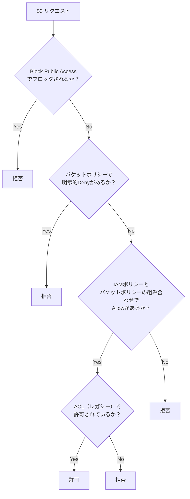
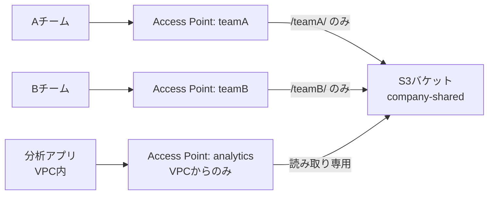

# テーマ11: S3セキュリティ

> 🔴 所要日数: 3-4日 | 座学 → ハンズオン → 問題演習

---

## 座学

## Part 1: SAAからの差分 — S3セキュリティで深く問われる領域

SAAでS3の基本（バケット/オブジェクト、バケットポリシー、暗号化、Block Public Access）は学びました。SAPではさらに深掘りします。

**バケットポリシーとIAMポリシーの評価順序**、**KMS暗号化（SSE-KMS、SSE-C、CMK）**、**S3 Object Lock（WORM）**、**Access Points**（多数アクセス許可の分離）、**S3 Access Grants**（IAM IdentityCenterユーザーへのアクセス制御）、**S3 Replication（CRR/SRR）とレプリケーション時間**——この辺が差分領域です。

---

## Part 2: S3のアクセス制御の階層構造

S3のアクセス制御は複数のレイヤーが評価されます。リクエストが届くと次の順序で評価されます。



**重要な原則**:

1. **明示的なDenyは全てのAllowに勝つ**: バケットポリシーで `Deny` があれば他のAllowは無効化される
2. **Block Public Access はバケットポリシー・ACLの設定よりも優先される**: たとえバケットポリシーで `Principal: "*"` のAllowがあっても、Block Public Accessが有効ならアクセス不可
3. **IAMポリシーとバケットポリシーは「OR」で評価**: どちらか片方でもAllowがあれば許可（Denyがなければ）
4. **クロスアカウントアクセスは両方のAllowが必要**: ソースアカウントのIAM + ターゲットバケットのポリシー

---

## Part 3: S3の暗号化 — SSE-S3 / SSE-KMS / SSE-C / DSSE-KMS

**SSE-S3（AES-256、S3マネージドキー）**:
- デフォルトで全てのバケットで有効化（2023年以降）
- 鍵管理はS3が完全に担当、無料
- キーのローテーションも自動
- 監査証跡は限定的

**SSE-KMS（KMSマネージドキー）**:
- AWS KMSの鍵（AWS Managed Key または Customer Managed Key）を使用
- CMK（Customer Managed Key）を使うと鍵ポリシーで「誰がこの鍵を使えるか」を細かく制御
- CloudTrailで鍵の使用がログ記録される（監査可能）
- KMS API呼び出しの料金が追加発生
- 大量アクセス時にKMSのスロットリング上限に注意（**S3 Bucket Key**で緩和可能）

**SSE-C（顧客提供鍵）**:
- クライアントが暗号鍵を自分で管理し、S3にアップロード時に鍵を送信する
- S3は鍵を保管せず、暗号化・復号化のみ実施
- 特殊な要件（独自鍵管理システムがある）向け

**DSSE-KMS（Dual-layer Server-Side Encryption）**:
- 2つのレイヤーでの独立した暗号化
- 最高水準の機密性が必要な場合に使う（政府機関、金融など）

**S3 Bucket Keyの役割**: SSE-KMSで大量のオブジェクトを暗号化すると、オブジェクトごとにKMSへのAPIコールが発生しコストが増大します。Bucket Keyを有効化すると、バケットレベルで一時的な鍵を生成し、KMS APIコール数を大幅削減（最大99%削減）できます。

---

## Part 4: S3 Object Lock — WORM（改ざん不可）ストレージ

**Object Lock**は、オブジェクトを指定期間「書き換え・削除不可」にするWORM（Write Once Read Many）機能です。コンプライアンス要件（SEC 17a-4、CFTC、FINRA）に対応しています。

**2つのモード**:

**Governance Mode**: 特定のIAMロール（`s3:BypassGovernanceRetention` 権限を持つ）のみが削除可能。通常の運用では誤削除を防ぎつつ、緊急時の対応は可能

**Compliance Mode**: AWSルートユーザーを含む**誰も削除できない**。期間中はオブジェクトを変更・削除するあらゆる手段がブロックされる

**Retention（保持期間）**と**Legal Hold（訴訟ホールド）**の2つの保護機構があります。

- **Retention**: 期間を指定してロック（例: 10年間）。期間経過後は自動的に解除
- **Legal Hold**: 期間なしでロック。訴訟対応で「いつ解除するか未定だが、確実に保持したい」場合に使う

**有効化の制約**: Object Lockはバケット作成時に有効化する必要があります（既存バケットへの後付けは不可、Versioning も必須）。

---

## Part 5: S3 Access Points と Access Grants

**S3 Access Points**は、バケットに対して**複数の名前付きエンドポイント**を作成できる機能です。各Access Pointに独自のポリシーとネットワーク設定を付けられます。

**問題の背景**: 1つのバケットを多数のアプリケーション・チーム・アカウントで共有する場合、バケットポリシーが複雑化します（「Aチームは /teamA/ 配下のみ」「Bチームは /teamB/ 配下のみ」「アプリXはVPC-1からのみ」...）。ポリシーの行が数百行になり、管理不能になります。

Access Pointsを使うと、**Access Pointごとに独自のポリシーを持つ**ことができます。「teamA-access-point」を作って「teamA-access-pointは /teamA/ のみアクセス可」と設定すれば、Aチームはこのエンドポイント経由でアクセスします。



**S3 Access Grants**（新機能）は、**IAM Identity CenterのユーザーやActive DirectoryグループにS3アクセス権限をスケーラブルに付与する**機能です。従来の「IAMポリシーで個別ユーザー管理」では数千〜数万のユーザーへのS3アクセス管理が困難でしたが、Access Grantsを使うとユーザー・グループ単位で「このプレフィックス配下にRead権限」といった設定ができます。

---

## Part 6: S3 Replication（CRR / SRR）

**Cross-Region Replication（CRR）**はバケット間の非同期レプリケーションです。ソースバケットのオブジェクトが別リージョンのバケットに自動複製されます。

**Same-Region Replication（SRR）**は同一リージョン内での複製。ログ集約、本番→監査用のコピーなどに使います。

**レプリケーション時間の保証 — S3 Replication Time Control（RTC）**:
通常のレプリケーションはベストエフォートで、データ量やオブジェクトサイズによって数秒〜数時間かかる可能性があります。RTCを有効化すると、**15分以内にレプリケーションが完了するSLA**が保証されます。DR要件が厳しい場合に使います。

**レプリケーション対象の制御**:
- プレフィックスフィルタ: 特定のプレフィックス配下のみレプリケーション
- タグフィルタ: 特定タグを持つオブジェクトのみ
- ストレージクラス変換: ソースはStandard、レプリカはStandard-IAなどへ変換
- 暗号化の変換: ソースはSSE-S3、レプリカはSSE-KMSへ変換

**2-way（双方向）レプリケーション**: 通常のレプリケーションは一方向（A→B）ですが、双方向にできます。両方のバケットで互いをレプリケーション先として設定します。Global Tables相当の使い方ができます。

---

## 練習問題

### 問題1

ある金融機関では、S3バケットに顧客の取引データを保管しています。セキュリティ監査で以下の要件が出ました。

1. バケットへの書き込み時はデータが暗号化されていること（KMSのカスタマー管理キーを使う）
2. データの暗号化・復号化の操作がCloudTrailで監査可能であること
3. 大量のオブジェクトアクセスが発生するため、KMSのAPI呼び出し料金・スロットリングを最小化したい

これらの要件を全て満たす構成として最も適切なものはどれですか？

<details>
<summary>選択肢を見る</summary>

A. SSE-S3（AES-256、S3マネージドキー）を有効化し、バケットポリシーで書き込み時のSSE-S3を必須化する

B. クライアントサイド暗号化を実装し、アプリケーションが独自の鍵で暗号化してからS3にアップロードする

C. SSE-KMSをバケットデフォルト暗号化で有効化し、Customer Managed Key（CMK）を指定する。さらにS3 Bucket Keyを有効化してKMS API呼び出し数を削減する

D. DSSE-KMS（Dual-layer）を有効化して2重暗号化する

</details>

<details>
<summary>正解と解説を見る</summary>

**正解: C**

SSE-KMS（CMK）+ S3 Bucket Keyの組み合わせが正解です。

- **SSE-KMS（CMK）**: KMS Customer Managed Keyを使うことで、鍵ポリシーで使用権限を細かく制御でき、**暗号化・復号化の操作はCloudTrailに記録される**（監査可能）
- **S3 Bucket Key**: 大量アクセス時のKMS APIコール数を**最大99%削減**し、KMSのコストとスロットリングリスクを大幅軽減する

この2つの組み合わせで3つの要件を全て満たします。

- A: SSE-S3はKMS CMKを使わないため要件を満たせません。また暗号化操作のCloudTrail記録も限定的です
- B: クライアントサイド暗号化は実装コストが高く、鍵管理もアプリケーション側で行う必要があります。KMS CMKの統合を活用できません
- D: DSSE-KMSは2重暗号化で高いセキュリティを提供しますが、KMSのAPIコール数が通常のSSE-KMSの2倍になりスロットリングとコストが悪化します。要件「KMS API呼び出し料金を最小化」に反します

</details>

---

### 問題2

ある証券会社では、取引記録をS3に保存しています。金融監督規制（SEC 17a-4）により、**7年間**は誰もデータを変更・削除できないようにする必要があります。ルートユーザーを含む全てのユーザーが削除不可である必要があります。

また、過去に内部不正で管理者が取引記録を改ざんしようとした事件があったため、「緊急時でもIAM権限者が削除できない」という厳格な要件が追加されました。

この要件を満たす構成として最も適切なものはどれですか？

<details>
<summary>選択肢を見る</summary>

A. バケットポリシーでDeleteObjectの操作を拒否し、管理者しか変更できないようにする

B. S3 Object LockをCompliance Modeで有効化し、Retentionを7年間に設定する。Compliance Modeではルートユーザーも含めて誰もオブジェクトを削除・変更できない

C. S3 Object LockをGovernance Modeで有効化し、特定のIAMロールのみが削除可能な設定にする

D. S3 Versioningを有効化し、削除マーカー付きの論理削除のみを許可することで、実データは削除不可にする

</details>

<details>
<summary>正解と解説を見る</summary>

**正解: B**

S3 Object Lock Compliance Modeが正解です。Compliance ModeではAWSルートユーザーを含む**誰もオブジェクトを削除・変更できません**。保持期間中（7年間）は完全にWORM（Write Once Read Many）ストレージとして機能し、SEC 17a-4等の厳格な規制に対応できます。

- A: バケットポリシーは管理者が変更できるため、内部不正による改ざん要件を満たしません
- C: Governance Modeは `s3:BypassGovernanceRetention` 権限を持つIAMロールから削除可能です。「IAM権限者が削除できない」要件を満たせません
- D: Versioningは物理的な削除を防ぎますが、管理者が明示的に旧バージョンを削除することは可能です

</details>

---

### 問題3

ある大手企業では、1つのS3バケット `corp-datalake`（数PB規模）に全社のデータを集約しています。以下のチームがこのバケットにアクセスします。

- 営業チーム: `/sales/` 配下の読み書き
- 分析チーム: バケット全体の読み取り専用（VPC内からのみ）
- 監査チーム: `/audit/` 配下の読み取り専用
- 外部パートナーA社: `/partner-a/` 配下の読み書き

現在、バケットポリシーに全てのルールを記述していますが、行数が500行を超え、新しいチームを追加するたびに既存のルールを破壊するリスクが高まっています。運用負荷を減らし、各チームのポリシー管理を分離したいと考えています。

最適な構成はどれですか？

<details>
<summary>選択肢を見る</summary>

A. 各チーム用のバケットを個別に作成し、データを適切なバケットに分散配置する

B. バケットポリシーを`Sid`ごとに分割し、ドキュメント化を徹底する

C. チームごとにS3 Access Pointを作成し、各Access Pointに個別のポリシーを設定する。チームはAccess Pointエンドポイント経由でのみアクセスし、バケットポリシー自体はシンプルに保つ

D. IAM Identity Centerを導入し、ユーザーごとにS3アクセス権限を付与する

</details>

<details>
<summary>正解と解説を見る</summary>

**正解: C**

S3 Access Pointsが正解です。Access Pointsは、バケットに対して**複数の名前付きエンドポイント**を作成でき、各Access Pointに独自のポリシーとネットワーク設定を付けられます。

- `sales-ap`: `/sales/` のみアクセス可能、営業チームのIAMロールに許可
- `analytics-ap`: 全バケット読み取り、VPC-xxxxからのみ許可
- `audit-ap`: `/audit/` のみ読み取り、監査チームに許可
- `partner-a-ap`: `/partner-a/` アクセス、外部アカウントに許可

バケットポリシー自体は「Access Points経由のアクセスのみ許可」とシンプルに保てます。新チーム追加時も既存のAccess Pointに影響を与えません。

- A: データ分割は大規模移行が必要で、クロスバケットのクエリ・分析が複雑になります
- B: バケットポリシーのドキュメント化は運用の一部改善ですが、破壊リスクの根本解決にはなりません
- D: IAM Identity Centerも有効な手段ですが、Access Grantsと組み合わせる必要があり、バケットポリシーの肥大化問題を直接解決するのはAccess Points です

</details>

---

### 問題4

あるメディア企業では、動画コンテンツをS3バケット（東京リージョン）に保存し、CDN（CloudFront）経由で配信しています。DR要件として、東京リージョンで大規模障害が発生した場合でも、大阪リージョンにある同じコンテンツでサービスを継続できる必要があります。

SLA要件として、東京リージョンへのアップロード後、**15分以内には大阪リージョンにコンテンツが複製されていること**が求められています。現在はLifecycle rule で翌日S3バッチ処理によるコピーを行っていますが、1日単位のRPOではDR要件を満たしません。

この要件を満たす最適な構成はどれですか？

<details>
<summary>選択肢を見る</summary>

A. S3 Cross-Region Replication（CRR）を有効化し、S3 Replication Time Control（RTC）を有効にして15分以内のSLAを保証する

B. AWS DataSyncで東京から大阪への定期同期（毎時）を設定する

C. S3バケット間を独自のLambda関数で監視し、S3イベント通知をトリガーに手動コピーする

D. S3 Cross-Region Replicationを有効化する（RTC なし）

</details>

<details>
<summary>正解と解説を見る</summary>

**正解: A**

S3 CRR + S3 Replication Time Control（RTC）が正解です。通常のCRRはベストエフォートで数秒〜数時間の遅延が発生する可能性があります。RTCを有効化すると、**15分以内にレプリケーションが完了するSLA**がAWSから保証されます。DR要件（15分以内）を確実に満たせます。

- B: DataSyncの定期同期（最短15分間隔）は可能ですが、ポーリング方式でS3イベントベースのレプリケーションと比較して効率が悪いです。またSLA保証もありません
- C: Lambda独自実装は開発・運用コストが高く、冪等性・エラーハンドリング・リトライの実装負荷が大きいです
- D: RTCなしのCRRはベストエフォートであり、大規模ファイル・大量アップロード時に15分を超える可能性があります。SLA保証の要件を満たせません

</details>

---

### 問題5

ある企業では、Block Public Accessが有効化されたS3バケットに機密データを保管しています。バケットポリシーは「特定のIAMユーザーA・Bからのみアクセスを許可する」という内容で、Principal にユーザーA・BのARNが列挙されています。

最近、セキュリティチームが誤ってバケットポリシーの一部を変更し、`Principal: "*"` の `Allow` を追加してしまいました。幸いBlock Public Accessが有効化されていたため、インターネット公開は発生していませんでした。

セキュリティチームが「Block Public AccessがONでもAllow `*`が残っているのは監査指摘になる」「さらに、ユーザーA・Bだけでなく、他のIAMユーザーもバケットにアクセスできてしまうのを確実に防ぎたい」と報告しました。

アクセス制御を強化するために最適な方針はどれですか？

<details>
<summary>選択肢を見る</summary>

A. バケットポリシーから `Principal: "*"` のAllowを削除し、IAMユーザーA・BのみのAllowを維持する

B. バケットポリシーに、ユーザーA・BのARN **以外**からのアクセスを明示的に拒否する `Deny` ステートメント（NotPrincipalまたはStringNotEquals条件）を追加する。これにより明示的Denyが他のAllowに優先され、想定外のIAMユーザーからのアクセスを確実に遮断できる

C. AWS Organizationsの SCP を使ってS3のアクセスを全社的に制限する

D. バケットポリシーをなくし、IAMポリシーのみでユーザーA・Bに権限を付与する

</details>

<details>
<summary>正解と解説を見る</summary>

**正解: B**

明示的Denyを追加する方針が最適です。S3のアクセス制御評価では、**明示的なDenyは全てのAllowに勝ちます**。バケットポリシーに「ユーザーA・B以外を拒否する」Denyを追加することで、仮に将来誤って `Principal: "*"` の Allow が追加されたり、IAMポリシー側で別ユーザーに権限が付与されても、このDenyが優先して拒否されます。

```
Deny
  Principal: "*"
  Action: "s3:*"
  Resource: "arn:aws:s3:::bucket/*"
  Condition:
    StringNotEquals:
      aws:PrincipalArn: [<ユーザーA>, <ユーザーB>]
```

- A: 現在の問題（Allow `*` の削除）は正しい対応の一部ですが、将来同じミスが再発した場合に無防備になります。**防御的な設計**として明示的Denyを追加する方が堅牢です
- C: SCPはAWS Organizations全体の制限であり、特定バケットへのアクセス制御には粒度が粗すぎます
- D: バケットポリシーをなくすとS3側での制御が失われ、クロスアカウントアクセスやリソースベースの制御ができなくなります

</details>

---

### 問題6

ある医療研究機関では、患者の診療記録データをS3バケットに保管しています。HIPAA準拠の要件として以下が求められています。

1. データは保存時に必ず暗号化されている（SSE-KMS + CMK）
2. 暗号化に使うKMSキーは、特定のIAMロール（研究員ロールと管理者ロール）のみが使用できる
3. データのダウンロード時には、KMSキーの使用履歴がCloudTrailに記録される
4. バケットへのアップロード時に、SSE-KMS以外の暗号化タイプ（SSE-S3、SSE-Cなど）でのアップロードは拒否する

上記を全て満たす構成として最も適切なものはどれですか？

<details>
<summary>選択肢を見る</summary>

A. バケットポリシーで `s3:x-amz-server-side-encryption` ヘッダーが `aws:kms` であることを必須とする条件を追加し、SSE-KMS のCMKをバケットのデフォルト暗号化に設定する。KMSキーのキーポリシーで研究員ロールと管理者ロールのみに `kms:Encrypt` / `kms:Decrypt` / `kms:GenerateDataKey` を許可する

B. CloudTrailを全リージョンで有効化し、S3イベントを全て記録する。バケットポリシーで暗号化を必須化する

C. IAMポリシーで研究員・管理者のみにS3バケットへのアクセス権限を付与する

D. バケットにSSE-S3をデフォルト暗号化として設定し、IAMロールで細かい権限を制御する

</details>

<details>
<summary>正解と解説を見る</summary>

**正解: A**

SSE-KMS + CMK + バケットポリシー条件 + KMSキーポリシーの組み合わせが正解です。

1. **SSE-KMS以外を拒否**: バケットポリシーの `Condition` で `s3:x-amz-server-side-encryption` が `aws:kms` でないPutObjectを拒否する
2. **KMS CMKのキーポリシー**: 研究員ロールと管理者ロールのみに `kms:Encrypt`、`kms:Decrypt`、`kms:GenerateDataKey` 権限を付与する。これにより他のロールはデータの復号化ができない
3. **CloudTrail記録**: KMS CMKの使用（Encrypt/Decrypt）は自動的にCloudTrailに記録される（AWS Managed KeyではなくCustomer Managed Keyの場合）

- B: CloudTrail有効化は必要ですが、それだけでは要件2（特定ロールのみ使用）と要件4（暗号化タイプの強制）を満たしません
- C: IAMポリシーのみの制御では、暗号化タイプの強制（要件4）や鍵の使用制御（要件2）が不足します
- D: SSE-S3はCMKを使わないため、要件1（CMK使用）と要件3（CloudTrail記録）を満たせません

</details>
