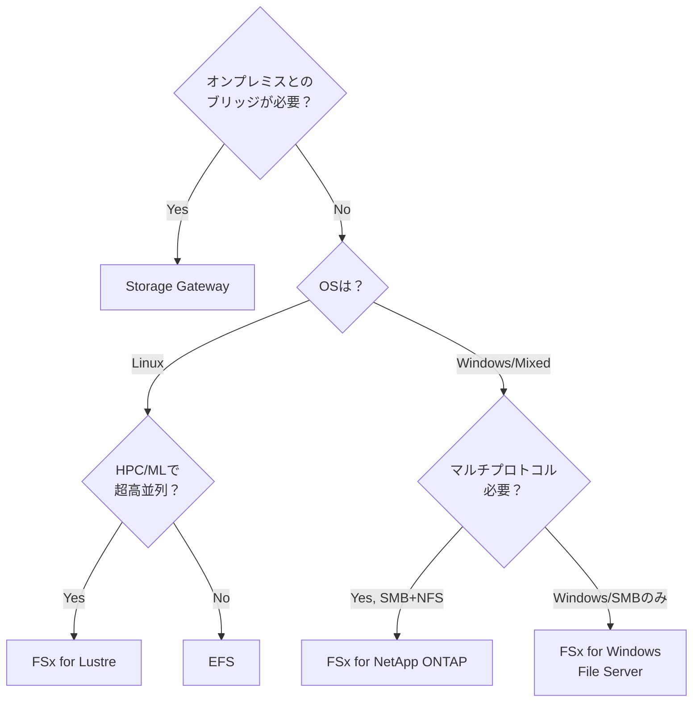

# テーマ13: 共有ストレージ（EFS / FSx / Storage Gateway）

> 🟢 所要日数: 1日 | 座学 → 問題演習

---

## 座学

## Part 1: SAAからの差分と選択肢の全体像

SAAではEFS（Elastic File System）の基本と、FSxの存在を学んだ程度でした。SAPでは「どのストレージをどの用途に選ぶか」の判断力が問われます。

AWSには共有ストレージの選択肢が複数あります。

| サービス | 対応プロトコル | ユースケース |
|--------|--------------|------------|
| **EFS** | NFS v4（Linux） | Linux EC2/Lambda/Fargateの共有ストレージ |
| **FSx for Windows File Server** | SMB | Windows環境の共有ファイル、ADとの統合 |
| **FSx for Lustre** | Lustre | HPC・機械学習の高並列ワークロード |
| **FSx for NetApp ONTAP** | NFS + SMB + iSCSI | マルチプロトコル、既存のNetApp環境移行 |
| **FSx for OpenZFS** | NFS v3/v4 | 高スループット、低レイテンシの汎用ファイル |
| **Storage Gateway** | NFS / SMB / iSCSI / VTL | オンプレミスからAWSストレージへのブリッジ |

---

## Part 2: EFS（Elastic File System）

**EFS**はNFS v4プロトコルで動作するLinux向けフルマネージドファイルストレージです。複数のEC2インスタンス・Lambda関数・Fargateタスクから同時にマウントでき、自動でスケールします（データ量上限なし）。

**ストレージクラス**:
- **Standard**: デフォルト、3AZ冗長、頻繁アクセス向け
- **Standard-IA**: 30日アクセスなしで自動移行、容量単価が約92%安い（取り出し料金あり）
- **One Zone**: 1AZのみ、Standard比47%安い（AZ障害でデータ損失リスク）
- **One Zone-IA**: 1AZ + IA、最安

**パフォーマンスモード**:
- **General Purpose**: 一般用途、低レイテンシ、デフォルト
- **Max I/O**: 高並列（数百〜数千クライアント）、若干高レイテンシ

**スループットモード**:
- **Bursting**: ストレージ量に応じたベースラインスループット + バースト（デフォルト）
- **Provisioned**: ストレージ量に依存しない一定スループット（小容量で高スループット必要な場合）
- **Elastic**: 自動的にスケール、最も予測困難なワークロード向け（新）

**使うべき場面**: Linux環境でのコンテンツ管理、CI/CDのキャッシュ共有、Lambdaの大容量ファイル操作、ウェブサーバーの共有ストレージ。

---

## Part 3: FSx — Windowsファイルサーバーと高性能ストレージ

**FSx for Windows File Server**はWindowsネイティブのSMBプロトコルでアクセスする共有ファイルサーバーです。**Active Directoryとの統合**が特徴で、ADグループによる細かいアクセス制御、Windowsのファイル権限（NTFS ACL）をフルサポートします。

**ユースケース**:
- 既存のWindowsファイルサーバー（自社データセンター）からAWSへ移行
- SharePointやWindows Applicationの共有ストレージ
- SQL Server on EC2のデータディレクトリ

**FSx for Lustre**はHPC（High Performance Computing）と機械学習向けの超高速分散ファイルシステムです。

- 数百ギガバイト〜数ペタバイトのスループット
- S3との統合（S3のオブジェクトをLustreとしてマウント可能、結果をS3に書き戻し）
- **一時的なコンピューティングジョブに最適**（ジョブ完了後にFSx削除してコスト節約）

**ユースケース**: 流体力学シミュレーション、ゲノム解析、機械学習のトレーニング、金融モデリング。

**FSx for NetApp ONTAP**は既存のNetApp ONTAP環境をAWSに移行する際に使う高度なファイルストレージです。NFS・SMB・iSCSIの全てに対応し、既存のストレージ管理スキル（NetApp ONTAPの管理）をそのまま活用できます。

**FSx for OpenZFS**はOpenZFSベースの汎用ファイルストレージで、NFS v3/v4に対応し、高いスループット・低レイテンシ・スナップショット・クローン機能を提供します。

---

## Part 4: Storage Gateway — オンプレミスとAWSの橋渡し

**Storage Gateway**は、オンプレミスのアプリケーションがAWSのストレージをローカルストレージのように使えるハイブリッドクラウドサービスです。4つのタイプがあります。

**1. File Gateway（NFS/SMB）**:
- オンプレミスからNFS/SMBマウントでアクセス
- 実データはS3に保存、オンプレミスにはキャッシュ
- 「オンプレからS3に直接書き込む」のが難しい場合のブリッジ
- ユースケース: バックアップデータのクラウド保管、コンテンツのクラウド移行

**2. Volume Gateway（iSCSI）**:
- ブロックストレージ（iSCSI）としてオンプレミスに提供
- **Cached Volume**: データはS3、ローカルにキャッシュ
- **Stored Volume**: データはローカル、バックアップをS3/EBSに
- ユースケース: オンプレアプリのバックアップ、DRコピー

**3. Tape Gateway（VTL）**:
- 従来のテープライブラリ（バックアップソフトがテープに書く運用）をエミュレート
- 実データはS3 Glacier / Deep Archiveに保管
- ユースケース: 既存のテープバックアップ運用をクラウドに移行

**4. FSx File Gateway**:
- オンプレミスからSMBでFSx for Windows File Serverにアクセス
- 低レイテンシのローカルキャッシュ

---

## Part 5: 選択のフローチャート

---

## 練習問題

### 問題1

ある機械学習研究チームでは、AWS上でのモデルトレーニング環境を構築しています。トレーニングには以下の特性があります。

- 数百ノードのEC2（GPU付き、計算コア数千）が同時にトレーニングデータを読み書き
- 総データ量は約50 TB、ジョブあたり数時間〜1日で完了
- トレーニングデータは事前にS3に保管されている
- ジョブ完了後のデータはS3に書き戻してアーカイブ

要件は、数百ノードからの超高並列アクセスに対応し、S3とのシームレスな連携ができることです。ジョブが終わったら関連リソースを速やかに削除してコスト削減もしたいと考えています。

最適なストレージはどれですか？

選択肢を見る

A. S3を直接全ノードから参照し、必要なファイルを都度ダウンロードする

B. EFS Standardに全トレーニングデータを配置し、全ノードからNFSでマウントする

C. FSx for Lustreを一時的にプロビジョニングし、S3をバックエンドとして統合する（S3のデータをLustreファイルとして扱い、結果を自動でS3に書き戻す）。ジョブ完了後にFSxを削除してコスト最適化

D. FSx for Windows File Serverでトレーニングデータを管理する

正解と解説を見る

**正解: C**

FSx for Lustreが正解です。LustreはHPCと機械学習の高並列ワークロード向けに設計された分散ファイルシステムで、数百ノードからの超高速並列アクセスに対応します。

- **S3との統合**: FSx for LustreはS3をバックエンドとして統合でき、S3のオブジェクトをLustreのファイルとしてマウント可能。結果は自動でS3に書き戻される
- **一時的利用**: ジョブ完了後にFSxを削除するとコストが発生せず、長期データはS3に保管される
- **スループット**: 数百GB/秒の帯域幅で数千クライアントからの同時アクセスに対応

- A: S3直接アクセスはHPCの要求するスループット・並列度に対して遅延が大きすぎます。並列ファイル操作の設計もLustreに劣ります
- B: EFSのMax I/Oモードでも数百GB/秒のLustreほどの並列性能は出せません。またS3との自動統合もありません
- D: FSx for Windows File ServerはSMBプロトコルベースで、Linux/GPU環境のMLトレーニングには不向きです

---

### 問題2

ある製造業の企業では、オンプレミスに従来のWindowsファイルサーバー（SMB）を持ち、Active Directoryで全社員のファイルアクセスを管理しています。このファイルサーバーには数TBのデータがあり、細かいNTFS ACLで権限管理されています。

AWSへの移行方針が決まり、「Windowsファイルサーバーの機能をAWS上で再現し、既存のActive Directoryとの連携を維持したい」「既存のNTFS ACLをそのまま使いたい」「SMB 3.0プロトコルで Windowsクライアントからアクセスしたい」という要件が出ています。

最適な構成はどれですか？

選択肢を見る

A. EFSにSambaサーバーを立てて、Windowsからアクセスできるように設定する

B. FSx for Windows File Serverを使い、AWS Managed Microsoft ADまたは既存のAD（AD Connector経由）と統合する。NTFS ACL、SMB 3.0、Volume Shadow Copyなど、Windowsネイティブの機能に対応

C. S3をWindowsのネットワークドライブとしてマウントする

D. Storage Gateway（File Gateway）でSMB共有を提供する

正解と解説を見る

**正解: B**

FSx for Windows File Serverが正解です。Windowsネイティブのファイル共有サービスで、以下の要件を全て満たします。

- **Active Directory統合**: AWS Managed Microsoft ADまたはオンプレADとAD Connector経由で統合可能
- **NTFS ACL**: Windowsの標準的なファイル権限がそのまま使える（既存ACLを移行してそのまま利用）
- **SMB 3.0 対応**: Windowsクライアントからのアクセスに最適
- **DFS Namespace、Volume Shadow Copy**などWindows固有の機能もフルサポート

- A: EFS + SambaはNFS + ソフトウェア構成で、NTFS ACLの完全互換性がなく、管理コストも高くなります
- C: S3はオブジェクトストレージで、ファイルシステムのネットワークドライブとして使うには特殊な仕組み（FUSE、AWS CLIのsync等）が必要で本格的なファイル共有には向きません
- D: File Gatewayは**オンプレからAWSへのブリッジ**用途で、AWS内部のファイル共有サービスとは用途が異なります

---

### 問題3

ある制作会社では、オンプレミスの動画編集システム（Windows）がローカルのNASファイルサーバー（約100 TB）を使っています。最近、動画素材のクラウドバックアップとAWS上でのレンダリング環境構築の計画が進んでいます。

以下の要件があります。

1. オンプレミスのWindowsアプリケーションから、既存のファイル操作の仕方を変えずにAWSのストレージにデータをアップロードできるようにしたい
2. データの実体はS3に保存し、オンプレミスには最近アクセスしたファイルのキャッシュのみ保持したい（ローカルストレージを節約）
3. アップロード後、AWS上のレンダリング環境からそのデータにアクセスできるようにする

この要件を満たす最適なサービスはどれですか？

選択肢を見る

A. AWS DataSyncでオンプレミスのNASからS3への定期同期を実行する

B. AWS Snowballを使って100 TBの既存データをS3にインポートする

C. Storage Gateway File Gatewayを使い、オンプレミスのWindowsクライアントからSMB/NFSで接続できる仮想ファイルサーバーを提供する。実データはS3に保存され、オンプレ側には最近アクセスしたファイルのキャッシュのみ保持される

D. Direct Connectを敷設し、オンプレミスからS3に直接アクセスする

正解と解説を見る

**正解: C**

Storage Gateway（File Gateway）が正解です。File Gatewayはオンプレミスに仮想アプライアンス（または物理ハードウェア）として配置され、ローカルにはSMB/NFSのインターフェースを提供します。

- **既存の操作感を維持**: SMB/NFSのプロトコルなのでWindowsアプリケーションの変更不要
- **S3への自動保存**: ファイルゲートウェイに書き込んだデータは自動的にS3オブジェクトとして保存される
- **ローカルキャッシュ**: 最近アクセスしたファイルのみキャッシュとしてローカルに保持、古いものはS3のみに
- **AWSからのアクセス**: S3に保存されたデータは、AWS上のレンダリング環境から直接S3としてアクセス可能

- A: DataSyncは定期バッチ同期サービスで、リアルタイムのファイル操作（書き込みしたら即S3に）には向きません
- B: Snowballは**一度きりの大規模データ移行**用で、継続運用には適しません
- D: Direct Connect + S3直接アクセスは可能ですが、Windowsアプリケーションの「既存のファイル操作の仕方を変えずに」要件を満たせません（S3はオブジェクトストレージでファイルシステムとして扱えない）

---

### 問題4

ある教育機関では、複数のLinux EC2インスタンス（数十台、将来的に数百台に拡張）で共有の教材ファイルストレージが必要です。以下の要件があります。

1. ファイルはPOSIX互換のファイルシステムとして扱いたい
2. 容量は自動スケールし、使った分だけ課金される方式にしたい
3. データの3AZ冗長保管が必要
4. 90日以上アクセスされないファイルは自動的に安価なストレージクラスに移動してコスト削減したい

この要件を満たす最適な構成はどれですか？

選択肢を見る

A. EBSボリュームを各EC2にアタッチし、NFSサーバーを構築して共有する

B. EFSをStandardで作成し、Lifecycle Management を有効化して30日または90日アクセスなしのファイルをStandard-IAに自動移行する設定にする

C. S3をs3fs（FUSE）でマウントして共有ファイルシステムとして使う

D. FSx for Lustreで共有ストレージを提供する

正解と解説を見る

**正解: B**

EFS + Lifecycle Managementが正解です。

- **POSIX互換のファイルシステム**: EFSはNFS v4ベースのPOSIX互換ファイルシステム
- **自動スケール・従量課金**: 使用容量に応じて自動スケール、プロビジョニング不要
- **3AZ冗長（Standard）**: EFS Standardは3 AZでデータ冗長化
- **Lifecycle Management**: EFSには組み込みのLifecycle Management があり、指定日数（7/14/30/60/90/180/270/365日）アクセスなしのファイルを**自動的にStandard-IAに移動**する。Standard-IAは容量単価がStandardの約92%安い

- A: EBSベースのNFSサーバー自作は管理コストが高く、自動スケール・従量課金の要件を満たしません
- C: s3fs（S3をファイルシステムとしてマウント）はPOSIX完全互換ではなく、ファイルロック・ランダムアクセスなどの機能に制限があります
- D: FSx for LustreはHPCワークロード向けで、コストが高く、本件のような一般ファイル共有には過剰性能です

---

### 問題5

ある金融機関では、オンプレミスでテープバックアップ運用を続けており、既存のバックアップソフトウェア（Commvault、Veeamなど）がテープデバイスに書き込む設定になっています。運用プロセスや管理スキルをそのまま維持しつつ、物理テープの管理負担と紛失リスクを排除したいと考えています。

以下の要件があります。

1. 既存のバックアップソフトウェアとプロセスを変更しない
2. バックアップデータは最終的にクラウドに保管したい
3. 長期保管はコスト最小化のため最も安価なストレージを使う
4. 緊急時にはバックアップからの復元ができること

最適な構成はどれですか？

選択肢を見る

A. オンプレミスのバックアップソフトを全てAWS Backupに置き換える

B. Storage Gateway Tape Gatewayを導入し、既存のバックアップソフトはVTL（仮想テープライブラリ）に書き込む。実データはS3、長期保管はGlacier Deep Archiveに自動移行される

C. Storage Gateway File Gatewayで、バックアップソフトの出力先をSMBに変更する

D. AWS Snowball Edgeを常設し、定期的にオンプレミスで書き込んでAWSにインポートする

正解と解説を見る

**正解: B**

Storage Gateway Tape Gateway（VTL）が正解です。Tape Gatewayは物理テープライブラリをAWS上で仮想化します。

- **既存ソフトとプロセス維持**: バックアップソフトから見れば通常のテープデバイスとして振る舞うため、運用変更なし
- **実データはS3**: Virtual Tapeの実体はS3に保存される
- **Glacier Deep Archiveへの自動移行**: 長期保管が必要なテープは自動的にGlacier Deep Archive（最安ストレージクラス）に移動
- **復元**: 必要時にVirtual Tapeを取り出して復元可能

- A: AWS Backupへの置き換えは要件「既存ソフトを変更しない」に反します
- C: File Gatewayはバックアップソフトの出力先変更（テープ→ファイル）を要求するため、「既存プロセスを変更しない」要件に反します
- D: Snowball Edgeは大容量データの一時的移動用で、継続的なバックアップ運用には適しません

---

### 問題6

ある企業では、既存のNetApp ONTAPストレージ環境をAWSに移行する計画です。現在の環境は以下の特徴があります。

1. NFSとSMBの両方で同じデータにアクセスしている（Linux・Windows混在）
2. NetApp固有機能（Snapshot、FlexClone、SnapMirror、重複排除、圧縮）を活用している
3. iSCSIでデータベースのストレージも提供している
4. 運用チームはNetApp ONTAPの管理スキルを持ち、既存のスクリプトも多数存在する

運用スキルや既存ツール・スクリプトを活かし、NetApp固有機能を継続使用できる移行先はどれですか？

選択肢を見る

A. EFSに全データを移行し、NFSは EFS、SMBはLambdaで変換レイヤーを構築

B. FSx for NetApp ONTAPに移行する。NFS・SMB・iSCSIの全プロトコルをネイティブサポートし、Snapshot・FlexClone・SnapMirror・重複排除・圧縮など既存のNetApp機能がフル機能で使える。管理も既存のONTAPスキルがそのまま活用できる

C. EFSとFSx for Windowsの2系統に分けて移行する

D. S3に全データを移行し、S3 Object Lambda で変換する

正解と解説を見る

**正解: B**

FSx for NetApp ONTAPが正解です。AWSマネージドのNetApp ONTAPサービスで、既存のONTAP環境をそのままAWSに移行できます。

- **マルチプロトコル**: NFS、SMB、iSCSIを同一ボリュームでサポート
- **NetApp固有機能**: Snapshot、FlexClone、SnapMirror、重複排除、圧縮などがフル機能で使える
- **既存スキル・スクリプト**: NetApp ONTAPと同じ管理コマンド・API・スクリプトがそのまま動作
- **AWS統合**: EBS・S3との連携、CloudWatch監視など

- A: EFS + Lambda 変換は実装コストが非常に高く、NetApp固有機能（Snapshot、FlexClone）も失われます
- C: EFS と FSx for Windows の2系統に分けると運用が複雑化し、NFS/SMBで「同じデータにアクセス」という要件を満たせません
- D: S3はオブジェクトストレージでPOSIX互換性がなく、NetApp機能も使えません

