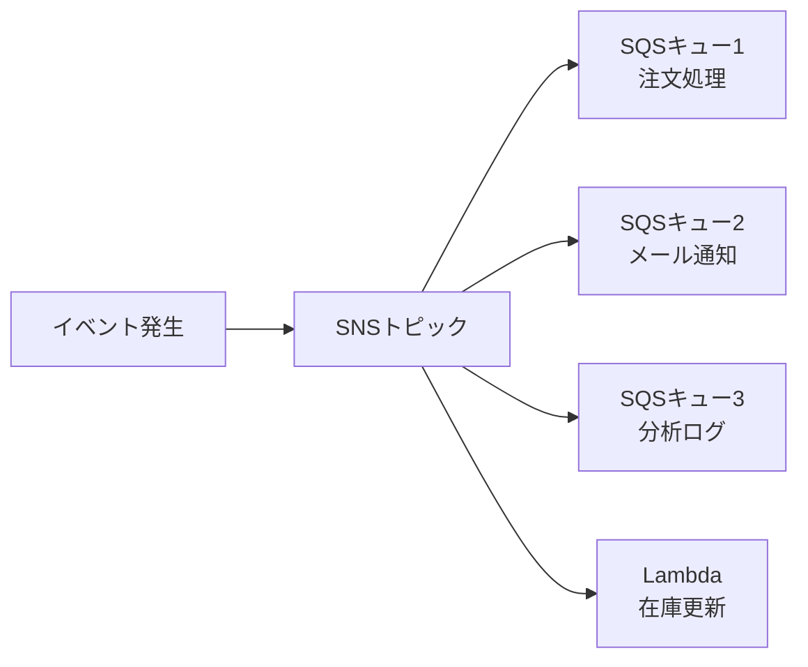

# テーマ15: 非同期処理パターン（SQS / SNS / EventBridge / Step Functions）

> 🟡 所要日数: 2日 | 座学 → 問題演習

---

## 座学

## Part 1: SAAからの差分 — 非同期処理の使い分け

SAAではSQS・SNS・基本的なLambdaトリガーを学びました。SAPでは**どのサービスをどのシーンで使うか**、**サービス間の組み合わせ設計**、**ワークフロー管理**（Step Functions）が深く問われます。

| サービス | 特徴 | ユースケース |
|---------|------|------------|
| SQS | メッセージキュー（1対1） | タスク処理、バッファリング、Worker負荷分散 |
| SNS | Pub/Sub（1対多） | 通知、ファンアウト |
| EventBridge | イベントバス、スキーマ管理 | SaaS統合、イベント駆動、ルールベースルーティング |
| Step Functions | ワークフロー | 複雑な処理フロー、状態管理 |
| MSK / Kinesis | ストリーム | リアルタイム大量データ |

---

## Part 2: SQS — キューの2種類と高度設計

**標準キュー（Standard Queue）**:
- **少なくとも1回配信**（重複の可能性あり）
- **順序は保証されない**
- 無制限のスループット

**FIFOキュー**:
- **厳密に1回配信**（重複なし）
- **順序保証**
- 300 TPS（バッチ処理で3,000 TPSまで）
- グループID単位で順序管理

**Visibility Timeout**: 消費者がメッセージを受信した後、他の消費者から見えなくする時間。処理が成功したらメッセージを削除、失敗したら自動的にキューに戻る。タイムアウトを処理時間より長く設定することが重要。

**Long Polling**: `WaitTimeSeconds`を20秒に設定すると、メッセージが来るまで最大20秒待つ。Short Polling（即座にreturn）と比較してSQS APIコールが大幅削減でき、コスト・レイテンシが改善。

**Dead Letter Queue（DLQ）**: 処理が`MaxReceiveCount`回失敗したメッセージを自動的に別キューに移動。処理不能なメッセージで元キューが詰まるのを防ぐ。

**拡張機能**:
- **SQS + Lambda**: Lambdaのイベントソースマッピング。バッチサイズ、最大バッチウィンドウを調整
- **SQS + Auto Scaling**: キューの深さでEC2 Auto Scalingをトリガー

---

## Part 3: SNS — Pub/Sub と Fanout

**SNS**は Pub/Sub モデルの通知サービスで、1つのメッセージを複数のサブスクライバーに配信します。

**サブスクライバー種類**:
- Lambda
- SQS
- HTTP/HTTPS エンドポイント
- Email / SMS
- Mobile Push（FCM、APNS）
- Amazon Data Firehose

**典型的なFanoutパターン**:



**SNS FIFOトピック**: FIFOキューと同様に順序保証とデデュープに対応。サブスクライバーはSQS FIFOキューのみ。

**メッセージフィルタリング**: サブスクリプション単位で属性フィルターを設定し、特定の条件に一致するメッセージのみを配信。「高額注文だけを不正検知Lambdaに流す」といった制御ができる。

**クロスアカウント**: SNSトピックのアクセスポリシーで他アカウントからのPublishやサブスクライブを許可できる。

---

## Part 4: EventBridge — イベントバスとルール

**EventBridge**はイベント駆動アーキテクチャの中核サービスです。SNSと似ていますが、以下の違いがあります。

| 項目 | EventBridge | SNS |
|------|------------|------|
| イベントの内容 | 構造化JSON（フィールドベース） | 任意の文字列 |
| ルーティング | JSONフィルター（高度な条件） | 属性ベースのフィルター |
| SaaS統合 | ✅ Zendesk、Datadog、Shopifyなど多数 | ❌ |
| スキーマレジストリ | ✅ | ❌ |
| 遅延 | 最大15分（スケジュールルール） | ミリ秒 |
| 宛先 | 20以上のAWSサービス | Lambda/SQS/HTTP/Emailなど |

**Event Bus種類**:
1. **Default Event Bus**: 自アカウントのAWSサービスイベント（EC2状態変化、S3オブジェクト作成など）
2. **Custom Event Bus**: 自社アプリケーションのカスタムイベント用
3. **Partner Event Bus**: SaaS（Zendesk、Datadog、Segmentなど）からのイベント用

**ルール**: イベントパターンで条件を指定し、マッチしたイベントをターゲットに送信

```json
{
  "source": ["aws.ec2"],
  "detail-type": ["EC2 Instance State-change Notification"],
  "detail": {
    "state": ["stopped", "terminated"]
  }
}
```

**EventBridge Scheduler**: cronスケジュールベースでイベントをトリガー（旧 Schedule Rules の置き換え）。100万スケジュール、精度1分以内。

**EventBridge Pipes**: ソース→フィルタ→変換→ターゲットの「点から点」のデータフロー。Kinesis→Lambda→SNSのような基本パターンをコードなしで実装。

---

## Part 5: Step Functions — ワークフロー管理

複数のサービスを組み合わせたワークフローを「状態機械」として管理するサービスです。

**2つのタイプ**:

**Standard Workflow**:
- 長時間ワークフロー（最大1年）
- 正確に1回実行
- 料金: 状態遷移ごとに$0.025/1000（高め）
- ユースケース: ビジネスプロセス、ETL、注文フロー

**Express Workflow**:
- 短時間ワークフロー（最大5分）
- 少なくとも1回実行（重複の可能性）
- 料金: 実行時間と呼び出し回数で課金（安価）
- ユースケース: IoTイベント処理、リアルタイムストリーム

**状態の種類**:
- **Task**: Lambda、ECS、DynamoDBなどのアクション実行
- **Choice**: 条件分岐
- **Parallel**: 並列実行
- **Map**: 配列の各要素に対して処理（並列 / 順次）
- **Wait**: 指定時間待機
- **Pass**: 入力をそのまま渡す（テスト用）
- **Fail / Succeed**: 終了状態

**Saga Pattern**: 分散トランザクションで、各ステップに補償アクション（Rollback）を定義。決済→在庫引き当て→配送の連鎖で、どこかが失敗したら全体をRollback。

---

## 練習問題

### 問題1

ある取引プラットフォームでは、ユーザーが注文を発行すると、以下の複数の処理が必要です。

1. 在庫システムに在庫引き当て依頼を送る
2. 決済システムに課金を依頼する
3. メール通知システムで注文確認メールを送る
4. 分析システムに注文イベントを送信

現在は注文APIのコードで4つの処理を順次呼び出していますが、どれかが失敗すると他の処理も巻き込まれ、またレイテンシも高くなっています。これらの処理を疎結合化し、**1つの注文イベントから全ての処理を並列実行**したいです。処理の追加・削除も容易にしたいと考えています。

最適な構成はどれですか？

<details>
<summary>選択肢を見る</summary>

A. 注文APIが個別のSQSキューに4回メッセージをPUTする

B. SNSトピックを作成し、注文イベントをPublishする。各処理ライン（在庫・決済・メール・分析）はSQSキューをSNSトピックにサブスクライブし、ファンアウトで並列にメッセージを受信する

C. Step Functionsで4つのタスクを定義し、全てParallelで実行する

D. Kinesis Data Streamsに注文イベントを書き込み、各処理がポーリングする

</details>

<details>
<summary>正解と解説を見る</summary>

**正解: B**

SNS Fanoutパターンが正解です。SNSトピックに対して複数のSQSキュー（各処理ライン用）をサブスクライブすることで、1つの注文イベントが全サブスクライバーに並列配信されます。

- **疎結合**: 注文APIはSNSへのPublishだけ、各処理の追加・削除は新しいサブスクリプションを増減するだけ
- **並列実行**: 全サブスクライバーが同時に受信
- **耐障害性**: SQSキューで各処理のバッファリング、DLQでエラー対応

- A: 注文APIから4つのSQSに個別PUTすると、API側に各キューのアドレスと送信ロジックがハードコードされ、疎結合にならない
- C: Step Functionsも機能しますが、非同期の疎結合より同期的なワークフローに近く、処理の追加が状態機械定義の変更を必要とする
- D: Kinesisは大量ストリームデータ向けで、この用途には過剰で料金も高い

</details>

---

### 問題2

ある金融機関では、送金処理を以下のような複雑なワークフローで実行します。

1. 送金元口座の残高確認
2. 決済システムへの送金依頼（最大30秒かかる）
3. 成功したら：受取人口座に反映、通知送信
4. 失敗したら：補償処理（すでに実行した操作の巻き戻し）
5. タイムアウトや一時的な障害時に自動リトライ（最大3回）
6. 最終結果をデータベースに記録

監査要件として、各ステップの実行履歴と状態を追跡可能にし、後から調査できるようにする必要があります。

最適な構成はどれですか？

<details>
<summary>選択肢を見る</summary>

A. Lambda関数内で全ての処理を順次実行し、try-catchでエラーハンドリングする

B. SNSでメッセージをファンアウトし、各Lambdaが並列処理する

C. Step Functions（Standard Workflow）でワークフローを定義し、各ステップをTaskとして実装する。Saga Patternで補償アクションを定義し、Choice状態で条件分岐、Retry設定で自動リトライを実現する。全ての状態遷移は自動的にCloudWatch Logsとステート履歴に記録される

D. SQS FIFOキューで順次メッセージを処理する

</details>

<details>
<summary>正解と解説を見る</summary>

**正解: C**

Step Functions（Standard Workflow）が正解です。複雑なビジネスワークフロー、状態追跡、補償処理、リトライを一元管理できるサービスです。

- **ワークフロー定義**: JSON（Amazon States Language）で状態機械を宣言的に定義
- **Saga Pattern**: Compensation（補償）アクションを明示的に記述可能
- **自動リトライ**: 状態の`Retry`設定で失敗時の自動再試行
- **監査性**: 全状態遷移がCloudWatch LogsとStep Functionsのステート履歴に自動記録
- **長時間実行**: Standard Workflowは最大1年実行可能

- A: Lambda内で全てを実装すると、タイムアウト（最大15分）、コード複雑化、状態追跡の困難さなど問題が多い
- B: SNSファンアウトは並列化には有効ですが、順序依存・条件分岐・補償処理などのワークフロー管理はできません
- D: SQS FIFOは順次処理を保証しますが、条件分岐や補償処理などの複雑なワークフロー機能は持ちません

</details>

---

### 問題3

あるSaaS企業では、複数のパートナー（Zendesk、Datadog、Shopifyなど）からのイベントを受け取り、社内システムで処理する必要があります。パートナーからのイベントは各社独自のフォーマットで送られてきます。

以下の要件があります。

1. パートナー別のイベントバスを分離したい（あるパートナーのイベントが他のパートナーのルーティングに影響しない）
2. 各イベントの内容をJSONパターンで条件指定し、特定のパターンのみを特定のLambda/SQSにルーティングする
3. イベントのスキーマ定義を一元管理し、発見できるようにしたい

この要件を満たす最適なサービスはどれですか？

<details>
<summary>選択肢を見る</summary>

A. SNSトピックをパートナーごとに作成し、属性フィルターでルーティングする

B. EventBridge Partner Event Busをパートナーごとに作成し、ルールでJSONパターンマッチングを行いターゲットにルーティングする。Schema Registryでイベントスキーマを自動発見・管理

C. Kinesis Data Streamsで全パートナーのイベントを受信し、Lambdaで振り分ける

D. API Gatewayで各パートナー用のエンドポイントを作成し、それぞれの処理に振り分ける

</details>

<details>
<summary>正解と解説を見る</summary>

**正解: B**

EventBridge Partner Event Busが正解です。

- **Partner Event Bus**: Zendesk、Datadog、ShopifyなどのSaaSからのイベントを受信する専用Event Bus。AWS Consoleで数クリックで設定可能
- **JSONパターンマッチング**: イベントの任意のフィールドに対してルール定義（例: `source == aws.partner/zendesk.com`、`detail.priority == urgent`）でルーティング
- **Schema Registry**: 受信イベントのスキーマを自動検出し、開発者が参照できる
- **疎結合**: パートナー別のEvent Busで分離、ルーティング設定の影響が局所化

- A: SNSは属性フィルタでルーティング可能ですが、EventBridgeほど高度なJSONパターンマッチングはできず、SaaS統合も手動
- C: Kinesisはストリーム処理向けで、イベントバスのようなスキーマ・ルーティング管理機能はありません
- D: API Gatewayは同期APIエンドポイント向けで、非同期イベントバスとは役割が異なります

</details>

---

### 問題4

あるEコマース企業では、商品の出荷通知メッセージをSQS FIFOキューで処理しています。Visibility Timeoutは30秒、最大3回までリトライする設定です。処理Lambdaは時々外部APIの障害で失敗し、その時メッセージは自動的に再キューに戻ります。

最近、「常に失敗し続けるメッセージ（商品の情報が壊れている等）」がキューに残り続け、他の正常なメッセージの処理を阻害する問題が発生しています。また、障害発生時に「どのメッセージが何回失敗したか」を調査するのも困難です。

この問題を解決する最適な構成はどれですか？

<details>
<summary>選択肢を見る</summary>

A. Lambda関数内でエラー回数をカウントし、3回を超えたらカスタムDynamoDBテーブルに記録する

B. Visibility Timeoutを300秒に延長して、Lambdaの処理時間を増やす

C. SQSキューにDead Letter Queue（DLQ）を設定し、`MaxReceiveCount = 3` で失敗メッセージを自動的にDLQに移動する。DLQには処理不能なメッセージが集約され、運用チームが内容を調査できる

D. メッセージ内容を事前にバリデーションするLambda関数をSQSの前段に配置する

</details>

<details>
<summary>正解と解説を見る</summary>

**正解: C**

Dead Letter Queue（DLQ）が正解です。DLQはSQSの標準機能で、設定した回数（例: 3回）以上受信されたメッセージを自動的に別のキュー（DLQ）に移動します。

- **本番キューの健全性維持**: 失敗を繰り返すメッセージが本番キューを詰まらせない
- **調査の容易性**: DLQに移動したメッセージは独立して閲覧・再処理・削除可能
- **自動化**: SQS自体が移動ロジックを管理、アプリケーションコードでの追加実装不要

- A: カスタムカウント・記録の自作は開発・運用負荷が高く、SQSの標準機能を使うべき
- B: Visibility Timeout延長はLambda処理時間の問題には効くが、「失敗し続けるメッセージ」の根本解決にはならない
- D: 事前バリデーションは予防的には有効ですが、実行時の外部API障害など動的な失敗には対応できない

</details>

---

### 問題5

ある企業では、毎晩2時に開始される大規模バッチ処理（数千〜数万件のデータ処理）があります。各データの処理は独立しており、並列実行可能です。現在はEC2で順次処理しており、完了まで6時間かかっています。

以下の要件があります。

1. 処理時間を短縮したい（並列化で1時間以内を目標）
2. 処理ステータス（どこまで進んだか）が可視化されること
3. 1件の失敗が全体を止めないこと
4. 処理件数が日によって変動するため、柔軟にスケールしたい

最適な構成はどれですか？

<details>
<summary>選択肢を見る</summary>

A. EC2を複数台に増やし、自作の並列処理スクリプトで分散する

B. Step Functionsの Distributed Map 状態を使い、S3のオブジェクトリストや配列に対して大量並列処理を実行する。各要素はLambdaで処理し、失敗は個別に記録、全体の進捗はStep Functionsのコンソールで可視化

C. SQSに全件メッセージを投入し、Lambdaで並列処理する。進捗確認は独自に実装

D. AWS Batchで大規模バッチジョブを実行する

</details>

<details>
<summary>正解と解説を見る</summary>

**正解: B**

Step Functions Distributed Map が正解です。

- **Distributed Map**: S3バケットのオブジェクトリストや配列入力に対して、最大10,000の並列度で各要素を処理できる状態タイプ
- **進捗可視化**: Step Functionsのコンソールで、全体の進捗・各要素の成否が一覧表示
- **個別エラーハンドリング**: 1要素の失敗が全体を止めず、失敗した要素のリストを出力可能
- **スケール**: 自動的に並列度を調整し、処理件数の変動に対応

- A: 自作の並列処理スクリプトは進捗可視化・エラーハンドリング・スケール管理を全て自作する必要があり、運用負荷が高い
- C: SQS + Lambda も並列処理できますが、全体の進捗管理・どのメッセージが失敗したかの追跡を独自実装する必要があります
- D: AWS Batchはコンテナベースの大規模バッチで有効ですが、起動オーバーヘッド・管理の複雑さがあります。本件のように「各要素が数秒〜数分で完了する小さな処理」の大量並列化には、Step Functions Distributed Mapの方が軽量です

</details>

---

### 問題6

ある組織では、複数のマイクロサービス間のイベント通信を整理中です。現状は各サービスが互いに直接HTTP APIを呼び出しており、サービス間の依存関係が複雑化しています。

サービスAで特定のイベントが発生すると、そのイベントを受信したいサービスB、C、Dが各自処理します。新しいサービスEも近い将来、同じイベントを受信する必要があります。

要件：
1. サービス間の直接依存をなくし疎結合にする
2. イベントは構造化データ（JSON）で表現
3. 一部のサービスは特定条件のイベントだけ受信したい（例: サービスBは「支払い成功」のみ、サービスCは「支払い失敗」のみ）
4. 将来サービスを追加するときに、既存のサービスに影響を与えない

最適な構成はどれですか？

<details>
<summary>選択肢を見る</summary>

A. 共通のEventBridge Custom Event Busを作成し、各サービスがイベントをPutEventsでPublishする。受信したいサービスはルールを作成し、JSONパターンで条件マッチングして自サービスのLambda/SQSをターゲットに指定する

B. 各サービス間でSQSキューを直接つなぎ、メッセージをやり取りする

C. サービスAが全サービスのHTTPエンドポイントを順次呼び出す

D. サービスAのDynamoDBテーブルにイベントを書き込み、他サービスがポーリングで読み取る

</details>

<details>
<summary>正解と解説を見る</summary>

**正解: A**

EventBridge Custom Event Busが正解です。マイクロサービス間のイベント駆動通信に最適な構成です。

- **疎結合**: サービスAはEvent Busにイベントを投げるだけ、受信側の存在を知らない
- **JSONイベント**: 構造化データでイベントを表現
- **JSONパターンマッチング**: 各サービスがルールで条件指定し、該当するイベントだけ受信
- **拡張性**: 新サービス追加時は新しいルールを作成するだけ、既存ルールに影響なし
- **アーカイブ・リプレイ**: EventBridgeはイベントの過去ログを保持し再生可能

- B: SQSの直接接続は依存関係の可視化が困難で、受信側の条件フィルタリング機能も弱い
- C: 直接HTTP呼び出しは疎結合の要件に反します（サービスAが他サービスの存在を知る必要がある）
- D: ポーリング型の設計は遅延と無駄なポーリング負荷が発生し、リアルタイム性とコスト効率が劣ります

</details>
