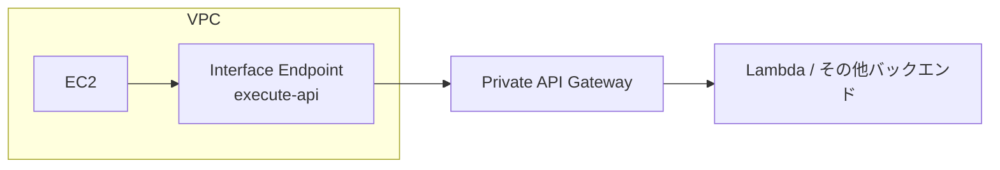

# テーマ16: API Gateway高度設計

> 🟡 所要日数: 2日 | 座学 → 問題演習

---

## 座学

## Part 1: SAAからの差分 — API Gatewayで深く問われる領域

SAAでAPI Gatewayの基本（REST API、Lambdaプロキシ統合、APIキー）は学びました。SAPではさらに以下を深堀りします。

**APIタイプの選択**（REST / HTTP / WebSocket）、**認証・認可**（IAM、Cognito、Lambdaオーソライザー、JWT）、**使用量プラン**、**キャッシング**、**プライベートAPI**、**Mutual TLS**、**リクエスト変換**（VTL）、**マルチリージョン構成**。

---

## Part 2: APIタイプの選択

API Gatewayには3つのAPIタイプがあり、機能とコストが異なります。

**REST API**:
- フル機能、本格的なAPI管理（キャッシュ、使用量プラン、APIキー、ドキュメント、リクエスト変換）
- エッジ最適化 / リージョナル / プライベート
- WebSocketとSDK生成サポート
- 料金: 100万リクエストあたり$3.50

**HTTP API**:
- 軽量、シンプル、REST APIの約70%安い（$1.00/100万）
- OIDC認証・JWTオーソライザーのネイティブサポート
- CORSの簡易設定
- VTL変換・APIキーなし（HTTP APIは最小限の機能）
- 料金: 100万リクエストあたり$1.00

**WebSocket API**:
- 双方向・永続接続
- リアルタイムアプリ（チャット、ゲーム、ライブダッシュボード）
- 接続ベース課金 + メッセージ数

**使い分けの目安**:

| 要件 | 推奨 |
|------|------|
| 基本的なRESTful API（Cognito/JWT認証） | HTTP API（安価） |
| 使用量プラン、APIキー、キャッシュが必要 | REST API |
| マルチバージョニング、ステージ管理 | REST API |
| 双方向リアルタイム通信 | WebSocket API |
| プライベートVPC内API | REST API（Private） |

---

## Part 3: 認証・認可の選択

API Gatewayは複数の認証方式をサポートします。

**1. IAM認証（SigV4）**:
- 呼び出し元がIAM認証情報で署名
- AWS環境内の相互通信に最適（EC2/LambdaからAPI Gateway呼び出し）
- エンドユーザーがいる場合にはCognito Identityと組み合わせて使う

**2. Amazon Cognito User Pools**:
- ユーザー登録・ログイン・MFAを統合管理
- JWTトークンで認証
- Cognito Authorizerで API Gateway 直接統合

**3. Lambda Authorizer（カスタムオーソライザー）**:
- 独自の認証ロジックをLambdaで実装
- トークンベース（JWT）、リクエスト全体ベース（ヘッダー + クエリ）
- IAMポリシーを動的に生成してAPI Gatewayに返す

**4. JWT Authorizer（HTTP APIのみ）**:
- JWTトークンを直接検証（Cognito不要）
- Auth0、Okta、Azure ADなどとのネイティブ統合
- HTTP APIでAPI Gatewayが自動検証

**5. Mutual TLS（mTLS）**:
- クライアント証明書で双方向認証
- B2B APIで相手組織を証明書レベルで検証
- カスタムドメイン必須

---

## Part 4: 使用量プランと APIキー

REST APIには**使用量プラン（Usage Plan）**があります。

- **API Key**: クライアントごとに発行する識別子
- **Throttle**: 秒あたりのリクエスト上限（Rate Limit）とバースト
- **Quota**: 日/週/月あたりのリクエスト上限

**ユースケース**:
- SaaSでパートナー企業ごとに異なる課金プラン（Free: 1,000/日、Pro: 100,000/日）
- APIキー単位での使用量追跡・課金
- 悪用防止のスロットリング

**注意**: API Keyだけでは認証として不十分。IAMやCognitoと組み合わせて使う。

---

## Part 5: キャッシング

REST APIではステージレベルで**APIキャッシュ**を有効化できます。

- キャッシュサイズ: 0.5 GB〜237 GB
- TTL: 0〜3600秒（デフォルト300秒）
- キャッシュキー: クエリ文字列、パスパラメーター、ヘッダーに基づいて自動生成
- キャッシュ暗号化のオプション

**コスト**: キャッシュサイズに応じた時間課金（0.5 GBで$0.02/時、237 GBで$3.80/時）

**ユースケース**:
- 頻繁に呼ばれる読み取り系API（カテゴリ一覧、マスターデータ）
- オリジンへの負荷削減
- レスポンスタイム改善（ミリ秒→数十ミリ秒）

**キャッシュ無効化**: `Cache-Control: max-age=0, no-cache` ヘッダーでキャッシュをスキップ（設定で許可要）

---

## Part 6: プライベートAPI

**Private API**は、VPC内のリソース（EC2、Lambda、ECS）からのみアクセス可能なAPI Gatewayです。

**構成**:
1. API Gateway で REST API を作成し、エンドポイントタイプを **Private** に設定
2. VPC に Interface Endpoint（`com.amazonaws.<region>.execute-api`）を作成
3. Resource Policy で「このエンドポイント経由のみ許可」を設定

**ユースケース**:
- 社内マイクロサービス間通信
- オンプレミスからDirect Connect経由でアクセスする閉域API
- コンプライアンス要件でインターネット公開不可のAPI

---

## Part 7: マルチリージョン API と DR

グローバルサービスやDR要件で、APIをマルチリージョン展開する設計。

**パターン1: Route 53 + エッジ最適化API**:
- エッジ最適化APIは自動でCloudFront経由、世界中のエッジでSSL終端
- Route 53 フェイルオーバーで別リージョンに切り替え可能

**パターン2: カスタムドメイン + Route 53 + Latency Routing**:
- 複数リージョンに同じカスタムドメインのAPIを作成
- Route 53 Latency Routingで最寄りのリージョンへ
- フェイルオーバーも組み合わせ可能

**パターン3: Global Accelerator + リージョナルAPI + NLB**:
- API GatewayはNLBターゲット化できないため通常は不可
- ALB経由でAPI Gatewayを呼ぶ構成は特殊で推奨されない
- RESTよりはLambda Function URLsやALBの方がGA統合しやすい

---

## 練習問題

### 問題1

あるスタートアップでは、新規プロダクトのAPIを設計中です。要件は以下です。

1. JWTトークン（Auth0発行）で認証
2. 基本的なRESTful APIだけで、APIキーや使用量プランは不要
3. CORSをシンプルに有効化したい
4. コストを最小限にしたい

どのAPI Gatewayタイプが最適ですか？

選択肢を見る

A. REST APIを作成し、Lambda AuthorizerでAuth0トークンを検証する

B. HTTP APIを作成し、ネイティブのJWT Authorizerを有効化する。Auth0の発行するJWTを直接検証でき、CORSも簡易設定で対応。料金はREST APIの約1/3

C. WebSocket APIを使い、接続時にJWTを検証する

D. Application Load Balancerで認証処理をOIDCで行い、バックエンドにLambdaを配置

正解と解説を見る

**正解: B**

HTTP API + JWT Authorizerが正解です。

- **JWT Authorizer**: HTTP APIはAuth0、Okta、Azure ADなどのJWTトークンをネイティブ検証できる。Lambda Authorizerが不要で、追加のLambda実行コストもかからない
- **シンプルなCORS設定**: HTTP APIのコンソールまたはCFNテンプレートでCORS設定が簡単
- **料金**: REST APIの100万リクエストあたり$3.50に対し、HTTP APIは$1.00（約1/3）

- A: REST API + Lambda Authorizerは機能しますが、Lambda実行コスト・遅延が加わり、本件の「シンプル・安価」要件に対して過剰
- C: WebSocketは双方向通信向けで、通常のREST APIには適さない
- D: ALB + OIDCは可能ですが、API Gatewayのような細かいAPI管理機能がなく、本件の用途には過剰で運用が複雑

---

### 問題2

あるSaaS企業のAPIプラットフォームでは、複数のパートナー企業に対してAPIアクセスを提供しています。以下の要件があります。

1. パートナー企業ごとに識別可能にし、利用状況を追跡したい
2. パートナーごとに異なる課金プランを適用したい（Free: 1,000リクエスト/日、Standard: 100,000/日、Enterprise: 無制限）
3. 悪用防止のため、パートナー単位で秒あたりのリクエスト上限（Rate Limit）とバースト制御が必要

最適な構成はどれですか？

選択肢を見る

A. REST APIで使用量プラン（Usage Plan）とAPIキーを作成し、プランごとに異なるQuota（1日あたりの上限）とThrottle（秒あたりの上限）を設定。各パートナーにAPIキーを発行してプランに紐付ける

B. Lambda Authorizerで独自の使用量管理ロジックを実装する

C. AWS WAFでパートナーごとのIPアドレスを制御する

D. HTTP APIでAPIキーを設定する

正解と解説を見る

**正解: A**

REST APIのUsage Plan + APIキーが正解です。

- **Usage Plan**: 1日/週/月のQuota、秒あたりのRate Limit、バーストを定義
- **APIキー**: パートナーごとに発行、Usage Planに紐付け
- **CloudWatch統合**: APIキー単位での使用状況がCloudWatchで可視化
- **プランの切り替え**: パートナーのプラン変更時はAPIキーを別Usage Planに移動するだけ

- B: 自作のLambda Authorizerは開発・運用コストが高く、API Gatewayの標準機能を使うべき
- C: AWS WAFはネットワーク層の保護機能で、使用量追跡や課金プラン管理には向かない
- D: HTTP APIはAPIキー・Usage Plan機能をサポートしていません。この要件ではREST APIが必要

---

### 問題3

ある企業では、社内マイクロサービス間の通信にAPI Gatewayを使いたいと考えています。外部インターネットには一切公開せず、社内VPC内のLambda・EC2・ECSからのみアクセスできる構成が必要です。

また、オンプレミスのデータセンターからDirect Connect経由でもAPIを呼び出せるようにしたいです。

最適な構成はどれですか？

選択肢を見る

A. REST APIを作成しエッジ最適化エンドポイントに設定、バケットポリシーでアクセスを制限する

B. REST APIのエンドポイントタイプをPrivateに設定し、VPCにInterface Endpoint（com.amazonaws.<region>.execute-api）を作成してAPI GatewayのResource Policyでそのエンドポイント経由のアクセスのみ許可する。オンプレミスはDirect Connect経由でVPCエンドポイントに到達可能

C. API GatewayをVPCエンドポイント（Interface Endpoint）で公開する

D. ALBを使ってPrivate Subnetに配置し、API Gatewayは使わない

正解と解説を見る

**正解: B**

Private API + VPC Interface Endpointが正解です。

- **Private API**: エンドポイントタイプをPrivateに設定すると、インターネットからアクセス不可になる
- **Interface Endpoint**: VPC内に`com.amazonaws.<region>.execute-api`のインターフェイスエンドポイントを作成し、VPC内のリソースがこのエンドポイント経由でAPIを呼び出す
- **Resource Policy**: API GatewayのResource Policyで「このVPCエンドポイント経由のみ許可」という制約を設定
- **オンプレミス**: Direct Connect経由でVPC内のInterface EndpointにアクセスできるためOK

- A: エッジ最適化はインターネット公開向けの構成
- C: 「API GatewayをVPCエンドポイントで公開」という表現が曖昧。正しい構成は「Private APIの前にVPCエンドポイントを置く」
- D: ALBでも可能ですが、API Gatewayのような認証・リクエスト変換・ステージ管理などの機能は失われる

---

### 問題4

あるECサイトでは、商品カテゴリ一覧API（`/categories`）へのアクセスが非常に多く、1秒あたり10,000リクエストのピークがあります。カテゴリ情報は1時間に1回程度しか更新されないのに、毎回バックエンドLambdaが呼ばれてDynamoDBをスキャンしており、コストとレイテンシが課題になっています。

バックエンドへのリクエストを削減し、レスポンスタイムを高速化する最適な方法はどれですか？

選択肢を見る

A. API Gatewayのキャッシュを有効化し、TTLを3600秒に設定する。`/categories`へのリクエストはAPI Gatewayのキャッシュから返され、バックエンドLambdaへの呼び出しが大幅に削減される

B. CloudFrontをAPI Gatewayの前段に配置する

C. Lambda内でDynamoDBの結果をメモリ変数にキャッシュする

D. DynamoDBにDAX（DynamoDB Accelerator）を使う

正解と解説を見る

**正解: A**

API Gatewayキャッシュが正解です。REST APIではステージレベルでキャッシュを有効化でき、TTLを0〜3600秒で指定できます。

- **バックエンド負荷削減**: キャッシュヒットすればLambda・DynamoDBへの呼び出し不要
- **レスポンスタイム改善**: ミリ秒未満〜数ミリ秒でレスポンス
- **キャッシュキー**: クエリ文字列、パスパラメーターで自動キー生成
- **1時間更新にマッチ**: TTL 3600秒で、更新から最大1時間遅延でキャッシュが失効

- B: CloudFrontも可能ですが、API Gatewayのエッジ最適化エンドポイントを使っている場合は既にCloudFrontが内部的に使われており、API Gatewayキャッシュの方がシンプルで効果的
- C: Lambdaのメモリキャッシュは、Lambdaコンテナ単位で独立。1秒10,000リクエストで多数のコンテナが並列動作する場合、各コンテナがそれぞれDynamoDBを呼び出すためキャッシュ効率が低い
- D: DAXはDynamoDBのキャッシュ層でマイクロ秒レスポンスになりますが、依然としてLambda実行が必要。APIレベルでキャッシュする方が効果的

---

### 問題5

ある金融機関では、パートナー企業との B2B API で相互認証が必要です。パートナーが正規の組織であることを、クライアント証明書レベルで検証したいと考えています。

要件：
1. クライアントが指定の認証局（CA）発行の証明書を保有していることを検証
2. 証明書が失効していれば接続拒否
3. カスタムドメイン（api.bank.com）での公開
4. API Gateway で実装したい

最適な構成はどれですか？

選択肢を見る

A. Lambda Authorizerで証明書を検証する

B. API Gateway REST API にカスタムドメインを設定し、Mutual TLS（mTLS）を有効化する。信頼するCAをS3にアップロードして設定することで、クライアント証明書を双方向認証する

C. ALBで証明書認証を行い、バックエンドにAPI Gatewayを呼ぶ

D. AWS WAFでカスタムルールを書いて証明書を検証する

正解と解説を見る

**正解: B**

Mutual TLS（mTLS）が正解です。API Gateway REST APIは2020年から**カスタムドメインでのMutual TLS**をサポートしており、B2B用途のクライアント証明書認証に使えます。

- **CA証明書の登録**: 信頼するCAバンドル（PEM形式）をS3にアップロードし、API Gatewayカスタムドメインに紐付け
- **証明書検証**: クライアントが証明書を提示しない、または認証済みCAで署名されていない場合は拒否
- **失効チェック**: CRL（証明書失効リスト）を組み合わせることで失効証明書を拒否

- A: Lambda AuthorizerはHTTPヘッダー・クエリ文字列には対応しますが、クライアント証明書の直接検証はTLSレイヤーの話で、Authorizerから扱えない
- C: ALBで証明書認証を行い、その後APIGatewayを呼ぶ構成は複雑で、ALBからAPI Gatewayへの呼び出しに認証情報を引き継ぐ追加実装が必要
- D: WAFはHTTP層のフィルタリング機能で、TLSレベルの証明書検証は担当しない

---

### 問題6

あるゲーム会社では、プレイヤー間のリアルタイム対戦APIを構築しています。従来はHTTPのポーリングでプレイヤーの動きを1秒間隔で取得していましたが、レスポンスの遅延と不要な通信量が問題になっています。

新設計では、プレイヤーの動きをサーバーから即座にクライアントに配信する仕組みが必要です。また、接続中のプレイヤーに対してサーバー側から能動的にメッセージを送る要件もあります。

最適な構成はどれですか？

選択肢を見る

A. REST APIにLong Pollingパターンを実装し、接続を長く保持してサーバー側からデータを返せるようにする

B. API Gateway WebSocket APIを使い、双方向の永続接続を確立する。接続時にconnectionIdを取得し、サーバーからAPI Gateway Management APIでconnectionIdを指定してメッセージをPushする

C. AppSync GraphQLのSubscriptionを使う

D. CloudFrontをフロントにして、オリジンから動画配信する

正解と解説を見る

**正解: B**

API Gateway WebSocket APIが正解です。双方向の永続接続を提供し、リアルタイム対戦のような用途に最適です。

- **永続接続**: クライアントとAPI Gatewayの間でWebSocket接続を維持
- **connectionId**: 接続ごとに一意のIDが発行される。DynamoDBに保存してユーザー管理
- **サーバーからPush**: `apigatewaymanagementapi.postToConnection`で任意のconnectionIdに送信
- **ルートキー**: クライアントからのメッセージを内容に応じて異なるLambda関数にルーティング

- A: REST APIのLong Pollingは双方向通信の根本的な制約を解決できません（サーバーからのPushは不可）
- C: AppSync GraphQL Subscriptionも有効な選択肢ですが、ゲームのようなシンプルなメッセージ交換にはGraphQLの複雑性が過剰です
- D: CloudFrontは静的コンテンツ配信向けで、双方向通信には対応していません

