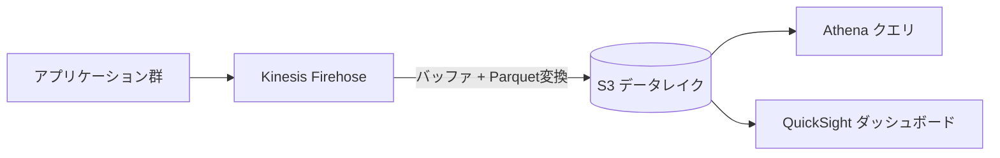
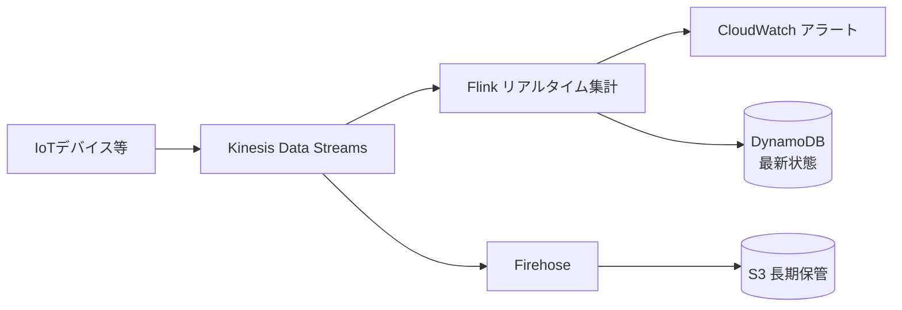
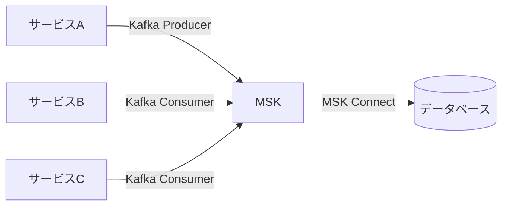

# テーマ20: ストリーム処理

> 🟡 所要日数: 2日 | 座学 → 問題演習

---

## 座学

## Part 1: SAAからの差分 — ストリーム処理サービスの全体像

SAAではKinesis Data Streamsの基本を学びました。SAPでは**各ストリームサービスの使い分け**と**大規模リアルタイム処理の設計**が問われます。

| サービス | 役割 |
|---------|------|
| **Kinesis Data Streams（KDS）** | リアルタイムストリーム、カスタム処理、データ保持最大365日 |
| **Kinesis Data Firehose** | ストリームからS3/Redshift/OpenSearchへの**配信専用**、マネージド |
| **MSK（Managed Streaming for Kafka）** | Apache Kafkaのマネージド版 |
| **Kinesis Data Analytics（現: Managed Service for Apache Flink）** | ストリームに対するリアルタイムSQL/Flinkアプリ |
| **Kinesis Video Streams** | ビデオストリーミング |

---

## Part 2: Kinesis Data Streams（KDS）

**KDS**はリアルタイムデータのストリーミングサービスで、カスタム処理ロジックをLambdaやKinesis Data Analyticsで実装する場合に使います。

**主要コンセプト**:
- **シャード（Shard）**: ストリームの並列度単位。1シャード = 1 MB/秒 または 1,000レコード/秒の書き込み、2 MB/秒の読み取り
- **パーティションキー**: どのシャードにデータを振り分けるかを決めるキー
- **保持期間**: デフォルト24時間、最大365日
- **コンシューマー**: プロビジョン済み（並列処理数制限）または拡張ファンアウト（Enhanced Fan-Out: シャードあたり2 MB/秒を各コンシューマーが独立利用）

**キャパシティモード**:
- **Provisioned**: 事前にシャード数を指定
- **On-Demand**: 自動スケール、最大200 MB/秒。使用量ベース課金（2021年以降）

**ホットシャード問題**: パーティションキーに偏りがあると特定シャードに負荷が集中。DynamoDBと同様の対策（高カーディナリティキー、シャーディング）が必要。

---

## Part 3: Kinesis Data Firehose — 配信専用

**Kinesis Data Firehose**はストリームデータをS3、Redshift、OpenSearch、Splunkなどの分析ストアに**自動配信**するサービスです。KDSと違い、カスタム処理は不要（または軽微）で、データの保管先への配信を自動化します。

**主要な機能**:
- **バッファリング**: 最大5分またはサイズ（5 MB〜128 MB）でバッファ、指定宛先に配信
- **データ変換**: Lambda関数でデータの加工（JSONからParquetへの変換なども可）
- **圧縮**: GZIP、ZIP、Snappyなど
- **パーティション**: 年/月/日/時間単位で宛先をパーティション化
- **フォーマット変換**: JSON → Parquet/ORCに自動変換（Athena分析用）
- **データ永続化**: 配信失敗時はS3のエラーバケットへ

**KDS vs Firehose の使い分け**:
- **KDS**: カスタム処理が必要（Lambda/Flinkで集計・加工）、低レイテンシ（秒単位）
- **Firehose**: 単純な配信、データレイクへのロード、フルマネージド、バッファ単位の遅延（最低60秒）

---

## Part 4: MSK — Managed Apache Kafka

**MSK**はApache Kafkaのマネージドサービスです。Kafkaはイベントストリーミングの業界標準で、既存のKafka資産（コード、運用知識、エコシステム）をそのまま活用できます。

**KDSとMSKの比較**:

| 項目 | KDS | MSK |
|------|-----|-----|
| プロトコル | AWS独自API | Apache Kafka |
| 既存アセット | SDK必須 | KafkaクライアントSDKがそのまま使える |
| 保持期間 | 最大365日 | 無制限（ストレージ次第） |
| スケール | シャード単位 | ブローカー単位 |
| 運用 | 完全マネージド | ブローカー管理は自動、トピック・パーティションは自己管理 |
| オンプレ互換 | なし | Kafkaコードがオンプレで動く |

**MSK Serverless**: パーティション管理・キャパシティ管理が不要な新しいオプション。

**MSK Connect**: Apache Kafka Connectのマネージド版で、DB/外部システムとの連携コネクタを実行。

**Amazon MSKとKDSの選択基準**:
- 既存のKafka実装がある、またはオープンソース互換性が必要 → MSK
- AWSネイティブでシンプルに、運用負荷を最小化したい → KDS

---

## Part 5: Managed Service for Apache Flink（旧 Kinesis Data Analytics）

**Managed Service for Apache Flink**は、ストリーミングデータに対してリアルタイムSQLまたはFlinkアプリケーションを実行するサービスです。

**ユースケース**:
- リアルタイムダッシュボード用の集計
- 異常検知（閾値超過、パターンマッチング）
- ウィンドウ集計（5分ごとの平均、過去1時間のトップN）
- ストリーム同士の結合

**2つの形態**:
- **SQL Applications**: SQLのクエリを書くだけ（非推奨、Flink Applicationsへ移行中）
- **Flink Applications**: Java/Python/ScalaでFlinkアプリを記述、より柔軟

---

## Part 6: ストリーム処理の設計パターン

**パターン1: ログ集約パイプライン**

**パターン2: リアルタイム分析 + 長期保管**

**パターン3: Kafka互換のマイクロサービス間通信**

---

## 練習問題

### 問題1

あるIoTプラットフォームでは、100万台のデバイスから毎秒データが送られてきます。以下の処理が必要です。

1. 全データを長期保管（S3）に保存する
2. 保管フォーマットはParquet（分析用）
3. データは数分単位で S3 に到着すれば良い（リアルタイム性は不要）
4. 運用負荷を最小化したい

最適な構成はどれですか？

選択肢を見る

A. Kinesis Data Streamsで受信し、Lambdaでカスタム処理してS3に保存

B. Kinesis Data Firehoseで受信、バッファリング（60秒〜15分）+ JSON to Parquet変換を有効化してS3に自動配信。パーティショニング（年/月/日/時間）も自動

C. MSKクラスターを立ち上げ、Kafka Connectでデータを受信してS3に書き込む

D. API Gateway + Lambda + S3で独自のパイプラインを実装

正解と解説を見る

**正解: B**

Kinesis Data Firehoseが正解です。「S3配信」が目的で「数分遅延OK」「フルマネージド」の要件に完全にマッチします。

- **JSON to Parquet 自動変換**: Glue Data Catalogと統合してスキーマ管理
- **バッファ + パーティション**: 年/月/日/時間の階層で自動パーティショニング
- **フルマネージド**: シャード管理、スケール、エラーハンドリングが全て自動
- **コスト**: 配信したデータ量に応じた従量課金

- A: KDS + Lambda は可能ですが、Lambdaコードの実装・運用が必要で、「運用負荷最小化」に反する
- C: MSKはKafkaエコシステム向けで、単純なS3配信には過剰
- D: 独自実装は開発・運用コストが高く、FirehoseのマネージドサービスでOK

---

### 問題2

ある企業では、既存のオンプレミスシステムでApache Kafkaを10年以上運用しており、数百のトピック、大量のProducer/Consumerアプリケーションが稼働しています。Kafkaのコードとエコシステム（Kafka Streams、Schema Registry など）に対する社内スキルも蓄積されています。

これらをAWSに移行したいのですが、「既存のKafkaコードをそのまま使いたい」「Kafkaプロトコル互換を維持したい」「運用自動化したい」という要件があります。

最適な選択肢はどれですか？

選択肢を見る

A. Kinesis Data Streamsに移行し、Producer/Consumerコードを書き換える

B. Amazon MSK（Managed Streaming for Apache Kafka）を使う。Apache Kafkaのマネージド版で、既存のKafkaコード・クライアントライブラリ・エコシステム（Kafka Streams、Connect、Schema Registryなど）がそのまま利用可能

C. SQSに移行する

D. Kafkaを自前でEC2にデプロイする

正解と解説を見る

**正解: B**

Amazon MSKが正解です。

- **Kafka互換**: Kafkaプロトコルそのまま、既存のProducer/Consumerコードが変更不要
- **エコシステム**: Kafka Streams、Connect、Schema Registryなど全て利用可能
- **マネージド**: ブローカーの運用、パッチ、スケールをAWSが管理
- **既存スキル活用**: Kafkaの運用ノウハウがそのまま活きる

- A: KDSはAWS独自APIで、Kafkaコードの大規模書き換えが必要
- C: SQSはキューサービスでKafkaのようなストリーミング（再読み込み、長期保持）に向かない
- D: EC2自前運用は「運用自動化」の要件に反する

---

### 問題3

ある金融機関では、クレジットカード取引ストリームに対してリアルタイムで不正検知を実施したいと考えています。以下の要件があります。

1. 1分間に1万件の取引をリアルタイム処理
2. 「直近5分間の同一カード10件以上の取引」などの時間ウィンドウ集計で判定
3. 異常パターンをリアルタイムに検出して即座にアラート

最適な構成はどれですか？

選択肢を見る

A. DynamoDBに保存し、定期的にバッチクエリする

B. KinesisDataStreamsで取引データを受信し、Managed Service for Apache Flinkで時間ウィンドウ集計（Sliding Window、Tumbling Window）を実行。異常検出時にSNSで通知

C. Lambdaで1件ずつ処理しDynamoDBでカウントする

D. S3に全件保存しAthenaで5分ごとにクエリする

正解と解説を見る

**正解: B**

KDS + Managed Service for Apache Flinkが正解です。

- **リアルタイム処理**: ミリ秒〜秒単位のレイテンシでストリーム処理
- **時間ウィンドウ**: FlinkはSliding Window、Tumbling Window、Session Windowに対応し、5分間の集計が自然に記述できる
- **異常検知**: Flink内で判定ロジックを実装、SNS/SQSへの通知連携
- **状態管理**: Flinkは分散ステートフル処理をサポート

- A: バッチクエリはリアルタイム性に劣る
- C: Lambda + DynamoDBも可能ですが、5分のスライディングウィンドウの状態管理を自作する必要があり、Flinkの方がネイティブ対応
- D: Athenaのバッチクエリは分単位のリアルタイム処理には遅延が大きすぎる

---

### 問題4

あるストリーミングアプリケーションで、Kinesis Data Streamsに `user_country` をパーティションキーとしてデータを書き込んでいます。日本のユーザーが他国より10倍多いため、日本データが特定シャードに集中してThrottlingが発生しています。

最適な対策はどれですか？

選択肢を見る

A. シャード数を10倍に増やす

B. On-Demandモードに切り替える

C. パーティションキーを `user_country#random_shard_number（0〜9）` に変更し、日本データを10個のシャードに意図的に分散させる。読み取り時は10個のシャードを並列処理

D. DynamoDBに切り替える

正解と解説を見る

**正解: C**

Write Shardingが正解です。パーティションキーの偏り（ホットシャード）問題はDynamoDBと同じ原理で、シャードサフィックスによる人工的な分散が効果的です。

- **書き込みシャーディング**: `jp#0`〜`jp#9` の10種類のキーで10個のシャードに分散
- **読み取り統合**: コンシューマー側で10個のシャードから並列読み取り

- A: シャード数を増やしてもパーティションキーが変わらなければ依然として日本データは1シャードに集中する
- B: On-Demandでもパーティションキー単位のスループット上限は存在する
- D: DynamoDBへの切り替えはアプリケーションの大規模改修が必要

---

### 問題5

ある企業のIoTプラットフォームで、数千台のデバイスからデータがKinesis Data Streamsに流れてきます。以下の要件があります。

1. 各デバイスからのデータを複数のコンシューマー（分析、アーカイブ、異常検知の3つ）が並列処理
2. 各コンシューマーがシャードの全データを独立して読める（コンシューマー間でスループット競合なし）
3. 各コンシューマーはミリ秒単位のレイテンシでデータを受信したい

最適な設定はどれですか？

選択肢を見る

A. 各コンシューマーが共有でシャードを読み、GetRecords APIを並列実行する

B. Enhanced Fan-Out（EFO）を有効化し、各コンシューマーがシャードあたり独自の 2 MB/秒の専用スループットを得る。サブスクリプションベースのPushで低レイテンシ（70ms未満）

C. 3つの別々のKinesisストリームを作成し、Producer側が全てに同じデータを書き込む

D. Kinesis Firehoseを使う

正解と解説を見る

**正解: B**

Enhanced Fan-Out（EFO）が正解です。

- **独立スループット**: 各コンシューマーがシャードあたり2 MB/秒の独立スループットを持つ（3コンシューマーなら合計6 MB/秒）
- **低レイテンシ**: 従来のポーリングベース（200ms以上）に対し、Push方式で70ms未満
- **追加コスト**: EFOは追加料金（シャード時間 + データ料金）が発生

- A: 標準コンシューマーではシャードあたり合計2 MB/秒の読み取りを共有し、3コンシューマーで競合する
- C: Producer側の実装変更が必要で、データ整合性・コストの問題も大きい
- D: Firehoseは配信専用で、カスタムコンシューマーロジックには向かない

---

### 問題6

ある企業では、ユーザーの Web 行動ログを Kinesis Data Firehose で S3 に配信しています。現在はデフォルト設定でJSONで配信していますが、月次分析で Athena クエリが遅く、スキャンコストが高額です。

データ量を減らさずに Athena のクエリ性能・コストを改善する最適な方法はどれですか？

選択肢を見る

A. S3のストレージクラスをStandard-IAに変更する

B. Firehoseの「Data Transformation with Lambda」と「Record Format Conversion」を有効化し、受信JSONをParquet形式に変換してS3に保存する。さらに動的パーティショニングで年/月/日/時間の階層に分割

C. Firehoseのバッファサイズを最小にして頻繁にS3に書き込む

D. Athenaのクエリに LIMIT を追加する

正解と解説を見る

**正解: B**

Record Format Conversion + 動的パーティショニングが正解です。

- **Parquet変換**: 列指向フォーマットにより、Athenaが必要な列だけ読み込む（スキャン量10倍以上削減）
- **圧縮率**: ParquetはJSONより圧縮率が高く、S3ストレージコストも削減
- **動的パーティショニング**: 年/月/日で分割されており、WHERE句での範囲指定でスキャン範囲が限定される
- **Athena料金**: スキャンデータ量 $5/TBのため、10倍削減で料金も10倍削減

- A: Standard-IAはS3料金削減には有効だが、Athenaのクエリ性能・コストは改善しない
- C: バッファサイズを小さくすると小さなファイルが大量生成され、逆にAthenaのクエリ性能が劣化する
- D: LIMITは結果を絞るだけで、スキャン量は変わらない（Athenaは全データをスキャン）

