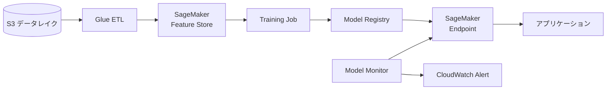

# テーマ21: AI/MLサービス

> 🟡 所要日数: 2日 | 座学 → 問題演習

---

## 座学

## Part 1: SAAからの差分 — AI/MLサービスの全体像

SAPではAWS AI/MLサービスの**使い分け**と**統合パターン**が問われます。サービスは3層構造で整理できます。

**AI Services（マネージド、学習不要）**:
- **Rekognition**: 画像・動画の分析（顔認識、ラベル、不適切コンテンツ検出）
- **Comprehend**: 自然言語処理（感情分析、エンティティ抽出、トピック抽出）
- **Translate**: 機械翻訳
- **Transcribe**: 音声→テキスト変換
- **Polly**: テキスト→音声変換
- **Textract**: ドキュメントからのテキスト・構造抽出（OCR）
- **Lex**: チャットボット、音声インターフェース
- **Personalize**: レコメンデーション
- **Forecast**: 時系列予測
- **Fraud Detector**: 不正検知
- **Kendra**: エンタープライズ検索

**ML Services（モデル開発・運用）**:
- **SageMaker**: MLモデルの構築・学習・デプロイのフルサポート

**ML Frameworks**:
- EC2 + DLAMI（深層学習AMI）、EKS、EMRなどで独自フレームワーク

---

## Part 2: 主要なAIサービスのユースケース

**Rekognition**:
- 顔認識、セレブ認識、年齢・性別推定
- S3上の画像・動画を直接分析
- Lambda + S3イベントで自動処理
- Custom Labelsで独自のオブジェクト検出モデルも可能

**Textract**:
- PDF・画像からテキスト抽出（OCR）
- フォーム・表の構造を保持（Form Extraction、Table Extraction）
- 保険請求書、IDカード、請求書などのドキュメント処理

**Comprehend**:
- 感情分析（Positive/Negative/Neutral）
- エンティティ抽出（人名、組織、場所、数量、日付）
- PII検出（個人情報の識別とマスキング）
- Comprehend Medical: 医療文書に特化

**Translate**:
- 75言語以上のリアルタイム翻訳
- カスタム用語集、アクティブカスタム翻訳
- バッチ翻訳でS3ドキュメントの一括処理

**Transcribe**:
- 音声ファイル・リアルタイム音声のテキスト化
- 話者識別、カスタム語彙、PIIマスキング
- Transcribe Medicalで医療用語対応

**Polly**:
- 60以上の声、多言語対応
- SSMLで発音・速度・ピッチ制御
- Neural TTSで自然な音声

---

## Part 3: SageMaker — MLプラットフォーム

**SageMaker**はMLモデルの構築・学習・デプロイをエンドツーエンドでサポートします。

**主要コンポーネント**:

**SageMaker Studio**: 統合IDE、ノートブック、実験管理

**Training Jobs**: モデル学習ジョブ
- 組み込みアルゴリズム（XGBoost、Linear Learner等）
- 独自フレームワーク（TensorFlow、PyTorch）
- Managed Spot Training: 最大90%割引でスポット使用

**Hyperparameter Tuning**: ハイパーパラメータの自動最適化

**SageMaker Endpoint**: モデルのリアルタイム推論エンドポイント
- **Serverless Inference**: リクエスト少量向け、アイドル時ゼロコスト
- **Asynchronous Inference**: 長時間推論、大きな入力データ対応
- **Multi-Model Endpoint**: 複数モデルを1つのエンドポイントで、コスト削減

**SageMaker Ground Truth**: 訓練データのラベル付け（人間のラベラー + ML自動ラベル）

**SageMaker Pipelines**: MLワークフローのオーケストレーション（データ準備→学習→デプロイ）

**SageMaker Model Monitor**: 本番モデルのドリフト監視（データ品質、モデル品質）

**SageMaker Feature Store**: 特徴量の一元管理・共有

**SageMaker JumpStart**: 事前学習済みモデルの簡単デプロイ（OpenAI互換、Stable Diffusion、Llama等）

**SageMaker Canvas**: コード不要のML（ビジネスユーザー向け）

---

## Part 4: 生成AI — Bedrock

**Amazon Bedrock**は生成AI（Foundation Model）をAPI経由で利用するサービスです。

**対応モデル**: Anthropic Claude、AI21 Labs Jurassic、Meta Llama、Cohere、Stability AI、Amazon Titan

**主要機能**:
- **Knowledge Bases**: RAG（検索拡張生成）の実装
- **Agents**: ツール呼び出し、ワークフロー自動化
- **Guardrails**: ハルシネーション防止、有害コンテンツフィルタ
- **Custom Model**: Fine-tuningと継続事前学習

**セキュリティ**: データはトレーニングに使われず、VPCエンドポイント経由で完全プライベート利用可能。

---

## Part 5: データ & ML統合パイプライン

---

## 練習問題

### 問題1

ある保険会社では、顧客から送られてくる保険請求書（PDF、画像）から構造化データ（請求金額、日付、患者名など）を自動抽出したいと考えています。手作業では月間5,000件を処理するのに10人日かかっています。

機械学習の知識がないチームでも使えて、フォームの構造を保持した抽出が必要です。

最適なサービスはどれですか？

選択肢を見る

A. SageMakerで独自のOCRモデルを開発する

B. Amazon Textractを使い、請求書PDFをS3にアップロード。Textractが Form Extraction でキー・値ペア（「請求金額: $5,000」など）、Table Extractionで表構造を自動抽出

C. Amazon Rekognitionで画像分析する

D. Lambda内でOCRライブラリ（Tesseract）を実行する

正解と解説を見る

**正解: B**

Amazon Textractが正解です。ドキュメントからの構造化データ抽出に特化したマネージドAIサービスです。

- **Form Extraction**: フォームのキー・値ペアを自動認識（「請求金額」→「$5,000」）
- **Table Extraction**: 表構造を保持して抽出
- **Analyze Document API**: ドキュメント全体の構造解析
- **ML不要**: 事前学習済みモデルですぐ利用可能

- A: 独自モデル開発はコスト・時間が大きく、Textractで十分に高精度
- C: Rekognitionは画像の物体認識向けで、ドキュメント構造抽出には不向き
- D: Tesseractなどのライブラリは単純なテキスト抽出はできるが、フォーム構造の保持は困難

---

### 問題2

ある大手Eコマース企業のカスタマーサービス部門では、顧客からの問い合わせメール（英語、日本語、中国語、スペイン語）を毎日数万件受信しています。以下の処理を自動化したいです。

1. メールの感情（満足/不満）を自動判定
2. 重要な固有表現（商品名、注文ID、場所）を抽出
3. 個人情報（メールアドレス、電話番号）を検出してマスキング

最適なサービスはどれですか？

選択肢を見る

A. SageMakerで感情分析モデルを独自に学習させる

B. Amazon Comprehendを使う。感情分析、エンティティ検出、PII検出（個人情報マスキング）をAPIコール1回で実行できる。多言語に対応

C. GPTを呼び出して分析する

D. Lambdaで正規表現を使って処理する

正解と解説を見る

**正解: B**

Amazon Comprehendが正解です。

- **感情分析**: Positive / Negative / Neutral / Mixed を自動判定
- **エンティティ検出**: 人名、組織、場所、数量、日付、商品などの抽出
- **PII検出**: メールアドレス、電話番号、SSN などの個人情報を自動検出
- **多言語対応**: 日本語、英語、中国語、スペイン語など多数

- A: 独自モデル学習は時間・コストが大きく、Comprehendで十分
- C: GPTは有効な選択肢ですが、AWSネイティブでマネージドなComprehendの方がセットアップが簡単
- D: 正規表現では感情分析・エンティティ抽出ができない

---

### 問題3

ある金融機関では、生成AIを使って社内ドキュメント（規約、マニュアル、過去のメール履歴など数万ドキュメント）を検索・要約できるシステムを構築したいです。以下の要件があります。

1. 生成AIの出力は社内ドキュメントの内容に基づいて行う（ハルシネーション防止）
2. コンプライアンス上、入力データはモデルの訓練に使われてはいけない
3. VPCエンドポイント経由でアクセスし、インターネット経由しない

最適な構成はどれですか？

選択肢を見る

A. OpenAI APIをインターネット経由で呼び出す

B. Amazon Bedrockで Knowledge Bases 機能を使い、社内ドキュメントを S3 に格納してベクター化。Claude/Llama等のFoundation ModelがRAG（Retrieval Augmented Generation）で回答生成。VPC Endpoint経由で完全プライベート利用、入力データはモデル訓練に使われない

C. SageMaker JumpStartでLlamaをデプロイし、独自RAGを実装

D. Comprehendで全文検索する

正解と解説を見る

**正解: B**

Amazon Bedrock + Knowledge Basesが正解です。

- **RAG（Retrieval Augmented Generation）**: 社内ドキュメントから関連部分を検索し、それに基づいて回答生成。ハルシネーション防止
- **データプライバシー**: Bedrockの入力・出力データはモデル訓練に使われない
- **VPCエンドポイント**: プライベート接続でインターネット経由しない
- **マネージド**: Knowledge Bases は S3 のドキュメントをベクター化して保持する処理を全て管理

- A: OpenAI APIはインターネット経由、VPCエンドポイントがなく、要件違反
- C: SageMaker + JumpStartでも実装可能ですが、RAGパイプラインを自作する必要があり運用負荷が高い
- D: Comprehendは全文検索機能はあるが、生成AI（要約・回答生成）は含まない

---

### 問題4

あるスタートアップでは、モバイルアプリ用の画像認識モデルをSageMakerで学習させています。推論リクエストは1日数千件程度と少なく、リクエストが来ない時間帯も長いため、常時稼働のエンドポイントではコストが割高です。

リクエストが来ないときのコストをゼロにしつつ、リクエスト時はすぐに応答できる推論エンドポイントはどれですか？

選択肢を見る

A. 常時稼働のReal-time Endpointを使う

B. SageMaker Serverless Inferenceを使う。リクエストがないときは自動的にアイドル状態になりコストゼロ、リクエスト時は自動スケールして数秒で応答可能

C. SageMaker Batch Transformで夜間バッチ推論する

D. SageMakerを使わずに全てLambdaで実装する

正解と解説を見る

**正解: B**

SageMaker Serverless Inferenceが正解です。

- **アイドル時コストゼロ**: リクエストがない間は課金されない
- **自動スケール**: リクエスト到来時に自動起動、数秒でレスポンス
- **小規模リクエスト向け**: 1日数千件レベルのスタートアップに最適
- **コールドスタート**: 最初のリクエストは数秒の遅延（Lambdaと同様）

- A: 常時稼働は予測可能な大量リクエスト向けで、小規模ではコスト非効率
- C: Batch Transformはリアルタイム推論には向かない
- D: Lambdaで大きなMLモデルを動かすのは難しい（10GBの制限、コールドスタート、GPU不可）

---

### 問題5

あるメディア企業では、配信動画の中から「人物の顔」「不適切なコンテンツ（暴力、アダルト）」「ロゴ」などを自動検出したいと考えています。動画は毎日数時間分アップロードされ、手動チェックは現実的ではありません。

最適な構成はどれですか？

選択肢を見る

A. SageMakerで独自の動画解析モデルを作る

B. Amazon Rekognition Videoをを使い、S3にアップロードされた動画を自動分析する。ラベル検出、顔検出、不適切コンテンツ検出、テキスト検出、ロゴ検出をマネージドで実行

C. Elastic Transcoderで動画を変換する

D. Kinesis Video Streamsで処理する

正解と解説を見る

**正解: B**

Amazon Rekognition Videoが正解です。

- **マネージドAI**: 動画の顔検出、ラベル、不適切コンテンツ、テキスト、ロゴをAPI1回で実行
- **非同期処理**: StartLabelDetection → GetLabelDetection で非同期、長時間動画にも対応
- **S3統合**: S3のオブジェクト指定で処理、Lambda統合で自動化
- **Custom Labels**: 独自のロゴ・物体検出も可能

- A: 独自モデル開発は大規模で、Rekognition Videoで事足りる
- C: Elastic Transcoderは動画の変換（フォーマット変更、解像度変更）で、コンテンツ分析機能はない
- D: Kinesis Video Streamsはライブストリーミングのキャプチャ・保存サービス、分析は別途必要

---

### 問題6

ある企業では、MLプラットフォームチームが複数のMLモデルをSageMakerでデプロイしています。10個のモデルがあり、それぞれ別々のエンドポイントで運用していますが、多くのモデルはリクエスト量が少なく、エンドポイントの時間課金が割高です。

コスト削減のために複数モデルを1つのエンドポイントに統合したいです。最適な構成はどれですか？

選択肢を見る

A. 10個のエンドポイントを統合し、1つの巨大モデルを作る

B. SageMaker Multi-Model Endpoint を使う。1つのエンドポイントに複数モデルをホスト可能、リクエスト時にモデル名を指定。使われていないモデルはメモリからアンロードされ、複数モデルで1つのインフラを効率利用

C. Lambdaで各モデルを個別に実行する

D. ECSで各モデルをコンテナ化する

正解と解説を見る

**正解: B**

SageMaker Multi-Model Endpoint（MME）が正解です。

- **複数モデル共有**: 1つのエンドポイントに複数モデルをホスト（数百〜数千モデルも可能）
- **動的ロード**: リクエスト時にモデルがメモリにロードされ、使われないモデルはアンロード
- **コスト削減**: 10個のエンドポイント → 1個にまとめることで、時間課金が1/10に
- **リクエスト**: `InvokeEndpoint` でモデル名を指定して呼び出し

- A: 10モデルを1モデルに統合するのは技術的に困難で、モデルの独立性が失われる
- C: Lambdaは大きなMLモデルを動かすのに制約が多い
- D: ECSでも可能ですが、SageMaker MMEのマネージド機能（自動スケール、モデル管理）の方が運用効率が良い

