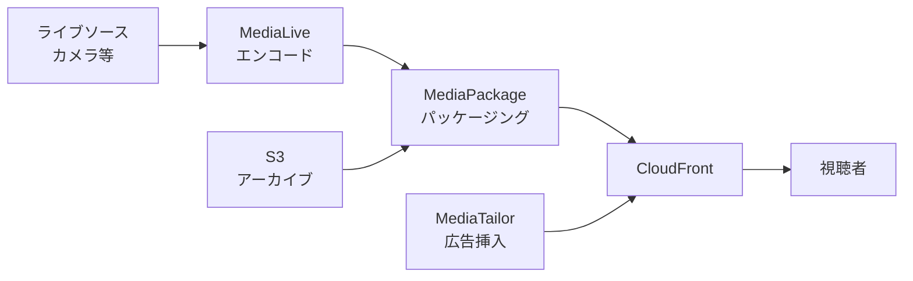

# テーマ23: メディア配信

> 🟢 所要日数: 1日 | 座学 → 問題演習

---

## 座学

## Part 1: SAAからの差分 — メディアサービスの全体像

SAPではメディアサービス（動画配信・音声処理）の使い分けが問われます。

**AWS Media Services**:

| サービス | 役割 |
|---------|------|
| **MediaLive** | ライブ動画のエンコード（ライブストリーミング用） |
| **MediaPackage** | ライブ・VODコンテンツのパッケージング・配信準備 |
| **MediaConvert** | VOD（オンデマンド）動画のトランスコード |
| **MediaStore** | ライブストリーミング向け低レイテンシストレージ |
| **MediaTailor** | パーソナライズ広告挿入 |
| **IVS（Interactive Video Service）** | 超低レイテンシ（< 5秒）のライブ配信 |
| **Elemental Appliance** | オンプレミス向けハードウェアエンコーダ |

---

## Part 2: 動画配信の基本フロー

### ライブストリーミング

### VOD（オンデマンド）配信

---

## Part 3: MediaLive と MediaPackage

**MediaLive**: ライブ動画を複数のビットレート・解像度にリアルタイムエンコード（ABR: Adaptive Bitrate Streaming）。入力はRTMP、RTP、HLS、MP4ファイル。

**MediaPackage**: MediaLiveから来たストリームを HLS / DASH / CMAF / Microsoft Smooth Streamingの複数形式に変換・配信。
- **Origin Endpoint**: CloudFrontのオリジンとして機能
- **DRM統合**: Widevine、PlayReady、FairPlayのDRMパッケージング
- **Time-shifted Viewing**: ライブ配信の過去部分を巻き戻して視聴
- **Live-to-VOD**: ライブ配信を自動的にVODコンテンツとして保存

---

## Part 4: MediaConvert — VODトランスコード

**MediaConvert**は、S3に保存されたMP4などのソース動画を、HLS/DASH（ABR配信用）や様々な解像度・コーデック（H.264、H.265、AV1）に変換します。

**主要機能**:
- **Output Groups**: 1ジョブで複数の出力形式を同時生成（HLS + DASH + MP4）
- **QVBR エンコーディング**: 品質ベースのビットレート制御（視覚的品質を保ちつつファイルサイズ最適化）
- **キャプション**: 字幕の変換（SRT、WebVTT、CEA-608）
- **DRM**: 暗号化対応
- **Reserved Transcoding**: 予約料金で大幅割引

**ジョブキュー**: 優先度別のキューを定義。緊急処理は On-Demand Queue、通常バッチは予約Queueに分ける運用。

---

## Part 5: CloudFrontとの統合

動画配信は大量のデータ転送を伴うため、**CloudFront**との統合が前提です。

**動画配信のCloudFront設定**:
- **Origin Shield**: 追加のキャッシュ層、オリジンへのリクエストを大幅削減
- **Signed URL / Cookie**: 有料コンテンツの保護（Part: テーマ7参照）
- **Field-level Encryption**: 機密フィールドの暗号化
- **地理的制限**: 配信対象地域の制限

**ライブストリーミングでのキャッシュ戦略**: セグメントファイル（.ts）はTTL数秒〜数十秒、マニフェストファイル（.m3u8）は短めTTL。頻繁に更新されるマニフェストと比較的変わらないセグメントを区別してキャッシュ。

---

## Part 6: IVS — 超低レイテンシライブ配信

**IVS（Interactive Video Service）**は、5秒以下の超低レイテンシライブ配信に特化したマネージドサービスです。

**ユースケース**:
- ライブ配信 + 視聴者コメントの双方向性（イベント、配信者）
- ライブコマース
- スポーツ配信でのリアルタイム解説
- ゲーム実況

**MediaLive/MediaPackageとの違い**:
- IVS: 完全マネージド、低レイテンシ特化、5分で立ち上げ可能
- MediaLive/MediaPackage: 高度なカスタマイズ、DRM、複雑な配信要件

---

## 練習問題

### 問題1

ある放送局では、毎日10時間のライブニュース番組をインターネット配信しています。以下の要件があります。

1. 複数のビットレートで配信（4K、1080p、720p、480p、360p）して、視聴者の回線に応じた品質を選択させる
2. HLSとDASHの両方で配信（異なるデバイス対応）
3. 視聴者は全世界に分散しているため、CDN経由で配信
4. ライブ配信の過去30分を巻き戻して視聴できる機能
5. DRMで有料コンテンツを保護

最適な構成はどれですか？

選択肢を見る

A. 自前のOBS StudioとEC2で配信する

B. AWS Elemental MediaLiveでABRエンコード、MediaPackageでHLS/DASH変換・DRM・Time-shifted Viewing、CloudFrontで配信する

C. Kinesis Video Streamsで配信する

D. S3に動画を保存してCloudFrontで配信する

正解と解説を見る

**正解: B**

MediaLive + MediaPackage + CloudFrontが正解です。

- **MediaLive**: 4K、1080p、720p、480p、360pの複数ビットレートに同時エンコード
- **MediaPackage**: HLS/DASHの両方の形式で配信、DRMパッケージング、Time-shifted Viewing（30分巻き戻し）
- **CloudFront**: グローバル配信、Origin Shieldでオリジン保護

- A: OBS + EC2の自前構築は大規模運用に向かず、スケール・品質管理が困難
- C: Kinesis Video StreamsはIoTカメラなどの映像取り込みで、視聴者向けのマルチビットレート配信には使えない
- D: S3 + CloudFrontはVOD向けで、ライブ配信には使えない

---

### 問題2

ある動画プラットフォームでは、クリエイターがアップロードするオリジナル動画（1本あたり10分〜2時間のMP4）を、視聴者向けにHLS形式に変換して配信したいです。

1日に数百本の動画が新規アップロードされ、アップロード後30分以内に視聴可能にする必要があります。

最適な構成はどれですか？

選択肢を見る

A. EC2でFFmpegを動かして手動で変換する

B. S3アップロード → Lambda起動 → MediaConvertジョブ送信 → HLS出力をS3に保存 → CloudFront配信。MediaConvertはサーバーレスでスケール、複数解像度同時出力、QVBR高品質エンコード

C. Kinesis Video Streamsに動画を送る

D. MediaLiveを使う

正解と解説を見る

**正解: B**

S3 + Lambda + MediaConvert + CloudFrontが正解です。

- **自動化**: S3イベント → Lambda → MediaConvertジョブの自動パイプライン
- **サーバーレス**: MediaConvertはサーバーレスで並列ジョブ実行
- **複数解像度**: 1ジョブで4K/1080p/720pなど複数出力
- **HLS形式**: 標準的なABRストリーミング対応

- A: EC2 + FFmpegは運用負荷が高く、スケール困難
- C: Kinesis Video Streamsはストリームの取り込み用で、VODトランスコードではない
- D: MediaLiveはライブ配信用で、VOD変換にはMediaConvertが適切

---

### 問題3

あるライブコマース企業では、配信者が商品を紹介しながら視聴者がリアルタイムにコメント・購入する配信サービスを構築中です。以下の要件があります。

1. 配信 → 視聴者までの遅延は3秒以下（低遅延必須）
2. 視聴者コメントとの同期
3. 配信の立ち上げをシンプルにしたい
4. 将来的に配信数が数千単位にスケールする見込み

最適な構成はどれですか？

選択肢を見る

A. MediaLive + MediaPackage（通常の設定は10〜30秒の遅延）

B. Amazon Interactive Video Service（IVS）を使う。超低レイテンシ（5秒以下、多くは2〜3秒）で、マネージドで数分で立ち上げ可能。SDK提供でモバイル・Webアプリから簡単配信

C. RTMPを直接CloudFrontに送る

D. Kinesis Data Streamsで動画を配信する

正解と解説を見る

**正解: B**

Amazon IVSが正解です。

- **超低レイテンシ**: 2〜3秒の遅延で、ライブコマースの双方向性に最適
- **マネージド**: エンコード、配信、プレイヤー全てマネージド
- **SDK**: iOS、Android、Webプレイヤーが用意
- **スケール**: 数千同時配信に対応
- **シンプル**: コンソールから数分で配信セットアップ完了

- A: MediaLive + MediaPackageの標準HLSは10〜30秒の遅延で、ライブコマースには不向き（Low-Latency HLSを使えば短縮可能だがIVSほど低遅延ではない）
- C: RTMPはアップロードプロトコルで、CloudFrontのエンドユーザー配信には使えない
- D: Kinesis Data Streamsは動画配信には使わない

---

### 問題4

ある動画配信サービスでは、視聴者のパーソナライズされた広告を動画中に挿入したいと考えています。視聴者の興味・地域・時間帯に応じて、異なる広告が配信される必要があります。

広告配信プラットフォーム（SSAI: Server-Side Ad Insertion）を構築する最適な構成はどれですか？

選択肢を見る

A. CloudFrontで広告のキャッシュ配信する

B. AWS Elemental MediaTailorを使う。視聴者ごとにパーソナライズされた広告を動画の指定位置に自動挿入、サーバーサイドで処理するため広告ブロッカーを回避できる

C. Lambda@Edgeで広告を動的に挿入

D. 動画をアップロードする段階で広告を結合する

正解と解説を見る

**正解: B**

AWS Elemental MediaTailorが正解です。

- **SSAI（Server-Side Ad Insertion）**: 視聴者別にパーソナライズされた広告を動画の適切な場所に挿入
- **広告ブロッカー耐性**: クライアント側処理ではないためブロックされにくい
- **ADS（広告意思決定サーバー）連携**: 外部の広告サーバー（Google Ad Manager等）と統合
- **VAST/VPAID**: 業界標準の広告フォーマット対応

- A: CloudFrontは静的コンテンツキャッシュで、視聴者別のパーソナライズ広告挿入はできない
- C: Lambda@Edgeでのリクエスト処理は可能ですが、動画のセグメント単位での広告挿入ロジックは複雑で自作困難
- D: 事前結合では視聴者別のパーソナライズができない

---

### 問題5

ある企業の動画配信サービスで、CloudFront経由のライブストリーミングが急激なトラフィック増加を迎えています。MediaPackageのオリジンへのリクエスト数が大きく、オリジン側のスループットとコストが問題になっています。

オリジンへのリクエスト数を削減する最適な設定はどれですか？

選択肢を見る

A. CloudFrontのキャッシュTTLを長くする

B. CloudFrontのOrigin Shieldを有効化する。世界中のエッジロケーションがさらに1層（Origin Shield）にまとめられ、オリジンへのリクエストが大幅に集約される。マルチリージョンのエッジ→Origin Shield→オリジンの階層でリクエスト削減

C. MediaPackageクラスターを増やす

D. CloudFrontを廃止してMediaPackage直接配信する

正解と解説を見る

**正解: B**

CloudFront Origin Shieldが正解です。

- **追加キャッシュ層**: 通常のCloudFrontエッジ階層の上にOrigin Shieldを追加
- **リクエスト集約**: 世界中のエッジロケーションからオリジンへのリクエストが1つのOrigin Shieldに集約される
- **オリジン負荷削減**: 特にライブ配信で多数のセグメントリクエストが発生する場合に効果大
- **設定**: CloudFrontディストリビューションの設定で有効化、適切なリージョンを選択

- A: TTL延長も有効だがライブセグメントは短時間で無効化されるため効果限定的
- C: MediaPackageクラスター自体はスケールするがリクエスト数削減にはならない
- D: CloudFrontを廃止するとグローバル配信性能が大幅に低下する

---

### 問題6

ある映画配信サービスでは、月に数千本のVOD動画をMediaConvertで変換しています。コストが月額$10,000を超えており、予算圧迫が問題になっています。変換ジョブは急ぎのものと夜間バッチに分けられるため、料金プランを最適化したいです。

最適な方法はどれですか？

選択肢を見る

A. MediaConvertのオンデマンドクエリのみを使用する

B. MediaConvertのReserved Transcoding（予約トランスコーディング）を購入。月額コミットメントで通常料金の大幅割引（約40%）。急ぎジョブはOn-Demand Queueで、通常バッチはReserved Queueで処理する使い分け

C. 動画変換をEMRで実装する

D. Lambda上でFFmpegを動かす

正解と解説を見る

**正解: B**

MediaConvert Reserved Transcoding（Reserved Queue）が正解です。

- **大幅割引**: 月額コミットメントで約40%の割引
- **ジョブキュー分離**: On-Demand Queueは即時処理、Reserved Queueは予約分で処理
- **使い分け**: 急ぎのジョブはOn-Demand、通常バッチはReservedで使い分けて最適化
- **予測可能なワークロード**: 月数千本の変換は予測可能で、Reservedに向く

- A: 全てOn-Demandでは割引がなくコスト削減にならない
- C: EMRで動画変換は可能ですが、MediaConvertのマネージド機能（複数出力、QVBRエンコードなど）と比較すると実装コストが高い
- D: LambdaでFFmpegは15分タイムアウト・メモリ制限があり、長時間動画には不向き

