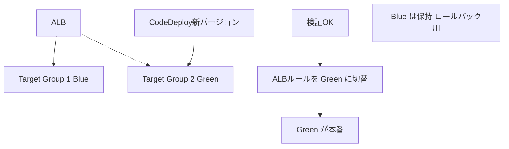

# テーマ25: CI/CD・IaC

> 🟡 所要日数: 2日 | 座学 → 問題演習

---

## 座学

## Part 1: SAAからの差分 — CI/CD・IaCサービスの全体像

SAAではCodeシリーズ、CloudFormationの基本を学びました。SAPでは**企業レベルのパイプライン設計**と**IaCの運用**が問われます。

**AWS CI/CD サービス**:

| サービス | 役割 |
|---------|------|
| **CodeCommit** | Gitリポジトリのホスティング（マネージド） |
| **CodeBuild** | ビルド・テスト実行 |
| **CodeDeploy** | EC2/Lambda/ECSへのデプロイ |
| **CodePipeline** | CI/CDパイプラインのオーケストレーション |
| **CodeArtifact** | パッケージリポジトリ（npm、Maven、PyPI互換） |
| **CodeGuru Reviewer** | MLによるコードレビュー（セキュリティ・品質） |

**IaC サービス**:

| サービス | 特徴 |
|---------|------|
| **CloudFormation** | AWS固有IaC、JSON/YAML、Stack Sets、Change Sets |
| **CDK** | 一般プログラミング言語（TypeScript、Python等）でCloudFormation生成 |
| **SAM** | サーバーレス（Lambda/API Gateway）特化のCloudFormation拡張 |
| **Terraform** | マルチクラウド対応（AWSでも利用可） |

---

## Part 2: CodeDeploy — デプロイ戦略

**CodeDeploy**はアプリケーションをEC2、Lambda、ECSにデプロイするサービスで、以下のデプロイ戦略をサポートします。

**EC2 デプロイ戦略**:
- **In-Place（All-at-once、Half-at-a-time、One-at-a-time）**: 既存インスタンスを順次更新
- **Blue/Green**: 新バージョンを別グループにデプロイし、ALBのターゲットを切り替え

**Lambda デプロイ戦略**:
- **Canary**: X%を新バージョンに、Y分後に全量切替（Canary10Percent5Minutes など）
- **Linear**: X%ずつY分おきに増やす（Linear10PercentEvery1Minute など）
- **All-at-once**: 全量即時切替

**ECS デプロイ戦略**:
- **Rolling Update**: ECS標準、タスクを段階的に置換
- **Blue/Green with CodeDeploy**: 2セットのタスクを並走、切替

**Lifecycle Hooks**: デプロイの各段階でカスタムスクリプト実行（BeforeInstall、AfterInstall、ApplicationStart、ValidateService、BeforeAllowTraffic、AfterAllowTraffic）

---

## Part 3: CodePipeline — パイプラインオーケストレーション

**CodePipeline**はCI/CDの各段階を定義・実行します。

**典型的なパイプライン**:
```
Source（CodeCommit/GitHub）
  → Build（CodeBuild）
  → Test（CodeBuild/自作）
  → Deploy to Staging（CodeDeploy）
  → Manual Approval
  → Deploy to Production（CodeDeploy）
```

**主要機能**:
- **複数の並列アクション**: 1ステージで複数のアクションを並列実行
- **手動承認**: 本番デプロイ前に承認者が確認
- **Variables**: ステージ間で変数を受け渡し
- **クロスリージョン**: 別リージョンへのデプロイ
- **クロスアカウント**: 別アカウントへのデプロイ（アカウント分離ベストプラクティス）

---

## Part 4: CloudFormation — 大規模運用

SAAではテンプレートの基本を学びました。SAP では以下の機能が問われます。

**Change Sets**: テンプレートの変更を実際に適用する前にプレビュー

**Stack Sets**: 複数のアカウント・リージョンにCloudFormationを一括展開
- AWS Organizations統合で組織全体への配布
- 管理アカウントからメンバーアカウントへSCPライクに配布

**Nested Stacks**: スタックを階層化して再利用（VPCモジュール、DBモジュールなど）

**Cross-Stack References（Outputs + ImportValue）**: スタック間のリソース参照

**Drift Detection**: 手動変更（コンソールでの変更）を検出してテンプレートとの乖離を発見

**CloudFormation Guard（cfn-guard）**: テンプレートのポリシーチェック（「S3バケットは暗号化必須」など）

**Deletion Policy**: スタック削除時にリソースを保持（Retain）またはスナップショット（Snapshot）

**Stack Policies**: 重要リソースの意図しない更新を防ぐ

---

## Part 5: AWS CDK — 開発者フレンドリーなIaC

**CDK（Cloud Development Kit）**は、TypeScript、Python、Java、Go、C#などでCloudFormationテンプレートを生成するフレームワークです。

**メリット**:
- **型チェック**: プログラミング言語のIDEで型チェック、補完
- **抽象化（Construct）**: 複雑なインフラをクラス化して再利用
- **ロジック**: 条件分岐、ループ、関数化で記述を圧縮
- **AWSベストプラクティス**: L2/L3 Constructsがベストプラクティスを自動適用

**Construct Levels**:
- **L1（CFN Resources）**: CloudFormationの低レベル対応
- **L2（Curated Constructs）**: AWSのベストプラクティスを適用した高レベル抽象
- **L3（Patterns）**: 複雑なパターン（Fargate + ALB + CI/CDなど）をひとまとめ

---

## Part 6: SAMとサーバーレスパイプライン

**AWS SAM（Serverless Application Model）**は、Lambda・API Gateway・DynamoDBなどのサーバーレス向けCloudFormation拡張です。

```yaml
Resources:
  MyFunction:
    Type: AWS::Serverless::Function
    Properties:
      Runtime: python3.11
      Handler: app.lambda_handler
      CodeUri: ./src
      Events:
        Api:
          Type: Api
          Properties:
            Path: /hello
            Method: get
```

`sam build && sam deploy` でビルド・デプロイが自動化。

**SAM Pipelines**: CodePipelineでのサーバーレスCI/CDを自動生成。

---

## Part 7: ブルーグリーン・カナリアリリースの実現

**ECS での Blue/Green（CodeDeploy）**:



**Lambda での Canary Deployment（CodeDeploy）**:
- エイリアスに重み（Blue 90%、Green 10%）で配分
- メトリクスベースの自動ロールバック（CloudWatchアラームで検知）

---

## 練習問題

### 問題1

あるSaaS企業のECSマイクロサービスで、デプロイ時に「新バージョンを10%のトラフィックに流して5分観察し、問題なければ全量切替、エラー増加なら自動ロールバック」というリリース戦略を実装したいです。

最適な構成はどれですか？

<details>
<summary>選択肢を見る</summary>

A. 手動でECSサービス定義を更新してトラフィックを段階的に変更する

B. CodeDeployのBlue/Green Deploymentを使い、Canary 10 Percent 5 Minutesのデプロイ設定を選択。ECSタスクを新旧並走させALBルールで10%→100%切替。CloudWatch Alarmと統合して自動ロールバック

C. Kubernetes IngressのCanary機能を使う

D. Route 53のWeighted Routingで切替える

</details>

<details>
<summary>正解と解説を見る</summary>

**正解: B**

AWS CodeDeploy Blue/Green Deploymentが正解です。

- **Blue/Green**: 2セットのECSタスク（Blue・Green）をALBのTarget Groupに分離
- **Canary 10 Percent 5 Minutes**: 10%→100%の2段階切替（事前定義済み戦略）
- **自動ロールバック**: CloudWatch AlarmがALARM状態になると自動でBlueに戻す
- **Lifecycle Hooks**: デプロイ各段階でテストスクリプト実行可能

- A: 手動運用は労力・ミスが多い
- C: Kubernetes IngressはECSでは使えない
- D: Route 53のWeighted Routingは有効ですが、DNS TTLの遅延があり、ALBレベルの切替の方が即時

</details>

---

### 問題2

ある大手企業では、AWS Organizationsで100以上のアカウントを運用しています。セキュリティチームから「全アカウントに統一されたVPC・セキュリティグループ・CloudTrail設定を展開したい」「アカウント追加時も自動で展開したい」という要件が出ました。

最適な手段はどれですか？

<details>
<summary>選択肢を見る</summary>

A. 各アカウントで個別にCloudFormationテンプレートを実行する

B. CloudFormation StackSetsを使い、AWS Organizationsと統合。管理アカウントから組織全体（OU単位も可）にCloudFormationスタックを一括展開、新規アカウント追加時にも自動展開

C. Terraformで各アカウントを個別に管理する

D. Lambda関数で各アカウントのAPIを呼んで設定する

</details>

<details>
<summary>正解と解説を見る</summary>

**正解: B**

CloudFormation StackSetsが正解です。

- **一括展開**: 管理アカウントから複数アカウント・複数リージョンへ同時展開
- **Organizations統合**: OU単位でのターゲット指定、新規アカウント追加時の自動展開
- **ドリフト検出**: StackSetsのドリフト検出で手動変更を検知
- **更新管理**: 全アカウントへの更新を中央から実行

- A: 各アカウントでの個別実行は100アカウント規模では現実的でない
- C: TerraformでもマルチアカウントN管理可能ですが、Organizations統合機能がなく、自動展開の実装が必要
- D: Lambda自作は冪等性・エラーハンドリング・バージョニングの実装負荷が大きい

</details>

---

### 問題3

ある開発チームでは、TypeScriptでアプリケーションを書いており、インフラもTypeScriptで定義したいと考えています。以下の要件があります。

1. AWSサービスのリソースをプログラミング言語で記述
2. 複雑なロジック（条件分岐、ループ、環境別設定）を書きたい
3. IDEの型チェックと補完を活用したい
4. 既存のCloudFormationテンプレートとも連携したい

最適なツールはどれですか？

<details>
<summary>選択肢を見る</summary>

A. CloudFormation YAML

B. AWS CDK（TypeScript）を使う。TypeScript/Python/Javaなどのプログラミング言語でインフラ定義、IDEの型チェック・補完が利用可能。合成でCloudFormationテンプレートが生成され、既存CFNとの互換性も保たれる

C. Terraform

D. Bashスクリプトでaws CLIを呼び出す

</details>

<details>
<summary>正解と解説を見る</summary>

**正解: B**

AWS CDK（TypeScript）が正解です。

- **TypeScript**: チームの既存スキル活用
- **型チェック・補完**: VSCodeなどのIDEでAWSリソースの型補完
- **プログラミングロジック**: 条件分岐、ループ、関数化で記述を圧縮
- **CloudFormation生成**: CDKは最終的にCFNテンプレートに合成、既存CFNエコシステム（Change Sets、StackSetsなど）をそのまま使える
- **L2/L3 Constructs**: ベストプラクティスを自動適用

- A: YAMLは宣言的で簡潔ですが、ロジックや型チェックは提供されない
- C: Terraformもプログラマブルですが、HCL独自言語で学習曲線があり、AWSネイティブのCloudFormation統合はCDKより弱い
- D: aws CLIスクリプトは冪等性・状態管理がなく、IaCに適さない

</details>

---

### 問題4

ある企業では、Lambdaベースのサーバーレスアプリケーションを、段階的にリリースしながら本番影響を最小化したいと考えています。具体的には、新バージョンを本番トラフィックの10%に流し、1時間観察してエラーレートが上昇しないなら残りを切替、エラーならロールバックしたいです。

最適な実装はどれですか？

<details>
<summary>選択肢を見る</summary>

A. Lambdaのエイリアスを手動で切り替える

B. SAM + CodeDeploy Linear10PercentEvery10Minutes または Canary10Percent60Minutesのデプロイプリセットを使い、Lambdaのエイリアス重みづけで段階的切替。CloudWatchアラームで自動ロールバック

C. Lambda の複数バージョンを並列にデプロイし、アプリ側でA/B分岐する

D. Route 53 のWeighted Routingでリクエストを分岐する

</details>

<details>
<summary>正解と解説を見る</summary>

**正解: B**

SAM + CodeDeploy Lambda デプロイが正解です。

- **SAM**: サーバーレスアプリ用のCloudFormation拡張でCodeDeploy統合が組み込まれている
- **Canary / Linear**: プリセット（Canary10Percent60Minutes、Linear10PercentEvery10Minutesなど）
- **エイリアス重み**: Lambda エイリアスの重み付けで段階的切替
- **自動ロールバック**: CloudWatch AlarmがALARM状態ならロールバック

- A: 手動切替は段階的・自動ロールバック要件に合わない
- C: アプリ側で分岐するのはデプロイ戦略ではなくアプリケーションロジック。複雑化する
- D: Lambdaに対してRoute 53のWeighted Routingは直接できない（API Gatewayなどを経由する必要あり、ただし複雑）

</details>

---

### 問題5

ある企業のCloudFormationテンプレート管理で、以下の問題が頻発しています。

1. エンジニアがAWSコンソールでリソースを手動変更し、CloudFormationテンプレートと実態がずれる
2. どのスタックで差異が発生しているか手動で確認する負担が大きい
3. 意図しない手動変更を防ぎたい

最適な対策はどれですか？

<details>
<summary>選択肢を見る</summary>

A. 全エンジニアのコンソールアクセスを禁止する

B. CloudFormation Drift Detectionを定期実行してテンプレートと実態の乖離を検出、Stack Policyで重要リソースの更新保護を設定し、Service Catalogで承認済みテンプレートのみ利用を強制

C. AWS Configで全リソース変更を監査

D. 手動で差分を確認する運用ルールを徹底する

</details>

<details>
<summary>正解と解説を見る</summary>

**正解: B**

CloudFormation Drift Detection + Stack Policy + Service Catalogが正解です。

- **Drift Detection**: テンプレートと実リソース設定の乖離を自動検出
- **Stack Policy**: 重要リソース（RDS、VPC、IAMなど）への更新を制限
- **Service Catalog**: 承認済みテンプレートのみエンジニアに提供、コンソール直接操作を減らす

- A: コンソールアクセス禁止は開発効率を大きく損なう
- C: AWS Configはコンプライアンス監査に有効ですが、CloudFormationテンプレートとの直接的な乖離検出はDrift Detectionの方が適切
- D: 手動確認は運用負荷が高く、ミスも発生しやすい

</details>

---

### 問題6

ある開発チームでは、アプリケーション（Node.js、Python、Java）の依存ライブラリをプライベートに管理したいと考えています。現在はパブリックなnpm、PyPI、Maven Centralからダウンロードしていますが、以下の課題があります。

1. 依存ライブラリの脆弱性スキャンを一元化したい
2. パブリックリポジトリへの依存を減らし、ビルドの再現性を高めたい
3. 社内向けのプライベートパッケージも公開したい

最適なサービスはどれですか？

<details>
<summary>選択肢を見る</summary>

A. S3に依存ライブラリを保存する

B. AWS CodeArtifactを使い、プライベートリポジトリ（npm、PyPI、Maven、NuGet互換）をセットアップ。パブリックリポジトリ（npm、PyPIなど）のキャッシュ・プロキシ機能、社内独自パッケージの公開、IAM統合の権限管理

C. GitHubリポジトリにライブラリをコミット

D. S3のプライベートバケットにZIPで保存

</details>

<details>
<summary>正解と解説を見る</summary>

**正解: B**

AWS CodeArtifactが正解です。

- **マネージドパッケージリポジトリ**: npm、PyPI、Maven、NuGet、Generic形式に対応
- **アップストリーム接続**: パブリックリポジトリ（npmjs.com、pypi.org、Maven Centralなど）をプロキシ、依存ライブラリをキャッシュして再現性確保
- **プライベートパッケージ**: 社内独自パッケージを公開
- **IAM統合**: 細かい権限制御（読み取り/書き込み、パッケージ範囲）
- **CodeBuildからの利用**: CI/CDパイプラインからの自動取得
- **脆弱性統合**: 他のSCAツールと組み合わせて脆弱性管理

- A: S3は汎用ストレージで、npm/pip/Mavenのクライアントから直接パッケージを取得できない
- C: GitHubコミットはバイナリ管理に不向きで、バージョン管理も煩雑
- D: S3 + ZIPは依存解決・バージョン管理の仕組みがない

</details>
